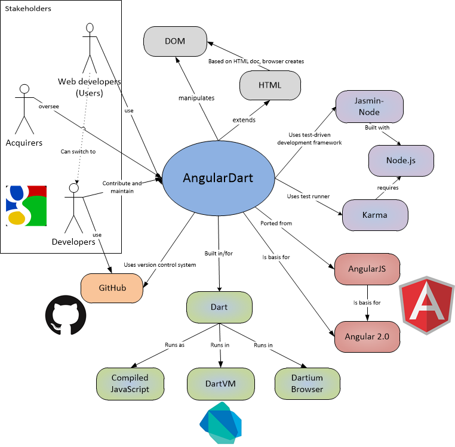
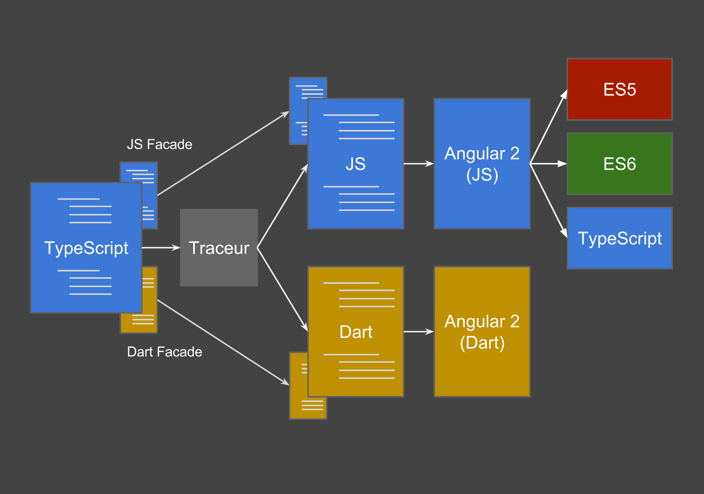
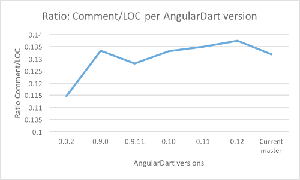
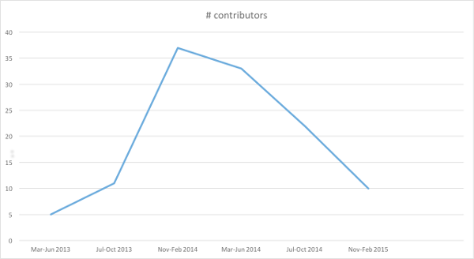

# AngularDart: A Client-Side Web Framework for Dart
**Stephan Kool, Kors van Loon, Jeroen Vos and Jochem de Goede** 
*Delft University of Technology*

<!-- -->

**Abstract**

*In this chapter, a client-side web framework called AngularDart is studied, which is a Dart version of its JavaScript counterpart: AngularJs. 
AngularJs came from the need of developers to have easy data binding between forms and JavaScript and grew out to a big framework for developing client-side web applications. 
Combined with the language and the developer environment of Dart, which tries to ease the development of client-side web apps, the original JavaScript framework was completely rewritten for this programming language and thus AngularDart was born. 
In this chapter, research is performed to how the team behind AngularDart works and how the architecture is organized and evolves over time. 
We discovered that for an open source project contributions are tremendously important. Also we discovered that the Angular team likes to think big and is rewriting Angular right now once more in yet another language. This version, Angular 2.0, is set to be released at the end of 2015.*

## Introduction

### From the Humble Beginnings of AngularJs

The story of Angular starts with the need for improved client-side scripting and quick prototyping. Two developers of the company Brat Tech LLC company started to work on a framework Angular. The framework had few followers and it was decided to release the framework as open source and abandon the idea. Later, Google picked up the initiative and turned it into the open-source AngularJS we know today. How Google is involved will be described in the stakeholder section. 
Amongst Angular's unique and innovative features are two-way data binding, dependency injection, easy-to-test code and extending the HTML mark-up with directives. AngularJs is a JavaScript client-side web framework that allows for expansion of HTML coding in applications. The data binding and dependency injection reduces the coding effort and the decoupling of the DOM convention reduces the testing effort. 
That is why sites that use Angular are good at making quick changes; because Angular, more aggressively than any other frameworks, nudges developers to create easily testable code that is tested often. Though some developers might find this guidance annoying, it pays off in catching little coding errors before they have a chance to do real damage. 
At the moment, it is one of the leading front-end development frameworks and the framework of choice for client-side application development.

Since the aging of the programming language JavaScript, AngularJs was still not very satisfying for many developers. Although it is massively supported and has a lot of extensive libraries, for many, it lacks object types and classes. The programming language Dart, also created by Google developers, tries to tackle this issue by adding these constructs for client side scripting. Dart can compile to JavaScript or can be executed in the DartVM, which is either implemented in the Chrome browser spin-off Dartium or the standalone DartVM console application.

AngularDart combines the client-side framework Angular with the programming language Dart. It provides the benefits of the more structured Dart over JavaScript, while still having the flexibility and power of Angular.

### What it is all about - A Quick Example

HTML:

    <!doctype html>
    <html>
      <head>
        <link rel="stylesheet" href="todo.css">
      </head>
      <body>
        <h2>Todo</h2>
        

        
          {{TodoCtrl.remaining()}} of {{TodoCtrl.todos.length}} remaining
        
            [ <a href="" ng-click="TodoCtrl.archive()">archive</a> ]
            <ul class="unstyled">
                <li ng-repeat="todo in TodoCtrl.todos">
                    <input type="checkbox" ng-model="todo.done">
                    {{todo.text}}
                </li>
            </ul>
            <form ng-submit="TodoCtrl.addTodo()">
                <input type="text" ng-model="TodoCtrl.todoText"  size="30"
                       placeholder="add new todo here">
                <input class="btn-primary" type="submit" value="add">
            </form>
        

        
        
      </body>
    </html>

In this HTML example you can see some unusual properties inside the tags often prefixed with `ng-`. 
These are standard Angular _directives_ that add behaviour or functionality to those tags.
This is done by the Angular library by scanning the HTML client-side. The `todo-list` attribute in the top `
` refers to the controller written in Dart below, which manages the logic of adding todos:

Dart:

    import ‘package:angular/angular.dart’;
    import ‘package:angular/application_factory.dart’;

    @Controller(
        selector: &#39;[todo-list]&#39;,
        publishAs: &#39;TodoCtrl&#39;)
    class TodoController {
      List&lt;Todo&gt; todos;
      String todoText;
     
      TodoController() {
        todos = [...];
      }
     
      void addTodo() {
        todos.add(new Todo(todoText, false));
        todoText = &#39;&#39;;
      }
     
      int remaining() {...}
     
      void archive() {...}
      }
    }
     
    class Todo {...}
     
    class TodoModule extends Module {...}
     
    main() {
      applicationFactory()
          .addModule(new TodoModule())
          .run();
    }

In the next section the Angular framework is described: Its stakeholders are analyzed, as well as the project's organization. Then, the implementation and its functions are assessed, after which the evolution is described and the metrics for evaluation are introduced. Lastly, the contributions made are discussed.

## AngularDart in detail
The need for AngularDart has been established in the previous segment. In the next section a description of relevant stakeholders, an overview of the functional aspects of AngularDart and an overview of the modularity of the system is given.

### Who are Involved? - Stakeholders
The stakeholders of AngularDart are divided according Woods and Rozanski (2011). The three main types of stakeholders for Angular are the acquirers, developers and users, which are described in this section. 

#### Google
Google is both the acquirer of AngularDart and delivers its main developers. 
Google is heavily investing in Dart and wanted to have the AngularJs team build a Dart version that seamlessly integrates with Dart. 
Seven of the top ten contributers to the GitHub repository of AngularDart were identifiable as Google employees.  
The development team of AngularDart densely communicates and cooperates with the team of AngularJs and therefore partly consists of the same members. 
Furthermore, the major contributors outside this core team are leading members of the Dart team.

The development team of AngularDart densely communicates and cooperates with the team of AngularJs and therefore partly consists of the same members. Furthermore, the major contributors outside this core team are leading members of the Dart team.

#### The Community
The last significant group of stakeholders are the users of AngularDart which make up the community and use this  framework for developing client-side applications. This group can contribute to the project by means of three crucial elements: adoption, feedback and module development.

For AngularDart, the users has to adopt to the Dart environment. The Dart environment (language and tools) has huge productivity benefits, but does right now not seamlessly works with Javascript libraries, which could be a hurdle towards adoption. This however, is being addressed and major improvements will come with the soon-to-come 2.0 version of Dart.

Within the Angular projects, one can see that feedback from the community often is accumulated and then handled by adding a big new feature or creating an entire new version. 
For instance, complaints of dependency injection were not fixed in AngularJs, but were in AngularDart by re-hauling the concept. This overhaul will be incorporated into the JavaScript version of Angular 2.0.

The community mostly contributes to the project, not by improving the AngularDart repository itself, but by creating and publishing their own modules.
The community modules are often proven solutions for real use cases, and therefore are an important factor of the overall value and success of Angular.

### How Angular is organized - A Modular View

Now that we looked into the people involved in Angular, its architecture is explored by looking at the different internal modules and their interdependencies. Angular is composed of different components and modules, which are explained in this section.

#### Module Structures
Modules are functional, largely independent, units in the project that contain multiple files of source code. It is an 'encapsulation' of a specific aspect of the project. The two main advantages of the modular programming method are (1) simplification of code through limitation of dependencies between modules and (2) easier organisation of distributed programming because teams (or individuals) can specialize on single modules instead of having to know all the source code [Sun Microsystems, 2007](https://netbeans.org/project_downloads/usersguide/rcp-book-ch2.pdf). 

Although the AngularDart repository could be considered to be relatively small, it also benefits from modules to structure the source code. The code section below illustrates a folder structure in the AngularDart project. It depicts the /lib folder, which actually contains 15 folders and 10 files. 

    angular.dart/lib
      /animate                  # contains files that provide animation functionality for angular.dart
        animation_loop.dart
        animation_optimizer.dart
        animations.dart
        css_animate.dart
        module.dart
        [...]
      /core                     # folder with core elements of angular.dart
        /parser                 # sub-folder of /core containing parsing functions
        [...]
      module.dart 
      annotation.dart           # source code file that adds annotation
      exception handler.dart    # source code file that handles exceptions in angular.dart
      [...]

The modules in AngularDart can be identified through the 'module.dart' file in a directory. In the example above, 'animate' is a module where 'core' contains the parser.

[Christopher Hiller](https://github.com/boneskull), a Software Architect and contributor to AngularJs, explained how  developers can modularize their projects when using Angular. 
His blog is a good addition on the explanation above and focuses on creating modules in an organically grown coding project ([Hiller, 2014](https://blog.safaribooksonline.com/2014/03/27/13-step-guide-angularjs-modularization/)).

The overall tendency is that the main modules in `/lib` are loosely decoupled, with only the Core module binding all the modules together.
In the image below, the different modules and the dependencies between them are illustrated by a network analysis graph: Larger modules have more imcoming dependencies whilst small modules rely on such dependencies.

_Module dependency graph analysis of /lib_

AngularDart is written with a Dependency Injection (DI) framework, used for the decoupling of classes, allowing for re-usability. 
It allows the import of some software library in such a way that the DI module handles the discovery and import of this library. 
This module is not directly part of AngularDart, as it is not included in AngularDart but rather in an external module. Close to every module in Dart is dependent on DI.

The Core module is, as the name would suggest, an essential module which provides libraries to other modules. It handles aspects as: Micro tasks, exceptions, annotations and parsing. This important role is supported by the network dependency graph where it is only best in importance by the external DI module.
  
Other modules that that provide functionalities and are fully dependent on other modules are represented by the small and red nodes in the graph. The Animate module is an example of this. It is dependent on the core, the DI, the Core DOM and the logging module and it provides the functionality of animations in AngularDart.

### The implementation - A Functional View

The functional view of the system describes the runtime functional elements and the responsibilities, interfaces and interactions. In this view first the functions of the system are defined before describing the responsibilities, interfaces and interactions.

#### Functional capabilities
The functional capabilities define what AngularDart does. AngularDart is a port of AngularJs to the Dart programming language, so its main goal is to provide all the features that AngularJs offers. 
We derived the following functions in AngularDart:

| Function | In component |
|----------------------------------------------------|------------|
| Animating HTML elements | Animate |
| Teach the browser new HTML syntax | HTML Compiler |
| Binding data in the view and in the model | Two-way data binding |
| Being able to create Services, which are substitutable objects wired together with DI | Services |
| Automatically resolve component dependencies | DI |
| Being able to write templates | Core DOM |
| Creating expressions | Formatter |
| Formatting values of an expression | Formatter |
| Easily create and validate forms | Forms |
| Attaching specific behavior to a DOM element | Directives |

Also the differences between AngularJs and AngularDart are taken into account, resulting in the following [[1](http://stackoverflow.com/questions/19993377/differences-between-angular-js-and-angular-dart)]:

* Difference in DI system: In Dart this is class-based, while it is symbol based in the Js version.
* Rewritten compiler, in which the Directives behave differently and there is a distinction between "structural directives", "decorative directives" and components.
* Directive controllers were merged in components.
* AngularDart spawned attribute maps, that means that directives should need fewer scope.$watches.
* AngularDart is built on top of Shadow DOM, so when implementing a Component the Shadow DOM is used. 

An example of the DI system differing between both versions, can be made clear as follows by an example from the blog [[2](http://victorsavkin.com/post/86909839576/angulardart-1-0-for-angularjs-developers)] of Victor Savkn:

    //JS:
    // The name here matters, and since it will be minified in production, 
    // we have to use the array syntax.
    m.factory("usersRepository", ["$http", function($http){
      return {
        all: function(){/* ... */}
      }
    }]);

    //DART:
    @Injectable()
    class UsersRepository {
      // Only the type here matters, the variable name does not affect DI.
      UsersRepository(Http h){/*...*/}
      all(){/* ... */}
    }

#### Interfaces
The Dart programming language does not contain the keyword `interface ` [[3](http://news.dartlang.org/2012/06/proposal-to-eliminate-interface.html)]. 
This was already removed from the framework in 2012. 
Instead, all classes in Dart have implicit interfaces. The motivation for this choice was that interfaces can be mapped to abstract classes. 

With this information at hand, we turn to AngularDart and look for abstract classes in the application. AngularDart provides several interfaces for other components internally in the AngularDart library to use.
Some examples are:

* ChangeDetectorGroup and ChangeDetector: groups related watches together and "guarantees that within a group all watches will be reported in the order which they were registered", from the AngularDart docs. 
* NgValidator: "the class interface for performing validations for an NgModel instance". It provides a function to get the name and a function isValid that returns a boolean.
* HttpBackend: this is the HTTP back-end which is used by the HTTP service. This is an implicit interface, as two other classes implement the HttpBackend.
* RouteProvider: classes that implement this interface can provide routes for the Web app for use with single-page applications.

#### Connectors
Connectors are the pieces of code of the architecture that link the elements, or modules, together. From what was observed, connectors are not used in AngularDart. Instead, the Core and Core DOM modules are the center of the framework and all other modules expand on this.

#### External entities
AngularDart has "other systems, software programs, hardware devices or other entities with which the system interacts" (Rozanski and Woods, p. 272), or external entities. These can be extracted from the Context view image below.

_Context view with logos_

* HTML: AngularDart extends the HTML with several directives, as discussed earlier, such as "ng-class". By using this directive, AngularDart attaches to that DOM element a specified behavior, or it can transform that DOM element (and its children).
* DOM: AngularDart relies on the DOM, which all browsers have implemented. Furthermore, it can make use of the Shadow DOM, which is a polyfiller if it is not already natively supported by the browser.
* Dart2Js compiler: AngularDart has to be used compiled as JavaScript, so this compiling also plays a role as an external entity.
* Browsers: AngularDart has to work flawlessly in all major and popular browsers, for it to be considered a serious web framework.

## Beyond AngularDart - Evolution perspective
The framework Angular is currently at the verge of a major change. Version 2 is under active development which will bring major changes to the platform. These changes are so major, that backwards compatibility with 1.x versions will initially be non-existent. However, once version 2 is deemed stable enough by Google, the development team will start working on a migration path from AngularDart and AngularJs 1.x to version 2. In the next section some of the dimensions of change in the overall Angular framework are discussed.

### Platform evolution
The major reason for this compatibility break between the two versions is that version 1.x does not fit today's modern Web. A new architecture is required since the Web is quite different than it was five years ago, with a largely changed device landscape and new technologies. The platform as a whole needs some more drastically than evolution: a revolution.

One of these technologies that is on the verge of change is JavaScript, or EcmaScript 5. Soon the EcmaScript 6 specification will be finalized, most likely  in mid 2015. Many Web frameworks will be willing to quickly adopt the new standard. Users, on the other hand will likely adopt the framework after major browsers support the new version of EcmaScript. Angular 2.0 will offer support for EcmaScript 6. 

Version 2 will also add support for Web Components, which are a collection of four related W3C specifications:

* Custom Elements: allows the extension of HTML with your own tags
* HTML imports: allows for packaging of resources, such as CSS, JS and more
* Template elements
* Shadow DOM

Angular 2.0 will be built using TypeScript from Microsoft. However, because no browser supports TypeScript natively yet, it will be transpiled (a source-to-source compiler, that *trans*lates code to another programming language) to EcmaScript 5. TypeScript differs from EcmaScript 5 by the addition of types to the language (type annotations, compile-time type checking and type inference). This also counts for classes, interfaces, modules and more. TypeScript is a superset of EcmaScript 5, which means that any current JavaScript program is a valid TypeScript program. However, Angular 2.0 does not offer any backwards compatibility to version 1.

_Angular 2 Transpile Architecture_

In the image above you can see the way the Angular 2 is built. Since the development started on version 2 of Angular, both teams of the JavaScript and Dart version are combined into one team. Version 2 uses the facada pattern, which uses abstracted functions to improve readability of the library and the make a coherent API that is easy to use. Also, the most important reason that these facades are necessary is for the differences between JavaScript and Dart APIs. The transpiler uses these facades to compile the correct API for both languages. Traceur is the component responsible for tranpsiling the code to EcmaScript 5 and Dart. 

_The team of Angular 2_

This compiler actually adds an extra option to develop Angular apps. Besides EcmaScript 5, EcmaScript 6, TypeScript and Dart, it is also possible to write Angular apps using the Traceur compiler in EcmaScript 6 and having it transpile to any number of the just mentioned languages. 

### Functional evolution
Angular 2.0 is set to improve performance of the framework drastically. Version 1.x was originally intended as a tool for designers in order to  create HTML forms. Over time, a lot of features for the framework to remain relevant for the Web were added. Performance never was really that important in the old Angular, something that will change in version 2.0. Some of these performance issues arise from the binding and template infrastructure.

Angular 2 will offer improved support for mobile devices and will become easier to use with a more elegant API. When Angular 1 was built five years ago, phones and tablets were not that pervasive as they are now. Features that need to be added are router extensions for mobile, caching pre-compiled views and better touch support. These will be added in Angular 2.0.

Moving to TypeScript will allow for better IDE support, making the lives of Web developers easier. For example, Microsoft will offer Angular support in Visual Studio 2015.

### Growth
Growth is of course very important to Angular. As the framework increased in popularity in the last five years, it needs to adapt in order to be able to handle larger tasks and websites. This means scalability and high performance are very important. As discussed in the Functional evolution paragraph, Angular 2.0 will focus highly on performance. In the Js and Dart versions, performance was not a requirement because of the initial application of the framework and as a result, AngularJs does not scale very well. However, now that Angular is used in so many Web applications, scalability has to be incorporated in the architecture of the framework, something that the developers will do with version 2.

### Migration path
With all these changes for Angular 2.0, current Web app developers that want to use Angular now, are put in a difficult position. Why would someone build a Web application with Angular now, when you'll be guaranteed to be obsolete by the end of the year, probably having to re-do much of your work? The Angular team, unfortunately, does not have a definitive answer right now. 

Some developers are not planning to wait for transition solutions. The blog [paislee.io](http://paislee.io/migrating-to-angularjs-2-0/) offers steps Angular developers can take right now to make the transition later on a less obstacle. The steps proposed in the blog post are the following:

1. Start making Directives, as Controllers will be removed in version 2. Making directives a very different way from writing code, as this is a more component-based architecture, with components being a loose term for DOM elements, according to the author
2. Clean up `$scopes`. Scopes bind the view, a DOM element, to the controller but will be implicit in version two. They are no longer needed as a result to the component-based architecture.
3. Finally, the author encourages everyone to 'start hacking with TypeScript'. 

As said at the beginning of this perspective, after releasing version 2, the Angular developers will start working on back-porting some of the new features to version 1.x of AngularJs. One of these features will most likely be the router [[5](http://blog.thoughtram.io/angular/2015/06/16/routing-in-angular-2.html)].

## The Major Challenge: Contributing

Throughout this project it appeared to be quite challenging to contribute to the project.
There are several reasons why contributing to AngularDart or Angular 2.0 turned out to be harder than expected.
This section summarizes the hurdles and present a metric system that could help improve the contribution process.

### Initial Complexity

Google developers are widely known for their excellence and professionalism.
This can be seen throughout all aspects of Angular. 
From documentation to testing to structure to code quality, everything is done very well and very thorough.
This results in a code base of which its heart is, taken the complexity into account, relatively understandable.
This also means that the tooling environment of which the project is dependent on is very complex and thus often leads to console errors during installation for example. 

The Dart programming environment seeks to ease this process by providing a very nice set of standard tools that work straight out of the box.
Unfortunately, AngularDart does not exploit this plug-and-play opportunity, and uses a mixture of Dart tests, JavaScript tests (which need JavaScript tooling dependencies) and shell scripts, all of which have to work before a contribution can pass the continuous integration gate.

#### AngularDart and Angular 2.0

We, as the 'SWA Angular team', tried to contribute to both AngularDart and Angular 2.0.
Apart from the hurdles described above, which are applicable for both repositories, there are some specific hurdles for each of them.

A contribution for AngularDart has the disadvantage that their team is not actively working on the project anymore during the Software Architecture course, which obstructs getting a pull request accepted or getting feedback on a pull request.
Furthermore, very simple contributions such as improving documentation is not realistic since everything is already very well documented.

Angular 2.0, on the other hand, is in an alpha stage and therefore is hardly documented and still going through big changes.
Besides that, everything in Angular 2.0 is on the bleeding edge of technology.
To contribute, you "need" the newest IDE configured for the __development__ versions of Dart and TypeScript.
Getting things running for Angular 2.0 is even harder and more time-consuming than for AngularDart, especially when you are not that experienced with Angular 2.0.

### Metrics

This section researches the improvements of certain processes of Angular 2.0 compared to the 1.0 version, both in JavaScript and Dart. Therefore, the upcoming measures should be done in threefold, whenever possible, starting from the beginning of the projects (AngularJs, -Dart, and -2.0) towards the current situation. 
The level of achievement of the goal can be measured by comparing the deltas of these threefold measurements. 
For example: the number of issues being raised in AngularJs might be higher than in AngularDart or Angular 2.0, but that cannot directly concluded that AngularJs is more fragile, AngularJs has more users and contributors. 
So the improvement of 2.0 over 1.0 in this measure `M` should measured as:

    Mjs = Issues(Ajs) / Contributors(Ajs)
    Mdart = Issues(Adart) / Contributors(Adart) 
    M2 = Issues(A2) / Contributors(A2) 

Resulting in: `M2 < Mdart < Mjs`

#### Goal for Angular

| Goal |  |
|---------|---------------------------------|
| Purpose | Lower |
| Issue  | The barrier  |
| Object  | For contributing towards Angular (2.0)  |
| Viewpoint  | From the perspective of the open source community |

#### Questions

##### Q1: How easy is it to start a local development environment for contributions?

This question is used to measure the difficulty for a potential contributor to start working. 
This involves steps like cloning the project, installing dependencies, handling the common difficulties encountered at the beginning and running tests.

###### Metrics

**Number of steps involved to get an example and the tests running and making a contribution**

* **Entity**:  Source code of AngularDart
* **Attribute**: Number of steps for setting up development environment
* **Mapping**: To number of steps

As of April 2015 for AngularDart, the following steps are logged in order to have a basic development environment and get the tests running for AngularDart:

1. Check-out the AngularDart project in Git
2. Import the project into the Dart Editor
3. Install Node.js
4. Set correct `ENV` variables for your OS
5. For OS X, heighten the maximum number of files a CLI app can open
6. Run `npm install` and `pub install`
7. Run the tests of Karma (3 steps in itself)
8. 8 -> Capture Dartium / Capture Chrome for Dart2Js tests
9. Write and run the example
10. Sign the CLA on Google for contribution

After those steps, the contributor can make the changes, run the tests and the example and finally file the pull request when the work is considered done.

**Number of issues raised related to the set up of the project relative to the external contributors**

* **Entity**: GitHub issue tracker
* **Attribute**: Number of issues
* **Mapping**: Monitoring the number of issues, seeing if it decreases

As observers, we were unable to execute this metric. The maintainers of the project could execute it by adding a specific label to opened issues for this topic on GitHub.

**Evaluation of the start up experience from first time contributors**

* **Entity**: Start-up experience
* **Attribute**: Subjective, what contributors think of it
* **Mapping**: A scale of 1 to 5 on how contributors rate their experience, open questions

An evaluation could be created that measures the experience for first-time contributors, with questions such as:

* How easy was it for you to find the set-up instructions?
* At what level the set-up instructions are clearly written? Did you encounter any problems while starting?
* Did you encounter any problems while running the tests? How easy was it to run those tests? 
* Is the code in the module where you were working understandable?
* Did you find the bite size bugs to be fixed by the community indeed bite size, or were they too difficult?

##### Q2: How easy is it for the contributor to understand the application architecture?

In order for contributors of the open source community to contribute productively, he or she has to work though the specifics of the code base.
Measuring the amount of documentation or comments can give an insight, however, a more subjective measurement like a questionnaire might also contribute to this metric.

###### Metrics

**Ratio of lines of code compared to commented lines**

* **Entity**: Source code of AngularDart
* **Attribute**: LOC and number of comments
* **Mapping**: Ratio of comments vs lines of code

An application called `cloc` is used to count the number of lines of code and the number of lines of comments.

| Comments|LOC|Ratio|Version|
|---------|-----|------|---------|
|7276 | 55201 | 0,131809206 | Current master|
| 5710	|41550|	0,137424789|0.12|
| 5540|	41046|	0,134970521|0.11|
|5325|	39998|	0,133131657|0.10|
|4937|	38550|	0,128067445|0.9.11|
|3000|	22495|	0,13336297|	0.9.0|
|2377|	20755|	0,11452662|	0.0.2|

 

_Ratio Comment / LOC_

**Total volume of documentation (word count)**

* **Entity**: Documentation of AngularDart
* **Attribute**: Volume
* **Mapping**: Monitoring that an increase in source code results in an increase in documentation

From the table above, the total volume for the comments can be found. Unfortunately, this misses the count of GitHub and other documentation, such as documentation available on the AngularDart website.

**Consistent and descriptive naming**

* **Entity**: Source code of AngularDart
* **Attribute**: Consistency in source code
* **Mapping**: The consistency could be measured on a scale of 1 - 5, the descriptiveness in total as well

The naming of variables, methods and classes can help to understand the application architecture, especially if it is done in a consistent matter. 
This metric is partially subjective, as it requires someone to determine if an entity is named appropriately. 
Also, it would be possible to measure how descriptive naming is in terms of length of names, where it is important to strike a balance.

##### Q3: Is the barrier to contribute visibly being lowered?

Finally, general checking metrics are needed to define whether the goal, namely actually and visibly lowering the barrier, is being achieved.

###### Metrics

**Number of contributors**

* **Entity**: GitHub contributors
* **Attribute**: Number of contributors
* **Mapping**: Monitoring the number of contributors, to see if this increases

This metric is performed and obtained from GitHub, with the results depicted in the following graph:

_Number of contributors_

The number of contributors reached a peak in November 2014, and has steadily declined. This might be just because of start of the AngularJs 2.0, the new framework.

**Number of pull requests by contributors**

* **Entity**: GitHub PRs
* **Attribute**: Number of pull requests
* **Mapping**: Monitoring the number of pull requests by contributors, to see if it increases.

Unfortunately, this is only measurable by the number of pull requests one month ago and it is difficult to exclude developers from Google to actually get an accurate picture of the number of pull requests filed by contributors.
For the period of February 22 to March 22 2015, the number of proposed pull requests is 6. 

Source: [GitHub AngularDart Pulse page](https://github.com/angular/angular.dart/pulse/monthly)

**Time between an issue being picked up by a contributor and its accepted pull request**

* **Entity**: GitHub issue and PR tracker
* **Attribute**: Time
* **Mapping**: Can be divided into fast, medium and slow, but also has to map the issue to easy, medium or difficult.

This is difficult to measure, as it first requires the issues to be marked that it is picked up by an external contributor. Then both the issue and the pull request need to be connected to determine the time between them. Also, the difficulty should be taken into account in order to gain an accurate picture of the time needed. This in combination with the survey could help to understand difficulties for new contributors.

## Conclusion
Angular is a complete framework for building client-side applications with ease thanks to the two-way data binding, the dependency injection and the testing built-in by design

In this chapter we looked at how a front-end developers life is made easier by AngularDart. The different stakeholders were described, from acquirers to end users, the internal structure of AngularDart and the metrics. Because the framework is on the verge of major changes, we have also decided to look ahead at Angular 2, in the Evolution Perspective, to see what is going to change and how these changes are going to affect the developers. 

Finally, for an open source project contributions are tremendously important, which makes it important to discuss how the contributing experience to AngularDart was and what might help the project to attract more developers. It became clear that there are some hurdles in the project which at least obstructed us from providing meaningful contributions to the project, unfortunately. Luckily, we did got also a contribution merged in an example project of the AngularDart framework.

## Bibliography
The majority of the references can be found in the text directly. In most cases links to the source are provided.

* [All About Angular 2.0](http://eisenbergeffect.bluespire.com/all-about-angular-2-0/)
* [A Preview of Angular 2 and TypeScript in Visual Studio](http://blogs.msdn.com/b/visualstudio/archive/2015/03/12/a-preview-of-angular-2-and-typescript-in-visual-studio.aspx)
* [Migrating to AngularJs 2.0](http://paislee.io/migrating-to-angularjs-2-0/)
* [The Angular Team on Angular 1.3 and the Road Ahead to Angular 2.0 on John Papa](http://www.johnpapa.net/the-angular-team-on-angular-1-3-and-the-road-ahead-to-angular-2-0/)
