

  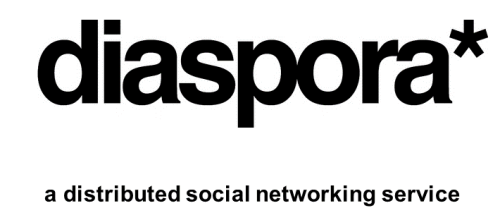

**Simon Bijl, Tejaswini Dandi, Selman Ercan, Revathi MC** 
+*Delft University of Technology*

## Abstract

*The past few years have brought a cascade of news of how our social networks are being monitored ranging from Wikileaks to Facebook's privacy issues. With the dawn of centralised social networks, comes the dusk of privacy. The centralised model is less trusted to keep any of the information private, or restricted to being viewed only by a small group of people. Diaspora presents a novel approach by providing users a decentralised social network, where users can register to one of the servers of the distributed network without any data centralisation. This chapter provides a map of the architecture of and the functionality provided by Diaspora and describes its path towards an online social world where users are in control of their data.*

###**Table of Contents**
- [Diaspora](#diaspora)
    - [Inception and development](#inception-and-development)
- [Organisation](#organisation)
    - [Stakeholders](#stakeholders)
    - [Context view](#context-view)
- [Features](#features)
    - [Main features](#main-features)
    - [Feature model](#feature-model)
- [Diaspora architecture](#diaspora-architecture) 
    - [Development viewpoint](#development-viewpoint)
    - [Deployment viewpoint](#deployment-viewpoint)
    - [Internationalisation perspective](#internationalisation-perspective) 
- [Project maintainability](#project-maintainability)
- [Conclusion](#conclusion)
- [References](#references)
        
## Diaspora

Social networking sites are gaining popularity in the recent years, and their usage has become a daily routine in everyone's life. With the increase in the growth of centralised social networks, there is a considerable increase in privacy concerns. Most of the sites try to walk a tightrope between offering users a private space to converse with their social media and feeding businesses as much user data as they can, in order to serve them effective advertisements. The most fundamental question to be answered is: "Is privacy dead?". The inception of Diaspora began by answering this question based on three key philosophies:  **Privacy, Freedom and Decentralisation**

The word Diaspora is of Greek origin and refers to a scattered or dispersed population. The name describes its main distinguishing factor with respect to mainstream alternatives: the distribution of user data across local servers ("pods") instead of containing them in a small number of centralised servers. The *star* sign in the logo also symbolises the dispersal of pods, focusing on its decentralised character. This approach has the advantage that a user can decide in which country his data should be stored and which laws are applicable to it.

Diaspora allows users to control which parts of their content can be seen by which of their contacts. This is achieved by the concept of *aspects*. Different aspects can be created, for example, family and work; content shared within one aspect is then invisible for contacts in other aspects. As data is stored within pods, owners of these pods are legally responsible, which helps in enabling the rights for supervision to prevent illegal data. 

In this chapter, we discuss the context, architecture and development of the Diaspora project with respect to various viewpoints and perspectives, illustrated in [Nick Rozanski Software System Architecture](http://www.nick.rozanski.org.uk/architecture) and its structure beyond the book.

### Inception and development

In 2010 the project was funded as a Kickstarter project, collecting over $200,000. Since 2012 the project is fully based on volunteer work. The image below gives a rough timeline of the project.

  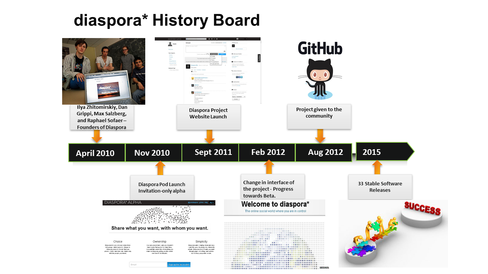

  Figure 1: Project History of Diaspora

##Organisation

In this section, the organisation and analysis of major stakeholders involved in the project are discussed. As the project is fully developed in GitHub, we also take issues and pull requests into account when searching for stakeholders. Finally, we present a context view that gives an overview of the external entities involved in Diaspora. 

###Stakeholders

Some of the stakeholder categories identified in Rozanski and Woods are included in this section. As the project currently involves less contributors, few of the stakeholders have multiple roles in the project. 

  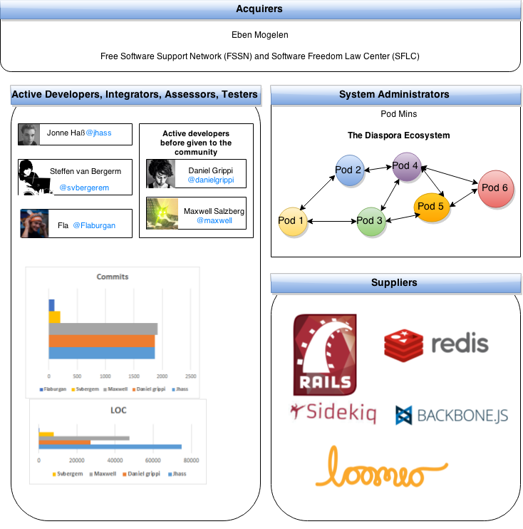

  Figure 2: Stakeholder Analysis of Diaspora

The Diaspora Foundation, which is part of the Free Software Support Network (FSSN), manages the Diaspora software development. Eben Moglen and the Software Freedom Law Center in turn run the FSSN. The FSSN provides resources to Diaspora development and manages Diaspora's branding, trademark, copyrights, finances and legal assets. Administrators who maintain the system once it has been deployed are called *podmins*, and the system administrators. Users of the network of nodes, mainly different individuals and organisations, can host a pod on their own server. 

Figure 2 shows that few of the developers work in multiple roles in the project.
The most active developer is [Mr. Jonne Haß](https://github.com/jhass) with 1872 commits, who also acts as an active community manager and integrator. Diaspora uses the GitHub issue tracking system and actively tags submitted bugs. On the issue board, especially the users Flaburgan and jhass are active contributors in terms of reactions. They almost always respond to confirmed bugs. Typically, [Flaburgan](https://github.com/Flaburgan) provides a better insight into the bug and jhass is often the one who comes with the bug fixes. Other active users are @goobertron, [@svbergerem](https://github.com/svbergerem). @jhass is the most active developer in pull request discussions; he reviews them thoroughly and has many comments on best practices and code style issues.

### Context view

The process of software architecture involves the concerns of both the internal and the external environment. In addition to the internal stakeholders, it is essential to give a definition of the environment of the system in terms of its relationships and dependencies. This need can be met by creating a context view as part of the architectural description. The figure below gives an overview of Diaspora's interactions with external entities. 

  

  Figure 3: Context view diagram of Diaspora

As seen from the figure, the most essential external dependencies of Diaspora can be categorised into three types: background processing, development environment and decision making tools. As Diaspora relies on a lot of network communication with other servers, background processing jobs are considered essential. This is mainly taken care of by [Redis](http://redis.io/) and [Sidekiq](http://sidekiq.org/). The development environment mainly consists of [GitHub](https://github.com/Diaspora/Diaspora) and [testing](https://wiki.diasporafoundation.org/Testing_workflow) frameworks. The process followed in the development environment is mainly discussed and decided in the central platform [Loomio](https://www.loomio.org/g/EseV9p4X/Diaspora-community), which acts a voting tool.

Parts of this diagram are expected to change in the near future. One such change is the integration of user data with more social networking sites and external services in addition to the four shown in the diagram. Another is the changing of the mailing list platform. Currently Google Groups is used for this, but many community members want to [switch](https://www.loomio.org/d/lKa0dbjz/replace-google-groups-mailing-lists-with-diaspora-forum-mailing-lists) to using Discourse within the Diaspora forum, as this is a tool that is in the hands of the community itself.

## Features
One of the characteristics that distinguishes Diaspora from many other networks is its networking features. In this section we give an overview of the main features provided by Diaspora and represent this graphically using a feature model diagram.

### Main features
* The main feature of Diaspora is its decentralised social network, which is constructed as a network of nodes, or pods, hosted by many different individuals and institutions. In the network, each node operates a copy of the Diaspora software acting as a personal web server.
* To the end users, it provides features which are similar to other social networks. Some of them are the following:
   *  Aspects: creating different sharing categories (for family, work, hobby, etc.).
   *  Designating posts as either "public" or "limited"; limited posts can only be seen by people within the corresponding aspect.
   *  Filtering news streams by aspect.
   *  Downloading all your images and text that were uploaded at any time.
   *  Sending private messages to others (called conversations).
   *  Integration with other social networks (Facebook, Twitter, Tumblr).
   *  Internationalisation and localisation.
   *  Commenting on, resharing and liking posts.
   *  Following tags.
* A feature aimed at pod administrators is the ability to host a pod on their own servers and, from that pod, interact with other users on all other pods. To create their pod, they can [install](https://wiki.diasporafoundation.org/Installation_guides) Diaspora* on their own system. The operating systems which support it are Linux, Mac OS, BSD, using automation to deploy on servers through Vagrant, Puppet, Capistrano and Ansible.
* Developers can write the code in Ruby, JavaScript and template/styling markup using any editor of their preference. They have a choice when it comes to the database to use, namely MySQL, PostgreSQL, or MariaDB. To attract more developers from around the world, the documentation in the wiki page is offered in different languages. 

### Feature model
A feature model is the representation of all the products of the Software Product Line as features. A feature is a system property or functionality that is relevant to some stakeholders.
It is used to capture commonalities or discriminate among systems in SPLs.

Variable features can be:
 * Mandatory
 * Optional
 * Alternative (XOR)
 * OR-features

Mandatory features are present in all products.
Optional ones may or may not be selected.
Among alternative features only one can be selected, while in OR-features it is possible to select one or more. Below is the feature model diagram of Diaspora.

  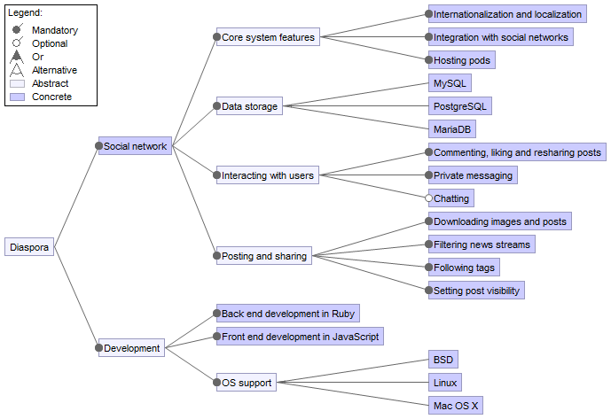

  Figure 4: Diaspora Feature Model

Most of the included features are mandatory. The OS support for development is an OR-feature; different operating systems are supported and it is possible to develop using more than one at the same time. The data storage feature is an alternative feature; various DBMSs are supported, but only one can be used at the same time. The chatting feature is optional.

## Diaspora architecture

In order to represent a complex system in a way that is manageable and comprehensible by a range of business and technical stakeholders, the only successful way is to attack the problem from different directions simultaneously. In this approach, the architecture definition is partitioned into a number of separate but interrelated views and perspectives, each of which describes a separate aspect of the architecture. Collectively these views describe the whole system. 

  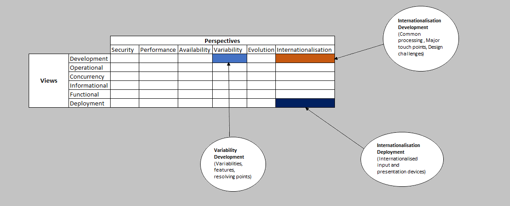

  Figure 5: Viewpoint Catalog

As shown in figure 3, we made use of some of the viewpoints and perspectives defined in Rozanski and Woods in analysing the architecture of Diaspora. In this section we will analyse the Diaspora project using two viewpoints (_Development_ and _Deployment_) and one perspective (_Internationalisation_).

We chose the development viewpoint as it is the fundamental viewpoint which describes the architecture that supports the software development process.

Being a social networking website, the Diaspora system may need to be accessed by users or operational staff from different parts of the world in different languages, either now or in future. Preferably, the system should therefore have the ability to be independent from any particular language, country or cultural group. This would also facilitate deploying the system into a number of different environments. This forms the basis of choosing the deployment viewpoint and internationalisation perspective.

### Development viewpoint
The developers of a system are considered as one of the most important stakeholders of an architecture description. The development viewpoint is suggested to satisfy the needs of the developers throughout the development process via codeline organisation descriptions, module structure models, etc. In this section, we present a development view for Diaspora.

#### Model-View-Controller architecture
In general, Model (M) is the central component of the MVC Architecture. Models are the objects, is the object oriented approach design. It encapsulates the data and the databases as well. The view (V) is the presentation layer. It is the layer which the user sees and interacts with. The controller (C) helps in processing and responding to events such as user actions. It invokes changes to models and views based on the user's action. Hence Model handles the data, Controller handles the decision and View handles the presentation. 

The operation of this architecture is illustrated in the following figure.

  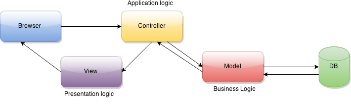

  Figure 6: MVC Architecture

As explained earlier, Diaspora's architecture consists of modules organised as models, controllers and views. The following figure shows which modules belongs to which part of the MVC architecture.

  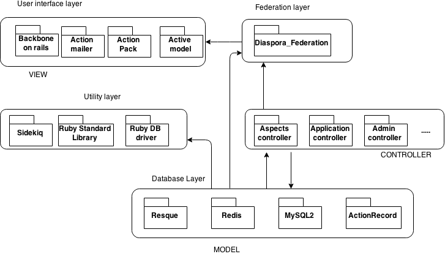

  Figure 7: Modular organisation

Redis, resque, mysql2, activerecord are the databases where Diaspora stores data and acts as models for the system. Diaspora uses [Sinatra](http://www.sinatrarb.com/) libraries for creating web applications in Ruby.

Diaspora uses controllers to communicate with the browser and has the code involved in making those decisions based on those actions. Hence it has numerous controllers such as `admins_controller`, `application_controller`, `aspect_membership controller`, `contacts_controller` and `conversation_controller`.

Diaspora uses JSXC in the front end of Diaspora's built-in chat feature. Diaspora uses [sidekiq](http://sidekiq.org/), which helps in taking all time intensive tasks outside the request cycle, which also forms the utility layer. Then the controller interacts with the model, which then communicates with the database and retrieves the data needed. The model can interact with the controller and go back to the database if needed. Finally, when the controller is satisfied to return its data to the browser, it sends its result to the view module, the presentation layer, which helps in handling the presentation to the user. Diaspora uses [backboneRails](http://www.backbonerails.com/ ) for the user interface. Diaspora uses [Federation](https://github.com/Raven24/Diaspora-federation) as a separate module, which supports the sharing of data between pods in a distributed network.

##### Source Code Structure
Diaspora is a Ruby on Rails application and the module organisation conforms to the Ruby on Rails project structure described in [application structure](http://en.wikibooks.org/wiki/Ruby_on_Rails/Getting_Started/Creating_the_application#The_Application_Structure). The project documentation is provided through [wiki](https://wiki.Diasporafoundation.org/Main_Page) where every single feature is precisely explained using workflows. The documentation on recent changes in the system is provided through the `Changelog.md` file. The Diaspora application structure is shown in the figure below. 

  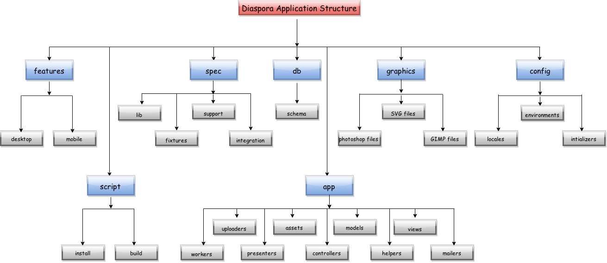

  Figure 8: The application structure of Diaspora

|**Directory Name** | **Description**|
| :-----| :-----|
| app | This folder contains the project's models, views controllers and the important source code |
| config | Contains all the necessary configuration files of the Rails application. Localisations, routes and all basic files can be found here. |
| db | All database related files go into this folder. |
| features | Code for the related desktop and mobile features are available here. |
| graphics | The files in this directory are "source" files for the graphics used in the Diaspora frontend. |
| script | This directory has scripts for Rails that provide a variety of tasks. These scripts link to another file where the "real" files are. Inside these folder generators, server and console can be found. |
| spec | RSpec tests are located in this directory. |

*Table 1: The content of the folders mentioned in figure 8*

##### Release Process

Diaspora uses the **release**/**major**/**minor**/**hotfix** versioning scheme, where **major**/**minor**/**hotfix** adheres to the [SemVer](http://semver.org/) versioning specification. This involves incrementing the **major** version for incompatible API  changes, the **minor** version for new backwards compatible functionality and the **hotfix** version for backwards compatible bug fixes.

The [new version release](https://wiki.diasporafoundation.org/Release_process) is agreed on in the meeting and the new version number is decided on as well. Once the new version is released, `Changelog.md` is updated with the details about the changes in the project.

### Deployment viewpoint

As mentioned earlier in the [architecture](#architecture), deployment viewpoint is considered essential for a system, which has users all around the world. This section provides a glimpse on the deployment environment of Diaspora.

#### Hardware requirements
An average-sized server executing the main functional elements of the system and allowing users to access the system should, at the very least, have 512MB of RAM (+1GB swap space) and a multi-core CPU. The storage hardware to support databases is having the required amount of hard disk space that the podmin expects that how many images the user may upload. If the podmin plans to run the database server on the same host then he should allow for at least double the amount of RAM and disk space. Diaspora requires valid [SSL](https://www.globalsign.com/en/ssl-information-center/what-is-an-ssl-certificate/) certificate for security and as cryptographic accelerator. 

#### Third Party Software requirements
Identifying the third party requirements helps the developers to know what software will be available for them to use and that the system administrators (podmins) know exactly what needs to be installed and managed on each piece of hardware.
In order to run Diaspora, it is essential to install the following dependencies:

* Build Tools - Packages needed to compile the components.  
* Ruby - The Ruby programming language.
* OpenSSL - An encryption library implementing the Secure Sockets Layer (SSL v2/v3) and Transport Layer Security (TLS) protocols .
* ImageMagick - An image processing library used to resize uploaded photos.
* Git - The fast version control system.
* RubyGems - Package manager for Ruby code libraries.
* Bundler - Gem management tool for Ruby projects.
* PostgreSQL - Backend storage engine.
* libcurl - A multiprotocol file transfer library. 
* Redis - Persistent key-value store.

#### Technology incompatibilities

|Software/Hardware elements|Incompatibility|
|:------|:-------|
| Ruby| It is recommended to use [Ruby Version Manager](http://rvm.io/) which helps in ensuring that the system is  always on the currently recommended Ruby version and also helps in cleanly separating the Diaspora installation from all other Ruby applications on the machine. If the Ruby version Manager is opted for, it is better to ensure that the Ruby version is at least 1.9.2-p320, as prior versions are incompatible. However this version is not maintained with security updates from the Ruby core team anymore. Hence it is recommended using the latest release of the 2.0 series.
| RubyGems |  If using Rails 2.x, then it is recommended to start using RubyGems from version 1.3.x.|
| Redis server| Diaspora uses versions 2.6 and later releases for Redis server. It is recommended to use [PPA](https://launchpad.net/~chris-lea/+archive/ubuntu/redis-server) for installing the latest version.|
| OpenSSL | At least version 0.9.5a of the OpenSSL libraries should be used. |
| Bundler | Bundler 1.0 requires a minimum RubyGems version of 1.3.6 and Ruby version of 1.8.7. |
| PostgreSQL | To use the PostgreSQL with Ruby, at least version 8.2 is recommended.|

*Table 2: Incompatibilities of Software/Hardware elements*

### Run time platform Model

This is an important model for the deployment viewpoint. This model defines:
* The set of hardware nodes that are required by the system.
* Nodes need to be connected to which other nodes via network interfaces.
* Software elements are hosted on hardware nodes.

The Runtime platform Model of Diaspora is shown below:

  

  Figure 9: Runtime platform Model

For every pod system few hardware requirements need to be satisfied like size of the RAM, disk space needed type of CPU recommended etc. And the software elements necessary for the pod are database technology, protocols that are needed to use for file transfer, or for security between the layers etc. The Diaspora social network is constructed of a network of pods(nodes), which are hosted by many different individuals and institutions. Each pod is operated with a copy of the Diaspora software which acts as a personal web server.

## Technology Dependency Models

This model defines the technology dependencies that are needed for a environment on a node-by-node basis. The following table provides the dependency model of Diaspora. 

| Layer | Components |
|:------------|:-----------|
| Database Layer | PostgreSQL is recommended but can also use MySQL ; Redis ; Resque |
| Network Layer | OpenSSL for encryption library ; libcURL for file transfer library |
| Utility Layer | Sidekiq ; Ruby standard library |

*Table 3: Software dependencies for the primary server node*

### Internationalisation perspective

 [Network statistics](http://pods.jasonrobinson.me/) of Diaspora from the latest release version shows that users are from more than 30 different countries and differ in languages and culture. For any system that has users who speak different languages or come from different countries, the internationalisation perspective is considered important to meet the explicit needs of the user. This section provides an overview on this perspective on the Diaspora system. 
 
#### Current process 

##### Translating wiki

Diaspora allows users to edit and translate the project wiki by adding language templates on the top of the page and translating the content. However, it allows only the translations of wiki pages, restricting translations of installation guides. Hence users installing Diaspora software will have to have a reasonable grasp of English in any case. This mainly attributes to the risk of maintaining outdated installation instructions in different languages. It doesn't allow any  [namespaces](https://www.loomio.org/d/lXq8SymH/translating-the-wiki?proposal=JT1RB4wh) for all the non-English content. 

##### Translating other parts of the project

Diaspora uses extensions such as [Siefca](https://github.com/siefca) made for Rails and the [I18n gem](https://github.com/svenfuchs/i18n) gem for translating languages with higher inflection and grammar different to English. [I18n-Inflector](https://rubygems.org/gems/i18n-inflector) is the library that contains backend module for I18n that adds some extra functionality to standard backend. It overwrites the translate method in a way that it will interpolate additional inflection tokens present in translations. These tokens may appear in patterns which are contained within `@{ and }` symbols. Configuration is stored also in translation data, in a scope `<locale>.i18n.inflections`, where `locale` is a [locale](https://github.com/Diaspora/Diaspora/tree/master/config/locales/inflections)  subtree. [I18n-Inflector-Rails](https://rubygems.org/gems/i18n-inflector-rails) is a plugin module that provides I18n Inflector module, integration with Rails. It's intended to be used in projects where translations are performed by many people, yet there is a need to inflect sentences or words by users' gender, person or other data.

By default rails-i18n loads all locale files, pluralisation and transliteration rules available in the gem. Manual installation can be done by downloading the locale files that are found in the directory [locales](https://github.com/svenfuchs/rails-i18n/tree/master/rails/locale) and putting them into the `config/locales` directory of the Rails application. Language can be chosen in accordance with [ISO 639-1](http://en.wikipedia.org/wiki/List_of_ISO_639-1_codes) or [ISO 639-2](http://en.wikipedia.org/wiki/List_of_ISO_639-2_codes) standards. Diaspora uses [WebTranslateIt](https://webtranslateit.com/en/projects/3020-Diaspora) which combines translation management and software translation in one easy to use platform. Language statistics acts as a tool in evaluating the proportion of Proof read and untranslated terms. 

#### Major touch points 

  

  Figure 10: Major Touch points of Diaspora around the globe

This concern focuses on identifying all the major touch points (where a person interacts with the system), its scope of services and information that need to be internationalised in each of these touch points and system's region of concerns. The regions plotted in the diagram show the major touch points of the Diaspora system. The data is retrieved by taking the regions of active pod administrators, regions which have their languages translated at higher rate and regions which has its recent updates on languages. 

  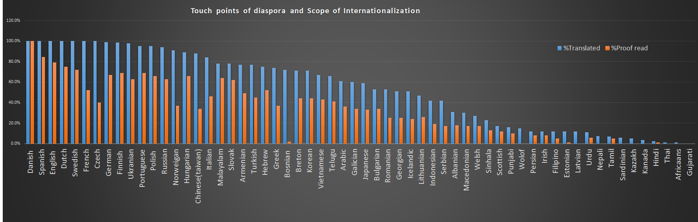

  Figure 11: Scope of internationalisation of Diaspora

 
 
The chart is plotted by taking the values on percentage of translated data and proofread data in the Diaspora system. The chart shows clearly the proportion of translated data and proofread data in different languages in the Diaspora system. It can be seen that, though some of the languages has been translated to its maximum extent, there still remains some maintainability concerns in proofreading the translated data and finalising the changes needed to the system.

It should also be noted that currently no locales are complete, lacking keys such as `activerecord.errors.messages.record_invalid` and `activerecord.errors.messages.restrict_dependent_destroy`. 

#### Architectural challenges

Successful internationalisation depends on a clear separation of presentation and content. The Model-Controller-View architecture helps in separating the presentation logic from the data logic, which helps in adding locales with ease for different languages. In Diaspora information and error messages are held in dynamic message databases, with variable parameters inserted at runtime. This also helps in greater flexibility over message content. Diaspora also uses specialised display for languages such as Arabic, Urdu which has a different oriented text.The underlying platform is internationalised, which has the ability to store unicode in data stores. Though most of the architectural challenges are met in the system, it heavily relies on contributions for translating the software and website. This makes the process of translations and proofreading a bit slow. 

## Project maintainability

Software always needs new features and bug fixes. Diaspora currently has 197 open issues on new features that have been requested by users. Being an open source project it is essential to have a maintainable software system which is easy to extend and fix, which in turn encourages the software system's uptake and use. Furthermore, releasing maintainable open source software during the project's lifetime will help other developers in fixing bugs or making extensions with minimum effort. Hence the developers of open source software have to develop their codebase with an intent that it will live on after the project is complete.

In this section we evaluate the maintainability of the Diaspora project. We define four metrics and present our measurement results for these.

##### Code complexity and duplication

The quality profile below is plotted by evaluating the cyclomatic complexity in the Diaspora codebase, through analysing every single line of code by the risk category instead of summation or average median method. Code complexity is analysed using Saikuro, which is a Ruby cyclomatic complexity analyser. When given Ruby source code Saikuro will generate a report listing the cyclomatic complexity of each method found. Some of the Classes/Modules which is under High risk category include `AspectsController`, `ConversationsController`, `PhotosController`, `StatusMessagesController`, `UsersController` and `PeopleController`. Duplication of code attributing to high risk category can be seen in the modules `PeopleController`, `StatusMessagesController`.

  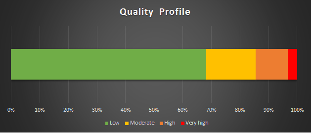

  Figure 12: Quality profile of cyclomatic complexity

|**Cyclomatic Complexity**|**Risk Category**|**Percentage of code**|
|:--------|:-------|:-----|
|1-5| Low|70%|
|6-10|Moderate|16%|
|11-25|High|11%|
|>25| Very High|3%|

*Table 4: Quality profile*

##### Maintainability trends

Below is a diagram generated by the CodeClimate plugin running on the Diaspora codebase. It shows the change in the number of classes per risk category over a period of four months, prior to the last release;`Diaspora 0.4.1.2`on October 30th, 2014.

  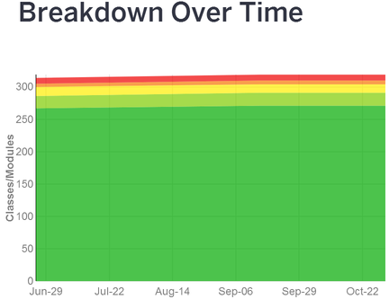

Figure 13: CodeClimate Maintainability trends

The first thing to note is that only the dark green area is increasing in height, meaning that most of the newly created classes and modules are in the _very low risk_ category.
 
A second observation we can make, however, is that the amount of classes and modules in higher risk categories tend to remain the same. It shows that there are quite a number of parts in the codebase that need refactoring and aren't yet taken up. This can also be seen as subjective evaluations, in some of the  [documentation](https://wiki.diasporafoundation.org/Development_features_wishlist) reports given by the core team. 

## Conclusion

In this chapter we have studied the stakeholders and architecture of the distributed social networking service Diaspora.
The project was launched in 2010 as a novel approach to social networking, promoting freedom and privacy.

The number of different stakeholders involved in the project is not much; there is a relatively small number of people who do most of the important things.
They do strive to involve the Diaspora community in decisions, though; discussions and votes are held on Loomio for a variety of issues. 

The project has many external dependencies.
One reason for this is the distributed character of the system, necessitating the application of different tools.
Another reason is the integration of user data with external services; having this is useful for attracting more users to Diaspora from other networking sites.

The choice of MVC architecture creates a flexible environment for diaspora to add in new features. The separation of concerns through mapping of database, user interface, utility and database layers helps in internationalisation and localisation of content with ease. Diaspora manages the dependencies within the development or test environment by bundling the software and its dependencies into one deployment unit. The deployment environment of Diaspora is designed as a part of architecture definition rather than as part of a separate exercise performed after the system has been developed. 

We carried out measurements to analyse the current state of maintainability of the Diaspora codebase.
The results of these showed that one third of the code was in at least a _moderate_ risk category.
Expected, but worrisome nonetheless, is that this corresponds to the more important and often used parts of the code: the parts related to aspects and users, for example. This is mainly due to the few unresolved code refactoring issues in the past years. However, Diaspora tends to gain momentum through its continuous integration environment where it is possible to evaluate code complexity over time. 

Our advise to the development team of Diaspora is to improve the user experience of the distributed aspect of Diaspora. Most users of a social network would not like to care which pod a certain friend is: a user just wants to connect to a certain friend without hazzle about pods. To make diaspora a real success, it is also highly desirable to find a new source of earnings to finance full time staff, although this is easier said than done.

To conclude, Diaspora has an expressive, stable and flexible internal architecture but has some maintenance issues; it is reasonable to expect progress in these issues once the project reaches a critical mass of users and developers.   

## References
* [Diaspora GitHub project](https://github.com/diaspora/diaspora)
* [Diaspora wiki](http://wiki.diasporafoundation.org/)
* [JoinDiaspora](http://www.joindiaspora.com/)
