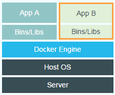
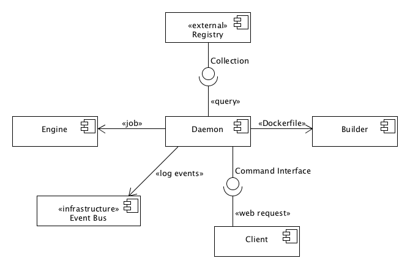
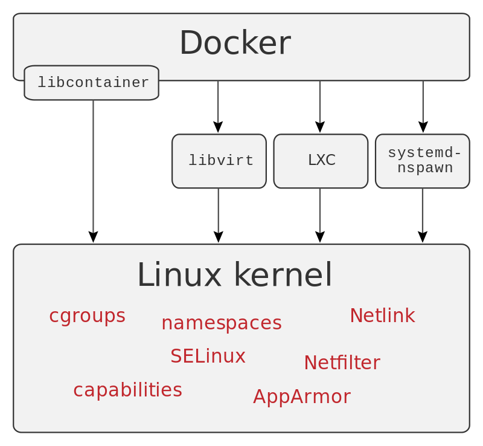
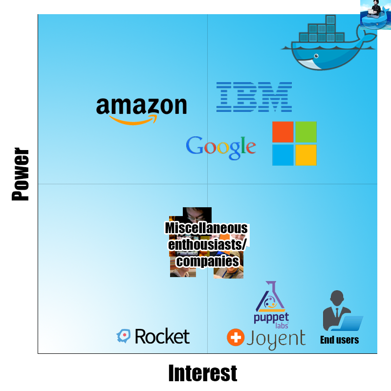
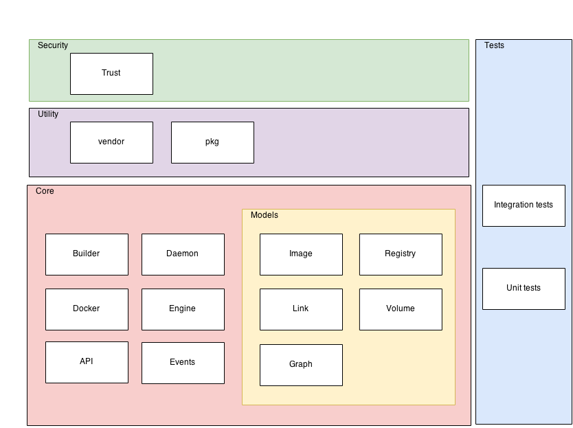
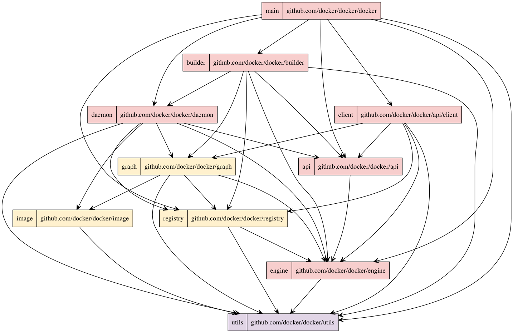

# Docker: Build, Ship and Run Any App, Anywhere
**[Martijn Dwars](https://github.com/MartijnDwars), [Wiebe van Geest](https://github.com/wrvangeest), [Rik Nijessen](https://github.com/gewoonrik) and [Rick Wieman](https://github.com/RickWieman)** 
*Delft University of Technology*

**Abstract**

*[Docker](https://www.docker.com/) is designed to run isolated environments in so called containers, without the overhead of virtual machines.
This document gives an overview of the source code of the project. The architecture is analyzed, discussing both stakeholders of the system and the design of the modules within it.
One of the ways in which this architecture is managed is through the development process.
The knowledge gained by hands-on experience with this process is used to explain it.
After this, a current big development within Docker, the porting to Windows, is discussed with regards to challenges and some ways in which the difficulty of the porting can be measured.*

**Table of Contents**

1. [Introduction](#introduction)
1. [What is Docker?](#what-is-docker)
1. [Usage Principles](#usage-principles)
1. [Architecture](#architecture)
	1. [Stakeholders](#stakeholders)
	1. [Modules](#modules)
1. [Development Process](#development-process)
1. [Windows port](#windows-port)
	1. [Challenges](#challenges)
	1. [Metrics](#metrics)
1. [Conclusion](#conclusion)

## Introduction

Docker started off as an internal project at [dotCloud](https://www.dotcloud.com/), but was released as an open-source project in March 2013.
Only a few months later, dotCloud, Inc. [changed its name](http://blog.docker.com/2013/10/dotcloud-is-becoming-docker-inc/) to Docker, Inc. as the Docker project had became so popular.
This is one of the aspects that makes the Docker project very interesting to investigate.
On the one hand it is backed by a company that can ensure continuity and quality.
On the other hand it is supported by a large community of contributors that provide lots of feedback and proposals for new/improved features.

In this chapter, we analyze the architecture of the Docker project and its environment.
We will first describe more detailed what Docker is and how it can be used.
Then we look at the architecture, in terms of its stakeholders and its modules (i.e. the structure of the code).
Afterwards, we discuss the development process by looking at the workflow of the project.
Additionally, we look at the challenges of porting Docker to Windows and we identify some metrics to measure the portability.
We end this chapter with a conclusion.

## What is Docker?

Practically every piece of software is dependent on other software to run: some programs need Java, others require .NET, et cetera. 
The software developers are well aware of what supporting software is required for their program, but the responsibility for having that software lies with those deploying the program. 
This can lead to a cumbersome process of acquiring the proper software, making sure everything required is present and manage the supporting software of multiple programs, which may or may not be compatible.
Docker aims to direct the responsibility of having the proper supporting software to those that have the most knowledge about them: the developers. 

Docker does so by running isolated, virtual environments in so called containers.
These containers are created by developers and can contain both the developed program and all other necessary software.
Normally this is done by using virtual machines, but this results in a large overhead caused by the hypervisor that creates and runs a virtual machine.
Docker makes it possible to create isolated environments without this overhead by running the processes in the kernel of the host OS, which eliminates the need for a guest OS.
The figures below illustrate the difference between using a virtual machine on the one hand and using Docker on the other.

 _Traditional Approach to Virtual Environments_

 _Docker's Approach to Virtual Environments_

To run such a container, an image is needed.
An image is the read-only description of a container, from which multiple containers can be run.
Images can be built by hand (git-like functionality, e.g. commits) or by using a manifest (a `Dockerfile`).
Building an image by hand starts with obtaining a base image. Changes can be applied using commands in a shell. These changes are then committed and layered onto the base image.
This process is hard to automate or execute repeatedly (e.g. for every new release), so Docker also supports `Dockerfile`s.
Writing a `Dockerfile` is like writing a recipe: define the base image, define the commands that should be run, the files that should be added, et cetera.
Docker can then automatically build the image by executing this `Dockerfile`.
Internally, Docker uses the same functionality as the commit command to execute a `Dockerfile`.

To take a closer look at the structure of the Docker project, we first identify the functional elements of Docker.
The relation between those elements is depicted in Figure [_Component diagram of Docker_](#component-diagram). The subsequent table provides a small description of each element's responsibility.

_Component diagram of Docker_

Element   | Responsibility
-------   | ------------------------------------------------------------------
Builder   | Parsing Dockerfiles and building images based on the contents of those Dockerfiles.
Client    | Providing a user interface (CLI) to interact with Docker
Daemon    | Running containers and storing images
Engine    | Storing containers and manipulating these containers by executing jobs
Event Bus | Providing a publish-subscribe interface for events
Registry  | Storing images and providing an interface for pulling those images

Table: Responsibility of each identified element

At the heart of Docker is [libcontainer](https://github.com/docker/libcontainer). 
Libcontainer provides an interface to making containers inside a host OS. 
It uses namespaces, cgroups, capabilities, and filesystem access controls to isolate containers. Until version 0.9 Docker used [LXC](https://linuxcontainers.org/) for this purpose and it is still possible to swap libcontainer for LXC (see Figure [Virtualization Abstraction](#virtualization-abstraction)). 
However, by using their own interface they are able to drastically reduce the number of moving parts [[ref]](http://blog.docker.com/2014/03/docker-0-9-introducing-execution-drivers-and-libcontainer/) and no longer depend on userland packages. 
The libcontainer project attracted a number of companies to support Docker, such as Microsoft, Google, IBM, Red Hat, and Canonical [[ref]](http://www.zdnet.com/article/docker-libcontainer-unifies-linux-container-powers/).

_Virtualization abstraction_

## Usage Principles
When starting to use Docker you will notice that it poses some restrictions on the application containers. Specifically, Docker encourages containers to be:

1. Layered
2. Application per container
3. Stateless

### Layered
As all changes are committed on top of the previous change, an image has a layered structure (see the [Figure](#layered-structure) below).
This also allows the use of previously built layers/images.
For example, when you have only changed the source code of your application, only the layers starting at importing your source code have to be rebuilt, i.e. the dependencies do not need to be built/installed again.
Intermediate layers are cached by Docker, so only the changed layer and all layers on top of that need to be rebuilt.

_Layered structure of an image_

### Application per Container
It is considered a best practice to run a single process in a single container [[ref]](https://docs.docker.com/articles/dockerfile_best-practices/#run-only-one-process-per-container). This best practice becomes obvious in several places:

- The official base image, such as the Ubuntu base image, lacks common Unix features. In particular, the base image does not contain `init`, `service`, `ssh`, `syslog`, and `cron`.
- The command to run a container is `docker run image [command]`. Docker runs the process that is given as *command* and nothing else. To run multiple processes, one should install a process management tool (such as [supervisord](http://supervisord.org/)) or run a process that in turn runs multiple other processes.

A common example of this *application per container* practice is a LEMP (Linux, nginx, MySQL, PHP) stack. A separate containers is created for the load balancer (nginx), webserver (PHP), and database (MySQL). Docker provides several methods for [linking containers](https://docs.docker.com/userguide/dockerlinks/).

### Stateless
It is a best practice to keep containers [ephemeral](https://docs.docker.com/articles/dockerfile_best-practices/#containers-should-be-ephemeral), which means that a container should be stopped, destroyed, rebuilt and put in place without much effort. This usually comes down to designing containers to be stateless. This should be taken into account when designing the architecture of your application. 
Data should be located outside of the application container, either on the host system or a designated storage container. 
For the former, Docker provides [data volumes](https://docs.docker.com/userguide/dockervolumes/). The latter can be achieved by running a designated container for e.g. your database.

There is another argument for keeping your containers stateless: as explained in the previous section ([Layered](#layered)), only the top layer of a container is writable. However, when the container is stopped this layer is removed and the contents are lost.

## Architecture

An integral part of software production is designing the architecture. 
A good architecture can ensure maintainability, modularity, decoupling and many more positive properties.  
This section will describe Docker's approach to its architecture. First the stakeholders are discussed, describing the types of persons and organizations involved with the project. Then Docker's modules are described, explaining the way Docker distributes its functionality. 

### Stakeholders

Stakeholders play a crucial role in the design of software. The requirements and desires of each stakeholder have to be taken into account and managing these can prove a difficult task. The identification of the stakeholders and their desires is the first step to accomplishing this.

The most important stakeholder is Docker, Inc., the company that practically created and now develops Docker. The corporation itself acts as one of the suppliers, since it provides the product directly to customers. As the main driving force behind Docker, its employees cover multiple stakeholder roles:

* Developers
* Maintainers
* Support staff

Among the developers are also employees of other companies, working on Docker in a partnership. Employees from Microsoft, IBM and Google are among the top 50 contributors to the project. Obviously, these companies are also important stakeholders. Because of their sponsorship (in the form of employees), they are viewed as acquirers: they allow Docker to continue to develop and expand.

Maintainers are the only persons allowed to merge pull requests and can be found in the [maintainers file](https://github.com/docker/docker/blob/master/MAINTAINERS). They consist of both Docker employees and others that have proven to be knowledgeable of the project.

Another big group of stakeholders are the suppliers. Companies offering Docker based services have a big interest in its development. Examples of suppliers are companies that offer Infrastructure as a Service with built-in support for Docker, such as [DigitalOcean](https://www.digitalocean.com/features/one-click-apps/docker/) and [GiantSwarm](https://giantswarm.io), but also [Docker Hub](https://hub.docker.com/), offering tools for building and sharing containers.

_The Power/Interest curve for Docker_

The [Figure above](#docker-pi) provides an overview of the power versus interest curve, which represents how much power and interest a given stakeholder has in the system.
On the top right, with the most power and interest, there are two stakeholders: Docker, Inc. and Solomon Hykes.
The first being the company supporting Docker, the latter being the inventor of Docker (also referred to as the [benevolent dictator for life](http://en.wikipedia.org/wiki/Benevolent_dictator_for_life)).
Google, Microsoft and IBM also have quite some power and interest in the Docker project, as they contribute to the source code and provide Docker on their systems.
Amazon provides Docker on their infrastructure, which gives them high power, but not so much interest, as Docker is just one of the many systems they provide.
There are also many other enthusiasts and smaller companies, that have quite a lot of interest, but not so much power, as they are just one of the many contributors.
It is self-evident that the end users have a high interest, but almost no power.
This also holds for Joyent and Puppet, two companies using Docker for their products.
Finally, there are also competitors, like Rocket, that have a little interest (and low power), as they probably want their product to be better than Docker.

### Modules

Docker has a clear modular structure.
Each module is represented by a directory in the root of the project.
These modules can be grouped together according to the layer they reside in.
The Docker project can be divided into four layers: core, utility, security, and test,
as shown in the figure displaying the [Modular Structure of Docker](#docker-modular-view).
Most of the modules that had their functionality described in Figure [_Component diagram of Docker_](#component-diagram) reside in the core layer of Docker.

_Modular Structure of Docker_

Most functionality is implemented in the core layer.
The `Daemon` module is responsible for constructing containers.
It uses the `Builder` module to parse Dockerfiles.
The `Docker` module represents the client.
The `API` is responsible for communication with the daemon.
The `Models` sub-layer contains representation of the main concepts within Docker, i.e. `Image`, `Registry`, `Link`, `Volume`, and `Graph`.
The models are used by all core modules.

The utility layer contains `vendor` and `pkg`.
The former contains third-party code, i.e. code that is not necessarily maintained by the Docker team. In the Go language it is encouraged to copy external dependencies to your own repository [[ref]](https://github.com/golang/go/wiki/PackageManagementTools).  
The latter contains packages that are maintained by the Docker team, but that are not specific to Docker's internals.
The `security` layer contains trust-related code, a concept that is used for managing authentication and authorization using public key cryptography. 
Finally, Docker uses both integration tests and unit tests, as indicated by the `Tests` layer.
This layer is represented by a vertical box, because testing occurs in all layers of the system.

_Module Dependencies_

Finally, the [Figure above](#docker-dependencies) shows an overview of the dependencies between the most important modules. This graph was generated by statically analyzing the source code. The colors correspond to the colors in the Figure describing the [Modular Structure of Docker](#docker-modular-view): pink nodes are core modules, yellow nodes are domain models and purple nodes are utilities. 
It should be noted that the figure shows just high-level dependencies of a subset of the project. This set was chosen because of it being the core of the project and a good representation of the dependency distribution in general. 

The figure starts at the top with the `docker` module, which is the entry point of the application. The important thing to note about this picture is that all dependencies contain arrows downward; there are no circular dependencies. Architectures without circular dependencies are usually easier to understand and maintain [[ref]](http://www.objectmentor.com/resources/articles/granularity.pdf).

## Development Process

Docker is an open source project with dozens of contributors. 
Maintaining a proper architecture can be a challenge when working with this many developers, especially since most are not part of Docker, Inc. 
This section will give a description of how Docker's architecture is maintained and how contributions are managed. 

The Docker project is very well organized and relies heavily on the issue tracker on GitHub.
For example, feature proposals, design proposals and bug reports (except security issues) can be submitted.
From these issues, PRs are created by the community (i.e. external contributors) or the maintainers themselves.

Once a PR gets submitted, an extensive review process begins.
For a start, all commits need to be signed; if this is not the case, the author of the PR gets an automated reply that he needs to sign and re-push his commit(s).
New PRs always get marked with a `triage` label, meaning that the PR needs some basic checks and the right label for the next step.
This next step can be either a `design review`, a `code review` or a `documentation review`.
A design review is a review on a high level, i.e. whether the implemented feature fits in the project. 
It might not be appropriate for the release currently in development, it could be outside of the scope of Docker or it requires functionality that is currently not available. 
Code review means that the code itself gets reviewed. This review consists of, among others, the appropriate location of the code and its general quality. 
The documentation reviewers assess whether the updated content in the documentation needs to be looked at. These reviews are done by Docker, Inc. employees or other explicitly authorized contributors: the maintainers.
Maintainers generally only have permissions to approve proposals and reviews for their assigned modules.
After the PR gets enough LGTMs from maintainers, the PR either gets merged or gets labeled that it should be merged.

Not only PRs get labeled; issues get labels as well.
Usually to mark bugs or to make clear that issues belong to a certain part of the project (e.g. networking, distribution, platform).
Additionally, certain issues get a label to indicate the difficulty. 
These difficulty indicators give an indication of the experience needed to contribute to the project. There are five levels, ranging from `exp/beginner` to `exp/master`. 
Each level is a guideline that indicates in how far a contributor can help solve issues that might require more knowledge of Docker. 
This is a great way for beginning contributors to familiarize themselves with the Docker contribution process, as much as it ensures that difficult issues are looked at by expert contributors.  
Docker's [Contributor Guide](https://docs.docker.com/project/find-an-issue/) explains this and more in detail.

## Windows port

On October 16, 2014 Microsoft announced a partnership with Docker, Inc. to bring Docker to the Windows platform [[ref]](http://news.microsoft.com/2014/10/15/dockerpr/). 
This partnership includes Microsoft developers being dedicated to the Docker project. One such employee has even been top contributor for some time [[ref]](https://twitter.com/taylorb_msft/status/577862692955820032).  
Before this project started, Docker was only useable on Linux. The goal is to make it possible to run containers on Windows Server.
The Docker client, which can be used to manage Docker containers running on Windows, has already been ported to Windows [[ref]](https://github.com/docker/docker/pull/9113). Developers from Microsoft are currently porting the Docker daemon to Windows at the Microsoft fork of Docker [[ref]](https://github.com/microsoft/docker/tree/JJHWindowsDaemon). 
In this section the challenges of porting Docker to Windows will be discussed. After this, metrics to be able to asses the portability of Docker will be introduced. 

### Challenges

Porting Docker to Windows is quite a challenge: it was not designed with portability in mind and Docker uses low-level features from the Linux kernel. Microsoft, however, is currently implementing similar features into the Windows kernel. Furthermore, it uses a lot of Linux specific features, such as Unix sockets and Linux specific storage drivers. Therefore, code should be refactored into modules in which functionality is implemented on a higher level. 
The operating system specific code should then be implemented on a lower level. On March 10, 2014, Docker did this by introducing an execution driver API, which can be used to customize the execution environment surrounding each container [[ref]](https://blog.docker.com/2014/03/docker-0-9-introducing-execution-drivers-and-libcontainer/). 
This makes it very easy to implement OS specific container functionality and therefore makes porting Docker to Windows much easier. The same driver API has been introduced for networking and a graphdriver API is added which abstracts (layered) filesystems away.

In addition to the architectural challenges, a lot of `Linuxisms` are included into Docker. For example, in Windows it is common to use the registry to get configuration settings. In Docker, however, dotfiles and commandline parameters are used, the former of which is commonly used in Unix environments.

In the short term the goal is to make the Docker daemon compile for Windows. This process is described in a proposal [[ref]](https://github.com/docker/docker/issues/10662) by @[jhowardmsft](https://github.com/jhowardmsft).
Dummy Windows drivers without functionality will be added to reach this goal, which means that the daemon will momentarily not have any functionality on Windows.
The long term goal is to write the actual implementation, so that the daemon can run on Windows.
This work is done in the Microsoft fork of Docker [[ref]](https://github.com/microsoft/docker/tree/JJHWindowsDaemon).
This approach has its disadvantages, as it will probably result in one large pull request into the project.   

### Metrics

The required changes to accommodate the port to Windows affect multiple aspects of the Docker project. This might have consequences for the quality of the software. In order to be able to keep an eye on this, some metrics are suggested.  
First, a goal is stated that specifies what should be achieved. 
Next, some questions are given, the answers to which will help give insight into the progress of achieving the goal. The answers of these questions consists of a combination of metrics given per question. After the questions and metrics are listed, the motivation behind them is given.  

The goal of these measurements is to **improve** the **portability** of **Docker** for its **developers**.  

Portability is, according to [ISO 25010:2011](http://www.iso.org/iso/catalogue_detail.htm?csnumber=35733), defined as the degree of effectiveness and efficiency with which a system, product or component can be transferred from one hardware, software or other operational or usage environment to another. 
The main aspect of portability that applies to the Docker project is *adaptability*: the measure of the ability of the system to be able to change, specifically when a high portability is desired. 

The questions relating to this goal and the corresponding metrics are defined as follows:

- **Q1: How adaptable is the system?**  
  1. Number of methods/function in a file containing `+build` followed by an operating system, divided by the total number of methods.
  1. Number of methods/functions that make calls to the Go `syscall` package and not contained in metric 1, divided by the total number of methods.
  1. The McCabe complexity of methods/functions that make platform-specific calls.

- **Q2: Has the adaptability improved during the past year?**  
  1. The evolution of metric Q1.1 per week for the past year.
  1. The evolution of metric Q1.2 per week for the past year.

- **Q3: What is the level of knowledge of specific operating systems?**  
  1. Number of contributors that have knowledge of Unix.
  1. Number of contributors that have knowledge of Windows.
  1. Distribution of the knowledge among Windows and Unix.

**Question 1** relates to how many changes are required to adapt the system to a new operating system.
Files containing `+build` followed by an OS are specific for that OS and will likely have to be changed or remade. 
The `syscall` package contains OS specific calls, so any code containing it will have to be looked at.
The McCabe complexity gives an indication of the effort required to change the mentioned methods. 

All these metrics can be mapped to numbers, which makes them easy to evaluate and compare to each other.

**Question 2** is designed to track the progress of the adaptability. Ideally, the amount of system specific calls should decrease over time. This can be measured by keeping records of the results of the metrics of question 1.

**Question 3** covers the knowledge distribution within the work force. It is important to have enough developers proficient in a supported operating system and ensure that the distribution between these is similar. A shift in this distribution could, for example, result in a lack of insight into the effect of changes on one OS or another. 
These metrics could be measured using questionnaires to identify experts and interviews to assess their actual knowledge.

These three questions should help to gain insight into the improvement of the portability of Docker.

## Conclusion

Docker is a product designed to make life easier for developers and software deployers equally. 
It allows the creation of stand-alone containers without the overhead of a similar virtual machine. 
It is designed as an open project, which introduces challenges as well as advantages.

Overall, the architecture of the Docker project is well-maintained. 
There is one very important reason for this:  
Despite the popularity of the project, the design reviews, code reviews and documentation reviews are executed very thoroughly.
This ensures that contributions from not just Docker, Inc. employees, but also those from external parties like IBM, Microsoft and others fit in the overall design of the project.

An important aspect of the Docker architecture is its modularity. 
All models have one responsibility, which fits the Unix philosophy. 
This design choice allows for good testability and provides a clear structure of the code.  
Another such enforced design choice is the driver model. 
Several components are designed as a driver (e.g. storage driver, engine driver), which allows for an easier porting of that specific part of the code to another platform, or to providing a new driver with another implementation.

Developers looking to contribute to the Docker project have an abundance of resources to help them get started. A contributor guide is available on the Docker website, a ranking system is maintained to indicate the difficulty of an issue and the maintainers are helpful in their comments and criticism. 

Among other features, a lot of effort is currently put into porting Docker to Windows.
This is a very intensive process, as the core of Docker relies on many platform-specific (Unix) system calls, that are not available (or implemented differently) on Windows.
Microsoft is providing employees that are dedicated to develop a Windows version. 
They are currently in the process of creating a dummy client version that can compile on Windows, but without some required functionality to work.

The metrics provided in this document can assist the project managers in keeping an overview of the Docker project’s ability to adapt to new operating systems. At the moment, this is a very interesting insight, since the port to Windows is an excellent opportunity to increase the adaptability. An opportunity that the Docker developers seem to be taking with both hands.

All in all, Docker is a very structured project, resulting in a stable product that is widely used by major companies. It allows enthusiasts and corporations alike to help them improve what already exists and increase its quality.
