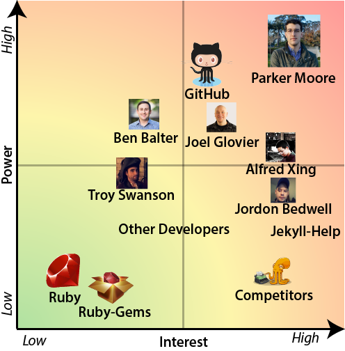
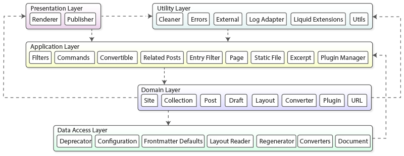
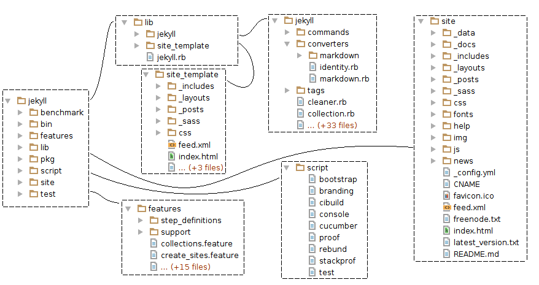
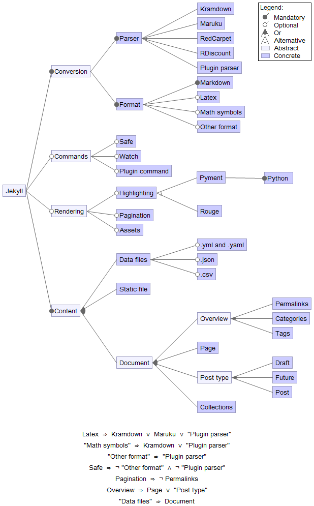
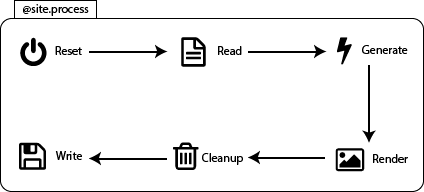
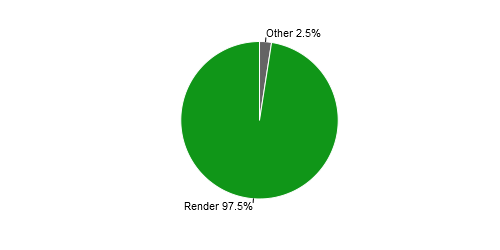
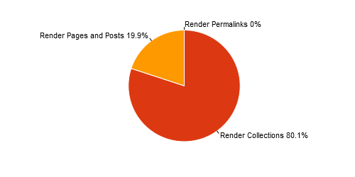
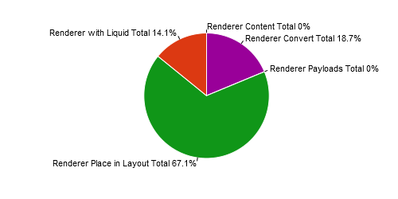
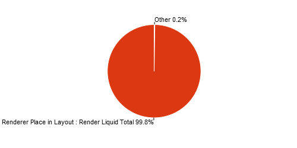

# Jekyll - A Simple Static Site Generator

<!-- -->

**[Joop Aué](https://github.com/JoopAue), [Anton Bouter](https://github.com/abouter), and [Martin Rogalla](https://github.com/MartinRogalla)** 
*Delft University of Technology*

**Abstract**

*The Delft Students on Software Architecture Jekyll chapter gives a concise well-structured overview of Jekyll's Software Architecture by providing perspectives of the various aspects that are important to its development.
The involved stakeholders and context view are used to fully explain the extent of Jekyll's outside influence.
This is followed by an in-depth developer's perspective after which Jekyll's variability and performance are analyzed.
These insights will not only make it easier for people to join the community and contribute to the project, but will also give the Jekyll core team an outsider's observation of Jekyll's Software Architecture.*

**Table of Contents**

* [Jekyll - A Simple Static Site Generator](#jekyll---a-simple-static-site-generator)
  * [Introduction](#introduction)
  * [Stakeholder Analysis](#stakeholder-analysis)
    * [Types of Stakeholders](#types-of-stakeholders)
    * [Power/Interest Grid](#powerinterest-grid)
  * [Placing Jekyll into Context](#placing-jekyll-into-context)
      * [Internal Systems](#internal-systems)
      * [External Systems](#external-systems)
      * [Classes of People](#classes-of-people)
    * [Context Diagram](#context-diagram)
  * [Developer's Perspective](#developers-perspective)
    * [Module Organization](#module-organization)
    * [Common Processing](#common-processing)
    * [Standardization of Design](#standardization-of-design)
    * [Standardization of Testing](#standardization-of-testing)
    * [Codeline Organization](#codeline-organization)
  * [Variability in Jekyll](#variability-in-jekyll)
    * [Identification](#identification)
      * [Main Features](#main-features)
      * [Implementation of Features](#implementation-of-features)
      * [Incompatibilities](#incompatibilities)
      * [Consolidation](#consolidation)
    * [Variation Points](#variation-points)
      * [Implementation of Variation Points](#implementation-of-variation-points)
  * [Improving Jekyll's Performance](#improving-jekylls-performance)
    * [Task Structure](#task-structure)
    * [Metrics](#metrics)
    * [Parallelizability](#parallelizability)
      * [Stamp Coupling](#stamp-coupling)
      * [Parallelizable Iterations](#parallelizable-iterations)
  * [Conclusions and Recommendations](#conclusions-and-recommendations)
  * [Bibliography](#jekyll-bibliography)
        
## Introduction
Jekyll is an open-source static site generator written in Ruby.
Jekyll started as an initiative by [Tom Preston-Werner](https://github.com/mojombo) as a self-hosted alternative to complicated engines like [WordPress](https://wordpress.org/) and [Mephisto](http://www.mephistoblog.com/).
Jekyll allows the use of versioning systems such as Git and generates a site statically, while giving all forms of customizations by integrating template engines.
Using only static pages, Jekyll provides a very stable and maintainable platform for generation of sites, which only requires a simple HTTP web server. 

Since late 2012, Jekyll has been maintained by Parker Moore, who took over the Jekyll project due to a decline in its active development.
Since then Jekyll has taken off and many new features have been added.
It is currently a very active open source project, which handles pull requests daily.
This makes Jekyll an excellent candidate for a Software Architecture analysis.

Jekyll automates many small tasks, which would take lots of time to do manually.
These tasks include pagination, syntax highlighting and making use of layouts. 

The generation of the static sites simplifies the software-stack required to operate a Jekyll site.
This simplification brings lots of benefits, such as a stability and security.

In this chapter insights regarding Jekyll's Software Architecture are given.
This makes it easier for new people to join the open source scene to contribute to the Jekyll project.
Additionally this will also give the Jekyll core team an outsider's view of their Software Architecture.

## Stakeholder Analysis
In order to obtain a better overview of the individuals and groups that affect Jekyll it is useful to learn about the different stakeholders that are involved.
The different [types of stakeholders](#types-of-stakeholders) are categorized by their concerns and influence.
Additionally the stakeholders differ largely in their interest in Jekyll and their power over the project.
These different levels of [interest and power](#powerinterest-grid) require a different approach of dealing with the stakeholders.

### Types of Stakeholders
In their book, Rozanski and Woods[[1]](#jekyll-bibliography) describe 11 types of stakeholders.
However, this section only discusses 4 of them, which are believed to be relevant for Jekyll.
One additional stakeholder, the community, is highly relevant for Jekyll and will therefore be included in the stakeholder analysis.
For each stakeholder type a short description is given followed by a specification of the Jekyll stakeholders that fit that description.

* **Communicators**:
 are the people that provide documentation for the users and administrators of the system.
 Furthermore they may provide training for staff or the development team.
 Often communicators promote the product by communicating the product's key features and benefits to other stakeholders.

  One of the more important communicators of the Jekyll project is [Troy Swanson](https://github.com/troyswanson).
  Troy Swanson organizes the [Town Hall Meetings](http://goo.gl/CFmDH9) of Jekyll in which the core team describes the current state of Jekyll and reason regarding future developments.

  When focusing on documentation, the task is spread throughout the Jekyll team and its community.
  Whenever new features are added, developers are required to supply tests and documentation of the feature.

* **Developers**:
 are responsible for the implementation and deployment from the systems' specification.
 That is: design, code, test and accept.
 Their concerns lie with the platform used, programming languages for writing code, tools used, dependencies needed, as well as the maintainability and flexibility of the system.

  The most active and notable developers at this moment are: [Parker Moore](https://github.com/parkr), [Alfred Xing](https://github.com/alfredxing), [Matt Rogers](https://github.com/mattr-), [Jordon Bedwell](https://github.com/envygeeks) and [Anatol Broder](https://github.com/penibelst).
  These developers create pull requests with new features or fixes, test their code and review other pull requests.
  It is important to note that these are not the only developers working on the Jekyll project.
  The full list of developers can be found on the [contribution page](https://github.com/jekyll/jekyll/graphs/contributors) of the Jekyll project.

* **Testers**:
 test the system to ensure that it works exactly the way it was intended to work.

  In Jekyll automatic Continuous Integration testing is done by [TravisCI](https://travis-ci.org/jekyll/jekyll/).
  [Jekyll Contributing page](http://jekyllrb.com/docs/contributing/) states the following: *"If you're creating a small fix or patch to an existing feature, just a simple test will do"*.
  This means that every developer is also immediately involved as a tester.
  There are no additional testers assigned; all of the testing is done automatically by the test suite and indirectly by the community.

* **Users**:
 define the system's functionality and use it once it has been deployed.

  There are two types of users for Jekyll:

    * Users that create content which is to be processed by Jekyll.
    * Users that use Jekyll to generate static pages.

  The content-creators include developers, employees, authors and other people writing articles.
  These people often also use Jekyll as a generator, since they would like to preview their pages.
  However the people who use Jekyll purely as a generator extend this group.
  Think of larger organizations such as [analytics.usa.gov](https://github.com/GSA/analytics.usa.gov), [healthcare.gov](https://developmentseed.org/blog/2013/10/24/its-called-jekyll/) and [GitHub Pages](https://help.github.com/articles/using-jekyll-with-pages/).

* **Community**:
  is concerned with its own involvement with the system and exploitation of its features.
 The community is also involved with the creation of new features as often suggestions and recommendations are coming directly from the community.

  The community stakeholder in case of Jekyll is a blend of the users and the developers.
  Although this stakeholder is a combination of two earlier defined stakeholders it is comprehensible to discuss the community as a separate stakeholder.

  The community can influence Jekyll's development by suggesting new features or reporting bugs using the [Jekyll issues](https://github.com/jekyll/jekyll/issues).
  Furthermore, the community can express their opinion by commenting on developments and ideas.

  Jekyll's community is essential to Jekyll's success.
  Due to [Jekyll's help repository](https://github.com/jekyll/jekyll-help), the community is self-supportive as there are people with a lot of knowledge regarding Jekyll who offer their expertise by answering questions asked by the community.
  Additional means of communications in the community are: IRC and [Stack Overflow](http://stackoverflow.com/questions/tagged/jekyll).

  The Jekyll community benefits greatly from [GitHub Pages](https://pages.github.com/) as GitHub Pages provides Jekyll [support](https://help.github.com/articles/using-jekyll-with-pages/) as a blog-aware static site generator.

### Power/Interest Grid
The stakeholders can be prioritized using the Power/Interest Grid[[2]](#jekyll-bibliography).
Stakeholders with high power and high interest must be involved in every decision and are to be satisfied.
A low interest and high power stakeholder should be kept satisfied, but should not be bothered with detailed information.
High interest and low power stakeholders need to be kept up-to-date with developments as they can be very helpful.
Low interest and low power stakeholders should be monitored and not flooded with excessive communication.
The Power/Interest Grid for the Jekyll project is displayed in [Figure 1](#figure1).

**Figure 1** - *Power/Interest Grid*

It is immediately clear that Parker Moore has great power and interest as he is the owner of the project.
Furthermore it is interesting to note that GitHub has such high power.
This is mainly because GitHub promotes Jekyll to be used with GitHub Pages and offers the feature to automatically build Jekyll sites.
This gives GitHub a lot of influence on Jekyll.
Besides GitHub's power, it is also interesting to see that the [Jekyll-help](https://github.com/jekyll/jekyll-help/) community has a relatively great power compared to the developers.

## Placing Jekyll into Context
In order to show the context in which Jekyll resides, a clear concise description is given of the relationships, dependencies and interactions between Jekyll and its environment.
The environment of a system include the people interacting with the system, dependencies and other interacting entities.

In order to construct a context view for Jekyll its core requirements, as given in [Jekyll's Features](#main-features), are to be combined with external entities.
According to Rozanski and Woods[[1]](#jekyll-bibliography) an external entity of a system is any system, organization, or person with which the system interacts.
The relevant entities are grouped in three relevant categories: [Internal Systems](#internal-systems), [External Systems](#external-systems) and [Classes of People](#classes-of-people).

### Internal Systems
Internal systems that run within the Jekyll organization include:

 * **Jekyll-help**: allows Jekyll users to ask questions and indirectly gives feedback to Jekyll itself.
 * **Jekyll-paginate**: is used to paginate large quantities of content.
 * **Jekyll-coffeescript**: is a [Coffeescript](http://www.coffeescript.org/) converter for Jekyll, which allows users to write Coffeescript.
 * **Jekyll-gist**: allows inclusion of [Gists](https://gist.github.com/) in Jekyll websites.
 * **Jekyll-sass-convert**: allows Jekyll to build [Sass and SCSS](http://sass-lang.com/).
 * **Jekyll-watch**: features automatic rebuilding of a Jekyll site when file changes occur.

### External Systems
External systems that run outside of the Jekyll organization include:

 * **Dependencies**: of which the most important dependencies include Ruby, RubyGems, Markup converters, testing frameworks, Rake and syntax highlighters.
 * **Plugins**: provided by Jekyll include Generator, Converter, Filter, Tag, Collection and other plug-ins.
 For a list of plugins consult the [plugin page](http://jekyllrb.com/docs/plugins/).
 * **Jekyll Offsprings**: are systems based on Jekyll such as [Octopress](http://octopress.org/), [Hyde](http://hyde.github.io/) and [Jekyll Bootstrap](http://www.jekyllbootstrap.com/).
	These systems provide similar features and target the same audience.
 * **Version Control**: which is facilitated by GitHub.
 * **Continuous Integration**: is handled by [TravisCI](https://travis-ci.org/) and creates a feedback-loop between the developers and the test-suite.

### Classes of People
There are several classes of people involved with Jekyll of which the relevant ones for the context view are listed below.

 * **Users**: are the people that either use Jekyll indirectly as authors or are generators, which means they use Jekyll to generate static web pages.
    Evidently a user can be both an author and generator.
 * **Developers**: contribute to Jekyll by applying changes and creating pull requests.
 The group of developers consists of Jekyll users and the core team that maintains Jekyll.
 * **Community**: is the combination of the users and developers.
Questions are asked and answered by the community.
Furthermore, ideas for features and the future of Jekyll originate from the community.

### Context Diagram
In the context diagram in [Figure 2](#figure2), a clear illustration is given of Jekyll's capabilities and its interaction with external entities.
It does not go into the system's details in terms of how it should be built, but rather gives an abstract and high level view of the system.

**Figure 2** - *Context Diagram*

## Developer's Perspective
A system from a user's point of view often differs greatly from that of a developer.
Both stakeholders, users and developers, have very different concerns and should therefore be dealt with differently.

The following sections will each go into the development aspects of Jekyll that concern the developer, like its [module organization](#module-organization) and [common processes](#common-processing).
Attention is given to standardization in terms of [design](#standardization-of-design), [testing](#standardization-of-testing).
Furthermore the [organizational structure](#codeline-organization) of the code is discussed.

### Module Organization
In order to convey the general structure and organization of Jekyll's source code, a module structure diagram is presented in [Figure 3](#figure3).
The structure consists out of the following five layers ordered by abstractness in descending order:

 1. **Presentation Layer**: provides the final user experience.
 2. **Application Layer**: controls the data and provides services to various components in the system.
 3. **Utility Layer**: is used by every other layer and contains all shared services.
 4. **Domain Layer**: contains all the program's logic, such as Draft, Layouts and Plugins.
 5. **Data Access Layer**: provides all the raw data. In this case folders from the disk.

The rough dependencies between the different layers in the figure are denoted by arrows.

**Figure 3** - *Structure Model*

### Common Processing
According to Rozanski and Woods[[1]](#jekyll-bibliography) any large system will benefit from identifying and isolating common processes into separate code modules that are used throughout the system.
Jekyll has isolated common processing into separate code modules of which some are described below.

* **Stevenson**:
 is named after the creator of the original [Jekyll & Hyde novel](http://en.wikipedia.org/wiki/Strange_Case_of_Dr_Jekyll_and_Mr_Hyde) and is used by Jekyll for logging.
 It provides 4 levels of severity: *debug*, *info*, *warn* and *error*, and prints all messages in the console, unless the `-q` flag is used.
 Its goal is to provide relevant information on the level of severity that is set.
 New components should use this logger to log messages.

* **Deprecator**:
 is used throughout the Jekyll code to notify the user of deprecated options and arguments.
 These arguments were used in earlier versions of Jekyll, but have been replaced in later versions.

* **Utils**:
 contains methods mainly for handling hashes as well as modifying strings.
 It is a great example of common processing as for example the method `deep_merge_hashes` is used in over 10 source files.
 If each of these files would include their own local implementation or a duplicate of the `deep_merge_hashes` functionality then changes in the implementation could result in bugs and a lot of work.

### Standardization of Design
When a large team of developers is working on a project, it is important to set rules and guidelines.
This is even more important in an open source project such as Jekyll, where literally everyone can contribute.
Therefore a [list of guidelines](http://jekyllrb.com/docs/contributing/) for contributing to Jekyll was created.
This section will elaborate on the most important guidelines and summarize them.

One very clear guideline is the use of [GitHub's Ruby style guide](https://github.com/styleguide/ruby).
This is an extensive guide that contains coding style rules regarding e.g. whitespace, naming and syntax.

According to Jekyll's guidelines a feature-contribution should contain one or more tests for this feature, depending on the complexity of the feature.
Guidelines for tests are described in detail in the section [*Standardization of Testing*](#standardization-of-testing)

It is recommended to submit small pull requests, because this makes reviewing easier.
Writing a description for the pull request and a motivation for the changes also helps and will reduce the time required to merge.

Finally, a contribution that somehow changes the way Jekyll behaves, should also include an update to the [documentation](http://jekyllrb.com/docs/home/).
Even though there is a separate repository for the Jekyll documentation, the guidelines state that any pull request that changes the documentation should be directed at the master branch.

### Standardization of Testing
Jekyll has standardized their way of testing.
Contributors are [asked](http://jekyllrb.com/docs/contributing/) to make tests when creating a small fix to an existing feature or creating a brand new one.
Standardization of the way one should make a test is useful, because everyone involved will know what to do.
The Jekyll test suite is making use of [Shoulda](https://github.com/thoughtbot/shoulda/), [RSpec](https://github.com/rspec/rspec), [Cucumber](https://github.com/thoughtbot/shoulda/tree/master) and [MiniTest](https://github.com/seattlerb/minitest).

Shoulda and MiniTest are used to make units tests, which reside in the `test` folder.
RSpec is used to mock objects and supports stubs, fakes, spies and proxies.
Cucumber is a tool for running tests written in a plain language, that can be read by anyone.
These tests can be found in the `feature` folder.

Jekyll is also using a continuous integration platform called [Travis CI](https://travis-ci.org/jekyll/jekyll/).
The config file `.travis.yml` for Travis CI can be found in the root directory.
This way every pull request will be automatically tested on all available tests.
Travis CI will also check on code style with [Rubocop](https://github.com/bbatsov/rubocop).
If a test fails or the code doesn't satisfy the [GitHub style guide](https://github.com/styleguide/ruby) for Ruby, the pull request will not be merged.

### Codeline Organization
A codeline is defined by Rozanski and Woods[[1]](#jekyll-bibliography) as a particular version of a set of source code files with a well-defined organizational structure.
This structure includes elements such as the directory structure, but also the utilities needed to test and release a build.
Because the organization of the tests was already discussed in the section [*Standardization of Testing*](#standardization-of-testing), this section will mainly describe the organization of the source files and how the project is built and released.

[GitHub](https://github.com/) plays a major role in the codeline organization, as it gives contributors an easy way of accessing the code and also gives the owner an easy way of releasing it.
The Jekyll project actually consists of multiple GitHub repositories.
The main project is located in the [Jekyll repository](https://github.com/jekyll/jekyll), but entities such as the [sitemap plug-in](https://github.com/jekyll/jekyll-sitemap), the [general classifier module](https://github.com/jekyll/classifier-reborn) and the [integration tests](https://github.com/jekyll/integration-tests) have a separate repository.

The directory structure of the main project is displayed in [Figure 4](#figure4).
The contents of the most notable subdirectories are also shown in this diagram.
The box of each subdirectory is connected to its parent directory by a line.
The *lib* folder contains the main *jekyll.rb* file and the Jekyll folder where the rest of the source code is located.
Additionally, it contains the files for the default site template in the *site_template* subdirectory.
The 3 subdirectories of *lib/jekyll/*, *commands*, *converters* and *tags*, only contain up to 6 Ruby files each.
However, the *lib/jekyll* folder also contains 35 Ruby files in the folder itself.
This is a very large number of files for a single folder and these should preferably be placed in separate folders to maintain a clear and organized structure.
One could for example place the files *site.rb*, *post.rb*, *page.rb* and *document.rb* in a new subdirectory *site* to organize the *lib/jekyll* folder.

**Figure 4** - *Directory Structure*

Some other notable subdirectories are *features*, *script*, *site* and *test*.
The *features* directory contains *.feature* files that are used by the [Cucumber](https://cukes.info/) plugin, which lets developers describe the behavior of software in plain text.
Scripts for e.g. building, testing and running plug-ins are located in the *scripts* subdirectory.
Finally, the *site* directory contains all code for the [Jekyll Site](http://jekyllrb.com/)
and the *test* directory contains the files required for automated tests.

Despite the large number of [dependencies](https://gemnasium.com/jekyll/jekyll), building Jekyll is very simple thanks to [Bundler](http://bundler.io/).
When the dependencies of the project are specified in a gem file, Bundler ensures that all of these are present and up-to-date.
This is done by simply calling `bundle install`.

Releasing a new version of Jekyll was made very convenient by GitHub's [release](https://github.com/jekyll/jekyll/releases) feature.
Whenever a build is released, a snapshot of the repository is taken and a version tag is attached.
Anyone can then download this version of the product while the development of the product continues as usual.

## Variability in Jekyll
The many features that Jekyll provides to the user result in an increasingly large variation in configurations.
It is important to make sure that an overview of these variations is maintained such that special configuration cases do not result in system failures.
In this chapter a focus is given on this variability looking from a [software product line perspective](http://www.sei.cmu.edu/productlines/).

Firstly the various [features](#identification) of Jekyll are identified and inter-feature incompatibilities are analyzed.
Secondly the [variation points](#variation-points) and their implementation are discussed.

### Identification
The [main features](#main-features) of Jekyll are to be identified to determine the variation points in the system.
The [incompatibilities](#incompatibilities) among the features are constraints for Jekyll's variability.

#### Main Features
The main feature of Jekyll is static site generation.
This feature is primarily made possible by the features listed below.

**Content**

* Content can be written in [Markdown](http://daringfireball.net/projects/markdown/) which is converted to HTML by using one of the following converters: [RDiscount](http://dafoster.net/projects/rdiscount/), [Kramdown](http://kramdown.gettalong.org/), [Redcarpet](https://github.com/vmg/redcarpet) or [Maruku](https://github.com/bhollis/maruku).
These converters have different advantages, e.g. LaTeX or [GitHub Flavoured Markdown](https://help.github.com/articles/github-flavored-markdown/) support.
* Content can be written in other languages, e.g. [Textile](https://github.com/textile), and can be converted using a custom converter plug-in.
Writers can benefit from this as a certain file type may fit their needs better.
* Static files are supported by Jekyll in case the user does not want to use templating for certain files.
These static files can be mixed with files that are to be rendered.
* Users can write drafts of posts that will reside in a special folder.
This folder is not included during build unless specifically configured.
* Users can write future posts which will not be displayed until the release time is reached.
* To make custom data available to the renderer a user can include [YAML](http://yaml.org/), JSON and CSV files.

**Commands**

* Jekyll will only rebuild that part of the website that is changed when the `--watch` command is supplied.
This allows for fast generation of the website by only regenerating the parts which are required.
This creates a fast feedback loop if users want to, for example, adjust their theme and see the changes applied to their site.
* Jekyll can be run in safe mode by supplying the `--safe` command.
For security reasons, when GitHub Pages is used for building and deploying a Jekyll site, Jekyll is run with the `--safe` command at all times.
* To allow users to run their own custom commands Jekyll allows plug-in commands to be used.

**Styling**

* Jekyll allows pages to be styled and to show content.
This may include pagination of posts with a small excerpt of this post.
* Jekyll provides highlighting for code snippets by supporting [Pygments](http://pygments.org/) and [Rouge](https://github.com/jneen/rouge) to be chosen.
* To allow users to use [CoffeeScript](http://coffeescript.org/) and [Sass](http://sass-lang.com/) the so named assets are built into Jekyll.

**Organizing**

* Besides pages and posts users can also write their own custom type of collections, to allow for a more diverse site.
* Pages that contain an overview of posts can be paginated.
By doing this a user visiting the blog gets to see a clear view and can browse pages of posts.
* To allow a better site navigation posts and pages can be accessed via permalinks, categories and/or tags supplied by the user building the site.

#### Implementation of Features
There is a tendency of first implementing features non-modularly.
After some time the developers realize that it is probably better to modularize the feature and thus it becomes it's own module.
This holds especially for the earlier stages of Jekyll as can be seen with the [related posts (LSI)](https://github.com/jekyll/jekyll/issues/1240) feature.
First this feature is integrated into the Post class (see [c98911f](https://github.com/jekyll/jekyll/commit/c98911f)), but later it was refactored into the `related-posts.rb` module (see [f67f7f3](https://github.com/jekyll/jekyll/commit/f67f7f3)).
Newer features such as [incremental regeneration](https://github.com/jekyll/jekyll/pull/3116) are making use of pull requests and tend to be more modular before they are merged into the master branch.
The collections feature is an exception to this rule, as it required many modifications throughout the entire codebase.

#### Incompatibilities
As can be seen in the [main features](#main-features) section, Jekyll offers a wide range of features.
This results in the fact that there are many possible configurations.
However, as will become clear, choosing a specific feature may limit the choices with regard to other features.
Incompatibilities that can arise are listed and explained below.

* The `--safe` flag for the command line or the `safe: true` flag for the configuration file makes Jekyll ignore plug-ins on build.
The use for this has been explained in the [main features section](#main-features).
This results in the fact that a custom converter cannot be used and that code written for a plug-in will not behave correctly.
When a plug-in is used, it naturally follows that the safe option cannot be used.

* When pagination is used the use of permalinks will break as can be found in the [documentation](http://jekyllrb.com/docs/pagination/#enable-pagination).
The use of both of pagination and permalinks will therefore result in an incompatibility issue.
There are several issues that are the result of this: [Jekyll-Paginate #25](https://github.com/jekyll/jekyll-paginate/issues/25) and [Jekyll #1625](https://github.com/jekyll/jekyll/issues/1625).
A solution has not been found yet, however an addition to the documentation was made to warn users of this problem in [Jekyll #3551](https://github.com/jekyll/jekyll/pull/3551).

#### Consolidation
Jekyll's features are consolidated in the feature model in [Figure 5](#figure5), which shows how the features are dependent on each other.
This model was created using the [Eclipse FeatureIDE plug-in](http://wwwiti.cs.uni-magdeburg.de/iti_db/research/featureide/).
The [incompatibilities](#incompatibilities) described earlier resulted in the constraints that are shown below the diagram.
Additional constraints are added and can be found as notes at the bottom of the figure.
The first constraint is on permalinks.
Permalinks should not exists without having a post or a page.
The second constraint is that data should also have either a page, post or collection, since otherwise the data will never be used.
Furthermore, formats like _LaTeX_ and _Math symbols_ require specific parsers to be used.

**Figure 5** - *Feature Diagram*

### Variation Points
The user can specify the configuration of the site build in a configuration file or with flags when executing Jekyll in the terminal.
However, not all settings can be set via flags.
All possible configurations can be described in the configuration file called  `_config.yml`.
Jekyll always uses a default configuration and then overrides all settings provided by the configuration file.
The flags set when running Jekyll override both the settings in the default configuration and the configuration file made by the user.

The user can also use third-party plug-ins to alter the system, but without the need to modify the Jekyll source code.
A plug-in can be used by placing it in the `_plugins` directory, by specifying the gems needed in the configuration file or by adding a little piece of code in the `Gemfile`.
The three ways of installing a plug-in can be used simultaneously.

#### Implementation of Variation Points
One important variation point in the Jekyll system is the way how it converts Markdown into HTML.
In the configuration file the Markdown entry can be set to one of the following four converters: `RedCarpet`, `Kramdown`, `RDiscount` and `Maruku`.
The `Markdown` class makes an instance of one of the four Markdown converters, which all implement the `convert(content)` method.
In this way the rest of the system does not need to know which type or version of Markdown converter is used.
This makes it easy to add support for new Markdown converters.
This feature can be used by any blogger that would like to use certain features that are not available in all Markdown converters, such as the math symbols feature of Kramdown.

Another variation point is the `--safe` function, which will disable the use of any plug-ins.
This variability point is mostly useful for developers that do not trust external plug-ins with the contents of their website.
The `--safe` feature resolves when the site is built.

## Improving Jekyll's Performance
Performance is one of Jekyll’s development priorities.
It has been a heavily recurring topic as can be seen in various issues ([Jekyll #3324](https://github.com/jekyll/jekyll/issues/3324), [18F #169](https://github.com/18F/hub/issues/169), [Jekyll #3365](https://github.com/jekyll/jekyll/issues/3365) and [Jekyll #1140](https://github.com/jekyll/jekyll/issues/1140)), the [Jekyll 3 Roadmap](https://byparker.com/blog/2014/jekyll-3-the-road-ahead/) and the [Jekyll Townhall (Status) Meetings](https://www.youtube.com/watch?v=sRCXRkUVAag).
These sources, especially the Jekyll 3 Roadmap, strongly influence the future development of Jekyll and therefore a performance analysis is definitely in place.
Furthermore this section gives insights in the possibilities for performance improvements.

Some of the performance issues were fixed with the [incremental regeneration feature](https://github.com/jekyll/jekyll/pull/3116).
Further developing the incremental regeneration feature is one way of improving the performance.

The Jekyll source contains [benchmarks](https://github.com/jekyll/jekyll/tree/master/benchmark) relevant for small scale improvements, like whether to use `+=` or `<<` for string concatenation.
Since the potential performance gain of the results of these benchmarks is very small these benchmarks will not be discussed.
 
Another, more favorable, way is performing certain processes in parallel.
However, many processes depend on other processes, which means that parallelization, in that case, is not possible.
Therefore an analysis of Jekyll is performed to find processes that could potentially be run in parallel.
This includes a [task structure](#task-structure) that describes the tasks of Jekyll and their dependencies.
By [applying metrics](#metrics) to a Jekyll site the most influential sub processes can be found and elaborated on in terms of [parallelizability](#parallelizability).

### Task Structure
Building a site starts with the `command` class that calls the `site.process` method.
This method calls the methods displayed in [Figure 6](#figure6) subsequently:

**Figure 6** - *Processes in Jekyll*

### Metrics
By running a benchmark on the processes described by the [task structure](#task-structure) a general idea of which processes are performance intensive is obtained.
Analyzing the time spent on these different methods indicates that 97.5% of the build time is caused by the `render` method, as is displayed in [Figure 7](#figure7).
The measurements have been performed on the [Jekyll site](http://jekyllrb.com/).

**Figure 7** - *Time delay caused by the site processes*

In [Figure 8](#figure8) the contribution in percentages of the total time spent by the renderer is displayed.
The renderer uses around 20% of the time to render pages and posts.
The other 80% is spent on rendering collections.
Time spent on rendering permalinks is negligible compared to the rendering of pages, posts and collections.

**Figure 8** - *Time delay caused by render processes*

When investigated further, it is found that in the collection rendering process 67% of the time is used by the `place in layout` process as shown in [Figure 9a](#figure9a).
Looking into that it is concluded that by far the most time can be gained by improving the rendering process that uses [Liquid](http://liquidmarkup.org/). 
Especially the `place in layout` process.
This fact is illustrated by [Figure 9b](#figure9b).

**Figure 9(a)** _Time delay caused by collection renderer processes_

**Figure 9(b)** - _Place in layout rendering processes_

### Parallelizability
Improving the rendering performed by Liquid may not be straightforward, but executing parts of the render process in parallel is definitely a possibility.
The current codebase however does not allow an easy way for identifying parallelizable processes as is discussed in the [section about stamp coupling](#stamp-coupling).
Parallelizing loops is a way of increasing performance which suits Jekyll well and is therefore explained in the [last section](#parallelizable-iterations).

#### Stamp Coupling
Stamp coupling occurs when two processes communicate through a data structure that contains unnecessary information.
In other words: information is passed from A to B that is not required by B.
Two processes that were thought to be dependent could therefore turn out to be independent if they happen to have a high level of stamp coupling.
In Jekyll's case the `site` object is passed into the constructors of `post`, `page` and `renderer` even though only a selection of attributes and methods of the site class is used.
Passing only the relevant attributes into constructors and methods will not only make the code clearer, it will also make it more obvious whether certain processes can be executed in parallel.

#### Parallelizable Iterations
Loops in which iterations do not depend on other iterations are perfect candidates for parallelization.
There are multiple performance influential loops in Jekyll, which can be parallelized.
For example the rendering of posts and pages:

    payload = site_payload
    [posts, pages].flatten.each do |page_or_post|
        if regenerator.regenerate?(page_or_post)
            page_or_post.render(layouts, payload)
        end
    end

It is worthwhile to take a look at these types of loops as the performance can be improved drastically by parallelization. 

## Conclusions and Recommendations
Throughout the analysis of Jekyll's Software Architecture many observations have been made.
First Jekyll's large and complex network of stakeholders, which includes many internal and external entities was analyzed.
The most important stakeholders identified are Parker Moore, the project's lead maintainer, and GitHub, Jekyll's largest user.

The management of all these different stakeholder is reflected in Jekyll’s organization.
As in any project with a large number of contributors with various backgrounds, it is important that the contributions are in some way standardized.
This is exactly why Jekyll keeps a clear structure and enforces guidelines in order to maintain its quality in code, documentation and testing.

The analysis of the variability in Jekyll has resulted in noting incompatibilities and has identified developer behavior when focusing on modularity.
These observations can be used in future development to think about modularity in the beginning of the development rather than only striving for modularity during refactoring.

Performance is one of Jekyll's main focus points and the analysis provided shows that the highest performance impact is the result of the render process.
As suggested in the analysis, parallelizability of the render process can dramatically improve performance.

All in all, Jekyll is a very lively open source project that is well tested, well documented and clearly structured.
Jekyll's community has been warm and welcoming, providing beginning contributors with help and guidance.

*Are you new to the open source community or simply interested in contributing to Jekyll? 
Have a look at [Jekyll](https://github.com/jekyll/jekyll) and don't be afraid to propose small changes as the Jekyll community will give you thorough feedback on your proposed contributions and will help you along your journey.*

## Bibliography
**[1]** Nick Rozanski and Eoin Woods. 2011. Software Systems Architecture:
Working with Stakeholders Using Viewpoints and Perspectives. Addison-Wesley
Professional.

**[2]** Rachel Thompson. Stakeholder Analysis - Winning Support for Your Projects. [http://www.mindtools.com/pages/article/newPPM_07.htm](http://www.mindtools.com/pages/article/newPPM_07.htm)
