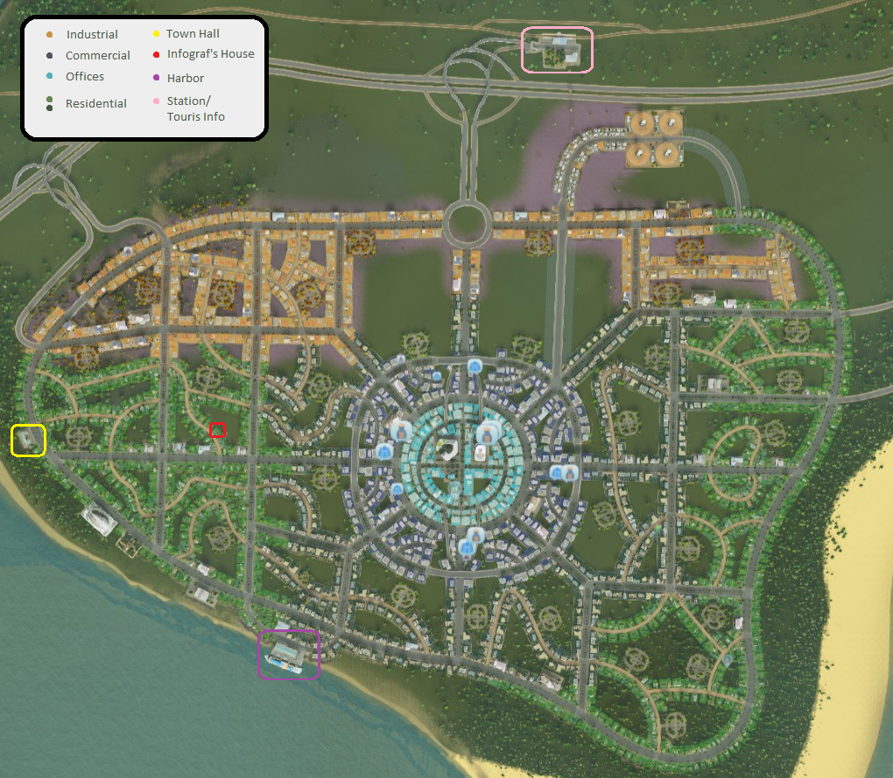
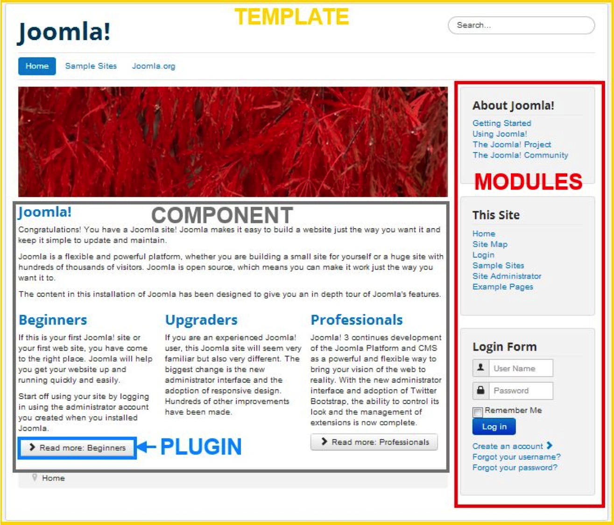
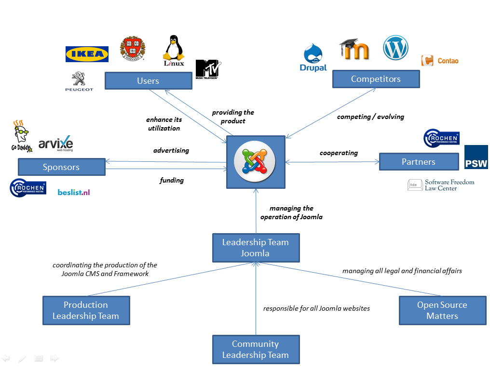
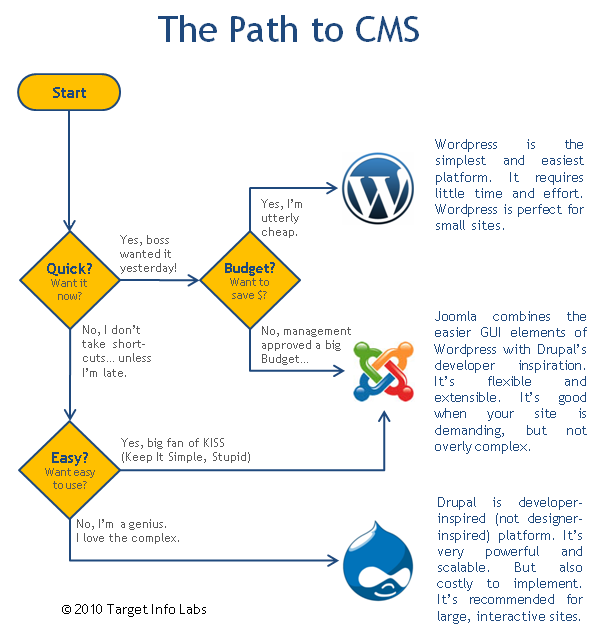
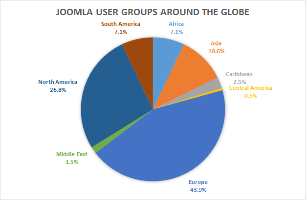
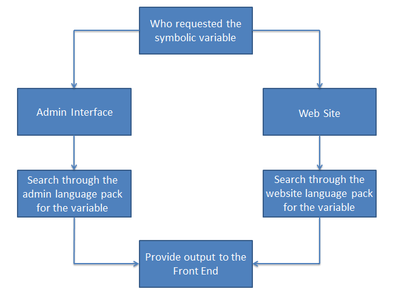
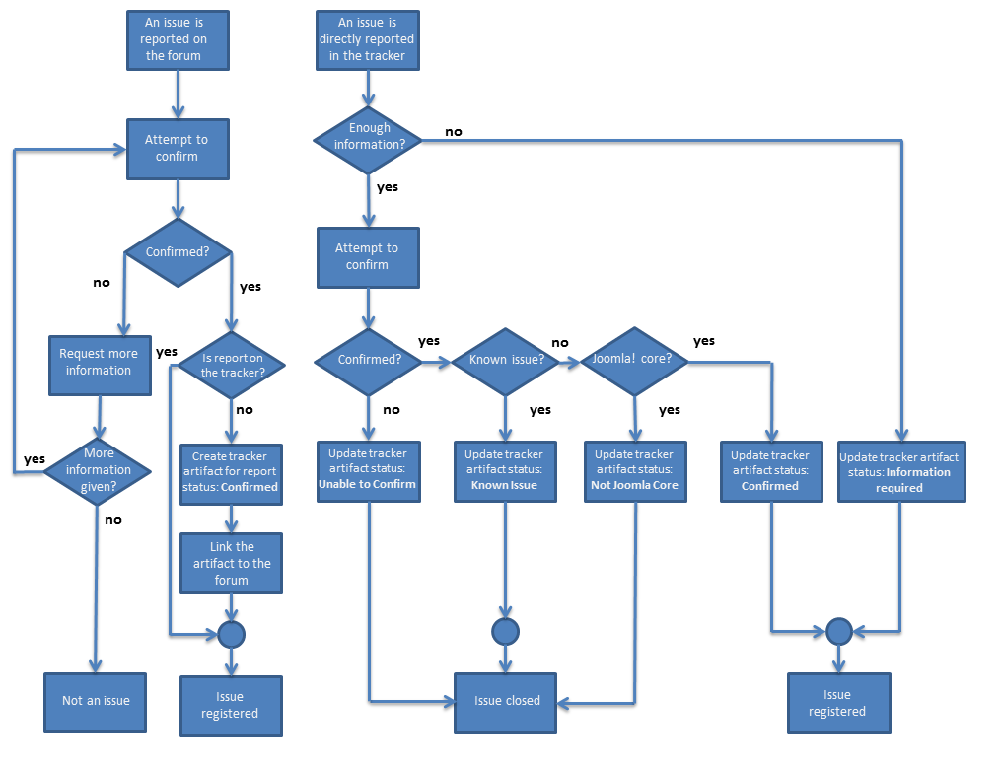
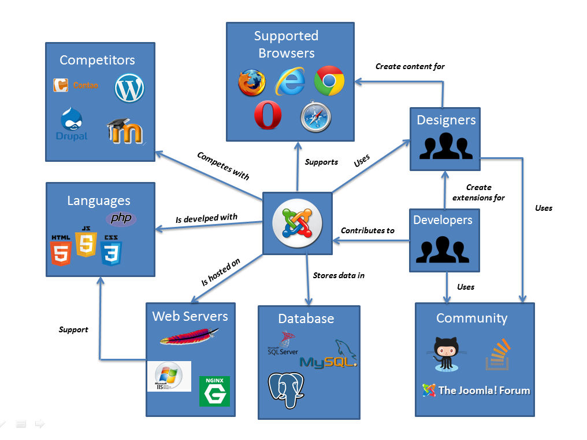
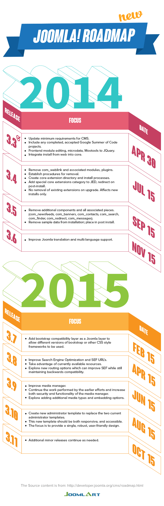

# Joomla

<!-- -->

**Remy Kabel, Panagiotis Mitsis, Michail Papadimitriou, Nikolaos Stekas**

_Delft University of Technology_

**Abstract**

_Joomla is an open-source Content Management System designed to assist users in building websites and online applications. Joomla is built using several levels of extensions that exist upon its framework. Through the combination of these extensions, content is generated and displayed to the user as a complete website.  Although Joomla is community-driven, many more stakeholders entailed due to the many millions of websites and developers supported. Through an analogy, comparing the architecture of Joomla to that of a large city, this chapter attempts to convey the details of the Joomla framework to the reader._

**Table of Contents**

- [All Together, as a whole](#all-together-as-a-whole)
- [The City of Joomla](#the-city-of-joomla)
	- [Architecture of Joomla](#architecture-of-joomla)
	- [Population](#population)
		- [Immigrants](#immigrants)
	- [City Maintenance](#city-maintenance) 
	- [Import and Export](#import-and-export) 
	- [Storage and Traffic](#storage-and-traffic) 
- [Utopia or Dystopia?](#utopia-or-dystopia)

## All together, as a whole

As a reader, by now you will have noticed the combined effort presented in the form of this book. A single person with a single article could have been interesting, but rather the combined effort of the students has created a book as interesting and complete as this. In exactly the same manner, Joomla approaches web design. 

Joomla (coming from the Swahili word _jumla_ meaning 'all together' or 'as a whole') is an open-source content management system (CMS) designed to assist users in building websites and online applications. 

A content management system (CMS) is a computer program that keeps track of every piece of content on your Web site. CMSs are often used to run websites containing blogs, news, and shopping. A major advantage of using a CMS is that it requires almost no technical skill or knowledge to manage because typically they aim to avoid the need for hand coding. 

In it's core, Joomla is a modular framework written in PHP and stores its data in a MySQL database. Although Joomla comes with enough functionality to build a basic website, its main strength comes from the extensions that may be installed into the system. Over 7500 extensions are available allowing for vast amounts of possibilities. These extensions are separate applications that integrate into the site. 

The positive userbase of Joomla also stems from the fact that Joomla splits its main usage into a 'frontend' and a backend. The frontend allows the visitors and basic users to view the site and edit the site's content. The backend allows the same, but also complete configuration of the site and its extensions. This separation reduces the pressure on the support by a webdesigner and allows the unexperienced user to be more self-sufficient.

As shown above, Joomla's core build contains a vast amount of features. As such, grasping its architecture may be overwhelming for a beginning software architecture or an otherwise intelligent reader. To ease the learning curve throughout this document, we build upon the analogy of comparing Joomla to a large city. This works suprisingly well.

## The City of Joomla
It is a bright and sunny day as you get off the open-source train at the station of Joomla. You look around but see nothing familiar and have no idea exactly where you are. The city of Joomla is much bigger than you imagined. You want to get the full experience of what the city has to offer. As such, you step into the tourist information office hosted by ___team-Joomla___. Here you look among the many similar documents and get yourself a map of the city in English. As you open the folder, the first thing you notice is a little piece of history.

> Over a decade ago in the year 2002, an open source CMS was created by the non-profit Miro corporation under the name of Mambo. Over the years, Mambo grows out to be a very successful and widely used platform for basic and more advanced web-designers. As is known to be a given in the world of business, money rules all and money makes corrupt. Whether that was true in the Miro corporation remains uncertain. The allegations, however, were enough for the core development team to abandon ship and fork to a "rebranding of Mambo" under the, now widely known, name of Joomla. Based on a very solid foundation with quite a decent community size, Joomla soon increased its population to over 500,000 members and 20,000 developers

These 500,000 community members are currently residing in the city of Joomla, using the services as provided by the many developers as you can see on the map.

_**Figure:** Map of the city of Joomla_

On the map you see that Joomla is divided in four main districts. As in any city, you can often find four types of buildings, which build upon one another. In the city of Joomla, however, you will find that it is just slightly different but still very similar. As such, the following analogies can be made:

* Industry - Plugins
* Commerce - Components
* Offices - Modules & Templates
* Residency - _The stakeholders_

>Everything in Joomla works in a very modular manner through an [MVC](https://docs.joomla.org/Model-View-Controller). As such, its functionality can be easily extended from its core. This is done using the the four extensions as listed above (those not italic) and will be explained below.

 The city is huge, with so much to see! To start, you get a ticket to head to the center of the city taking the tourist bus. 
 
### Architecture of Joomla

On your way there, you drive past the industrial area. But it is unlike what you have seen before. Instead of services such as a power plant or waterworks, you see plugin companies. Right at that moment the tour guide starts speaking. (You hadn't even noticed there was one)

> [Plugins](https://docs.joomla.org/Category:Plugins) provide the most basic of functions such as 'search' functionality. These plugins extend the functionality of the Joomla platform. Plugins do not provide the user with functionality directly, but rather provide extra building blocks for components to utilize.

A few minutes later, you decided to get off at a stop in the commercial district. Many different types of stores are to be found. Among others you see [NewsFeed](https://docs.joomla.org/Help34:Components_Newsfeeds_Feeds), [Messaging](https://docs.joomla.org/Help34:Components_Messaging_Inbox) and many others belonging to the Joomla concern. There are also many from other parties, however, including [EasyBook](http://extensions.joomla.org/extensions/extension/contacts-and-feedback/guest-book/easybook-reloaded), and [AdmirorGallery](http://extensions.joomla.org/extension/admiror-gallery). After some window shopping, you step inside the NewsFeed store. "Good day!", the store cleric greets you, "Can I interest you in some articles?" You thank kindly, but inquire about the commercial district in general. "Ah, but of course!", he says and starts rambling.

> [Components](https://docs.joomla.org/Component) are the main functional units of Joomla; they can be seen as mini-applications. An easy analogy would be that Joomla is the operating system and the components are desktop applications. Joomla comes with a number of core components, like the content management system, news feed and messaging services, but can easily be extended through 3rd-party additions. Components can make use of the functionality added through plugins.

You thank him and decide to buy an article to read on your tour through the city. As you skim through the news, you spot a headline **"Joomla more and more international!"**, but you decide to leave that until later. Slowly but surely you reach the Office district of Joomla. You look around and gaze upon the many skyhigh, reflective buildings and are mesmerized by the sheer number of buildings and floors. Curious as to what you will find inside, you walk into random building. Immediately a large signpost catches your eye:

	1st Floor: Reception   
	2nd Floor: Peugeot  
	3rd Floor: Ikea  
	4th Floor: Harvard University   
	...

And it continues for a while. Noticing your confused gaze, the receptionist kindly welcomes you and explains the building you've entered.

> This is where authors, designers and other stakeholders come together to discuss and determine the content and appearance of the ultimate websites, the products of the city of Joomla. At first, the authors determine the necessary content. This is selected and the rough size and location are determined through modules. [Modules](https://docs.joomla.org/Module) are lightweight and flexible extensions used for page rendering. Modules usually contain information presented by components, but can also show static HTML code or plain text. An example of a commonly used module is the login module. These modules are often “boxes” arranged around a component on a typical page. Modules are the content that may be used by templates. [Templates](https://docs.joomla.org/Template) make use of a combination of CSS and images to change the way a site looks. Templates control the way the website is presented to the user viewing the website's content as presented in modules.

"As she finishes her story, she notices there is still some doubt in putting it all together. "Here!", she continues, "Have a look at this sample product you'll understand how Joomla combines all of it's aspects together.

> Instead of directly writing and designing the final webpage or the final product, the front-end, it is automatically created from a combination of extensions. What you saw on that signpost there is a short list of some of Joomla's many products. All are built on the same foundation and yet they are all so different. The combinations are endless. At any moment in time, any part of the product line may be changed increasing the variability of Joomla. Additions of extensions such as plugins are easily managed through the 'backend', where the main configuration of the ultimate product is done.

_**Figure:** Example of a Joomla Page_

### Population
Slowly you begin to unravel more and more of the mysteries that the city of Joomla holds. For now though, there is something on your bucketlist; namely to meet a distant friend of yours, [infograf768](https://github.com/infograf768). Although you haven't met much in real life, you've often talked in the past on improvements to open source software. He works on and off in the town hall as well as in some industrial companies, really working on the basics of the city. So you hop into a cab and head to his place, back through the many areas as more and more residential houses appear spread through the city. On your way there, you drive past a big and majestic building and wonder what it is. You ask the taxi driver whether he knows, to which he replies "But of course! Everybody knows! It's the town hall!"

> Although Joomla is open-source community driven software, for smooth proceedings, marketing, budget allocation a strong leading team should exist for managing all other people involved (stakeholders).  Within Joomla, the leadership team is divided into three main teams:

> * **Production Leadership Team (PLT):** responsible for coordinating the production of the Joomla CMS and Framework, including code, documentation, and localization.

> * **Community Leadership Team (CLT):** responsible for all Joomla websites, forums, and user groups.

> * **Open Source Matters (OSM):** responsible for managing all legal and financial affairs for Joomla and also the Joomla demo sites.

The moment he finishes his last sentence you notice the care has come to a halt. You grab your bag and reach for your wallet but even before you can open it, the driver says, "Are you mad, it's all free here!". So you thank him kindly, exit the vehicle and walk to the house where you are warmly greeted. You are immediatly taken inside, get a drink and make small talk for hours on end. Amongst others as to how he moved into the city of Joomla. "Ah!", he says, "Anyone who uses, or contributes to the products Joomla creates need to work in the center. As such Joomla provides housing. As such there are many different people here. All linked to Joomla"

#### Partners

* Rochen LTD
	* Hosting the official website
	* Hosting Joomla sites
* The PSW Group
	* The PSW GROUP offers certificate, encryption, authentication and signature solutions for web and e-mail communications as well as trust seals and customer evaluation systems
* Software Freedom Law Center
	* Legal guidance and representation 

#### Users
Other cities and villages

* Individual web site developers
* Companies' web site developers
* Government's web site developers

#### Popular Users

* Harvard University 
* UK Ministry of Defense
* Government of Greece
* Peugeot
* Maersk
* IKEA
* Linux
* The Hill
* MTV
* IT Wire
* The Fashion Spot
* El VIlliareal CF

#### Developers
 * Joomla! Production Working Groups
 * Third Party Developers
 * Designers

_**Figure:** Graph showing all related stakeholders of Joomla_

#### Competitors
With a slightly dim face he continues, "Joomla is not the only city delivering product like these though. Two other cities directly compete which does no good to our inhabitants."

> There are two main competitors in the current world of CMS based website building. These are WordPress and Drupal. The reasons for one over the other can be easily seen in the first image below. Although there are other competitors, these do not even come close to the main three in terms of users.

>##### Biggest Competitors
* Wordpress - GPL
* Drupal - Open-Source

>##### Other Competitors
* Moodle - Open-Source, mainly used to create a private website for dynamic online courses.
* Contao - Free Content CMS, specializes in back-office and front-office accessibility.
* Modx - Open-Source CMS, awarded Packt Publishing's Most Promising Open Source Content Management System in 2007.

_**Figure:** A typical path to decide between the main competitors in the world of CMS_

#### Immigrants
Some more time passes and you accidentally blurt out: "There are many different nationalities of people here. Is immigration a problem?". He continues, "No we very much support immigration! We have done so right from the start. "One of the powers of Joomla is it's welcoming of different nationalities and we try to cater them as much as possible. As you may have noticed when visiting the city, we try to present all services in all languages, even those from outside of Joomla."

>The [vision](http://www.joomla.org/about-joomla/the-project/mission-vision-and-values.html) of the Joomla Project includes "people around the world using their preferred languages." Translation of the language in the Joomla core files, the help screens and documentation along with other tasks such as working with the Development Team to meet the needs of diverse language communities all help to achieve this. This Translation and Localization Policy is intended to embody that vision while creating a worldwide community that is rewarding and enjoyable to participate in and that maintains the trust of its users. It builds on the core values of the Project which are: freedom, equality, trust, community, collaboration and usability.

"And this reflects in the ethnicities of the inhabitants of the city. With all core functionalities in Joomla supporting over 60 languages, this leads to an extensive number of multilingual users. But vice versa, because Joomla has strong support from the community , translation is stimulated."

>Joomla users though have created local communities in order to be able to interact with each other. Through these communities we can approximately calculate the percentages of different nationalities of Joomla users. Below we present a graph which categorizes different nationalities according to the continent of their origin.

_**Figure:** A location based dissection of the different user groups_

>In many cases Joomla has to provide output or feedback to the user (administrator or visitor of a site). In order to be able to provide feedback in the correct language the site administrator decides the default language in use. Whenever a message has to been created Joomla use a symbolic variable to represent the message. That variable will get its value from the system depending on the administrator's configuration.

_**Figure:** Implementation of translations using language packs_

### City Maintenance
After engaging in many hours more of interesting conversation you decide to call it a night. The next morning [infograf768](https://github.com/infograf768) takes you around to see some more of the city and the town hall, where he works. However, before you are even able to get out of the residential area, you have to stop because you see a large cloud moving towards you. "Is it a sandstorm?", you ask. "No", your friend replies, "Sadly, with every new company or industry coming into the city, more pollution is brought in which attracts many bugs. It is the biggest problem the city faces." You sit silently for a while as the swarm of bugs passes by. "I'm part of the city maintenance, however, and I lead many of the bug catchers. I'll show you as we reach the town hall!" Skipping ahead about an hour and the explanation starts.

>Joomla provides developers with an action plan in case of an issue. Issues assigned with a priority and a status (e.g pending, open and confirmed). Consequently, all necessary information can be found in the [Joomla Issue Tracker](http://issues.joomla.org/) which works using GitHub. 

_**Figure:** Bug Tracker decision tree_

>All changes is the Joomla code is done through GitHub. Joomla on Github uses a staging branch. The reason of using such a branch is mainly for developers to have a steady ground for contributing to the source code of Joomla. Opening Pull Requests (PRs) allows solving already identified issues and step-by-step integration by Joomla's integrator.

"Such as yourself?", you wonder. "Yes," he says, "for example, I have accepted and integrated several fixes through PR's as submitted by team-Joomla. You know, the guys that also run the tourist information center?"

>Of course, every newly submitted code in Github will be tested to avoid making Joomla vulnerable to attacks. When there is a proposal for a pull request on Github two things will happen:

>* The newly submitted code will be tested in different PHP configurations in different Operating systems using the [Travis-CI](https://travis-ci.com/) automated platform.
* After this tests finish successful a reviewer will run also tests using the newly submitted patch to ensure that  it fix or add the functionality that it claims that does.
* If this also finished, the pull request gets the RTC label which means `Ready to commit`.

>In addition the Joomla team provides a [checklist](https://docs.joomla.org/Testing_Checklists) for the developers.

### Import and Export
As his shift ends, you head back to the train station and drive past the docks. You notice many trucks going in and coming out. It seems like the city of Joomla has a very bustling trade market. Once again you see the names you've seen before on the signpost, such as Peugeot, but now on a truck going toward the docks. However, the outgoing trucks you do not recognize. Apache, for example. Your gaze is not left unnoticed. "The latest versions of the finalized products as designd in the office buildings you were at earlier are now shipped to their respective cities and villages. New versions are often shipped daily at even the slightest change." "But what about the other trucks?", you ask. "Ah, that...", he declares, "No city can only produce goods, we need something to build with as well"

>As we can see from the figure corresponding to the context view of Joomla there is a wide range of factors that influence its structure. For example, adaptability to different environments that vary from  mobile apps to any possible browser. Also, the ability to facilitate functionality for different web servers, programming languages and databases. For instance, Joomla needs to integrate functionality for the web servers(e.g NGiNX, APACHE) that is going to hosted in and also handle the supported  variety of databases (e.g MySQL, Microsoft SQL server).

"This just adds more to the many varieties of products that are designed here."

_**Figure:** Joomla Context view_

### Storage and Traffic
Upon arrival back at the station, you notice that there hasn't been a lot of traffic, but still everything was running smoothly. "Are there ever any traffic jams?" you ask. "Sure, every so often there is a bottleneck, an infinite loop or a new unknown dead-end road, but generally all traffic runs smoothly due to the good infrastructure"

>Text is stored as records in a mySQL database. Therefore, not all content is necessarily shown on the designed website, although all textual content is stored. the Joomla database. On the other hand, content which is considerable larger (e.g. images, video, audio, etc) is not part of the above-mentioned database. These files are stored on the file system that is accessible by Joomla.    

>In general information can be stored in many different places and may be called for by the extensions. Not every option is good practice, however.

>* **The database:** When considering the database, information can be store in SQL tables. Entries allow calling for information from other sources.
* **Templates or static HTML:** This solution for storing information consists of a very bad practice. By choosing to store a lot of information in a single file, a lot of manual updating is required. On websites with more than four pages the content tends to be very messy to maintain.
* **Filesystem:** By using Joomla extensions you may be able to explore  functionality that comes from a different file system. 
* **3rd party external repositories:** Usually this option is only related to widgets. Widgets almost always generate information which sourcing from 3rd party repositories.

> Information flow is mainly handled through the database. Clear paths are made between the several sources of information. This allows for fast handling of data. A clear [visualisation](http://www.torkiljohnsen.com/wp-content/uploads/2010/07/joomla_1.6_database_schema.png) of this can be made by investigating the inter-table calls.

## Utopia or Dystopia
As you buy your ticket and board the train, you wonder what will happen to the city of Joomla. Now such an organized and bustling city full of activity, but with many a flaw. Sure it has its fantastic characteristics and highlights, but will that be enough to keep the inhabitants happy?

>One of the key features of Joomla is that it is offering more than 64 languages. The result of that is that creates a lot of issues to the Joomla development team. Many people are working on the multilingual issues (for example in [#6051](https://github.com/joomla/joomla-cms/pull/6051)). All these could be eliminated if only one language was offered resources are focused in other things.   

>On the other hand there are a lot of volunteers contributing to the project and the [Joomla Bug Squad](https://docs.joomla.org/Portal:Bug_Squad) who are helping to make a very stable CMS. This huge amount of volunteers make it evolve but not very quickly due to the large number of bugs and that it doesn't follow a strict roadmap. So what team-Joomla believes is that Joomla can extend a lot its features but first it should fix all the bugs that it faces. Also, they should have feasible and realistic views about their future. Below you can see the roadmap that Joomla wanted to follow but currently we are at March 2015 and they are still in version **3.4** and the suggested improvements are acceptable but new features remain abstract. In their [current roadmap](http://developer.joomla.org/cms/roadmap.html) they have adapted this. However, adapting a roadmap with every delay is not a solution.

With that thought, the train stutters once and steadily increases its speed. You wave goodbye to your friend and decide to continue the journey on the open-source train.

_**Figure:** Joomla 2014-2015 roadmap_

