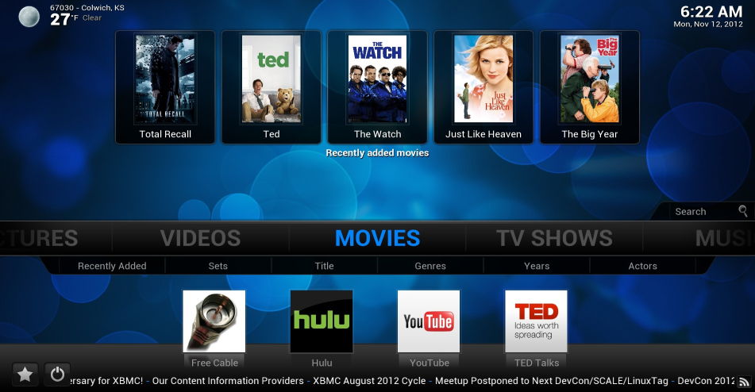
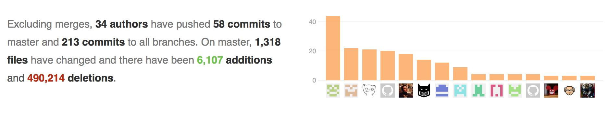
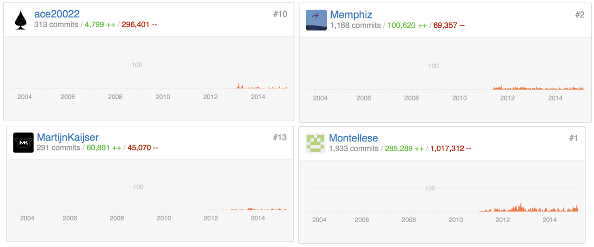
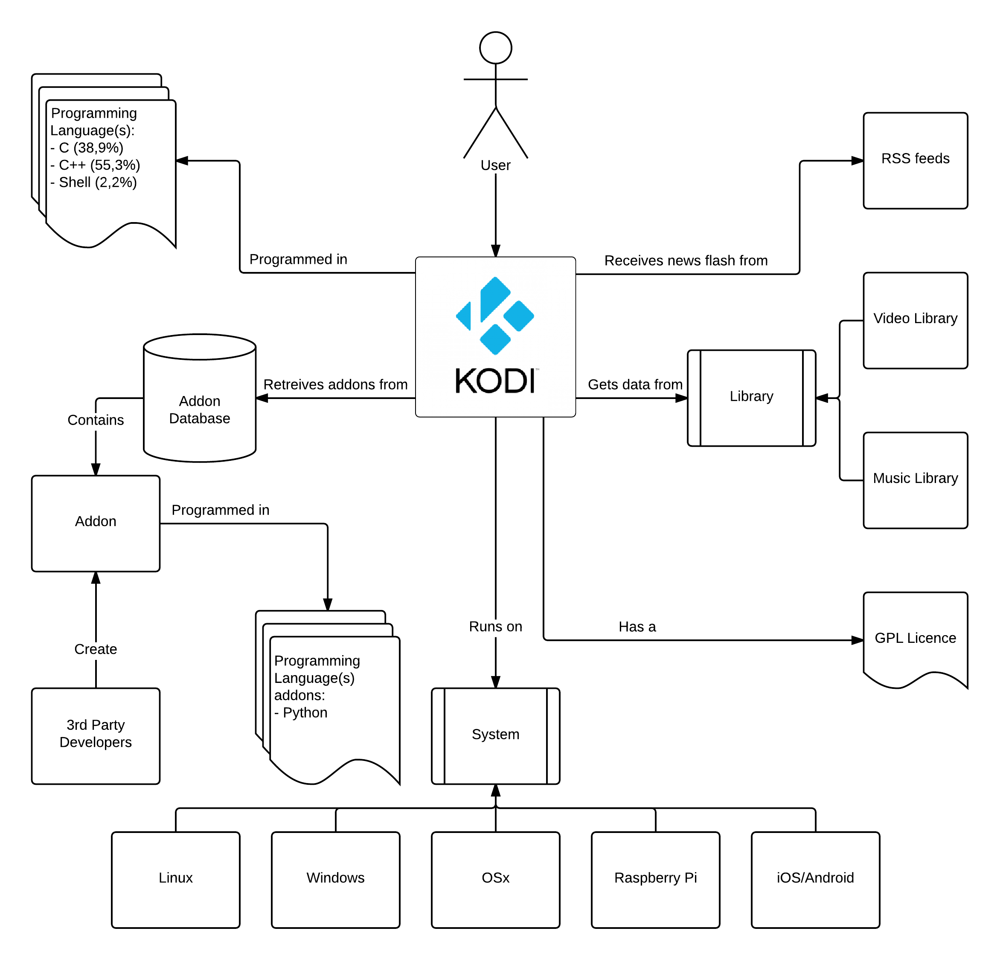
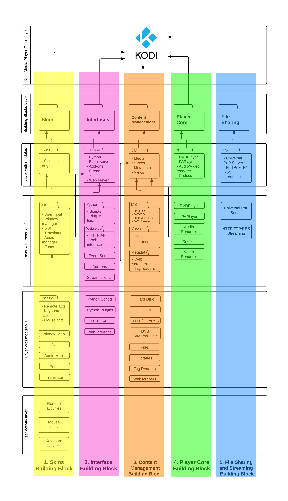
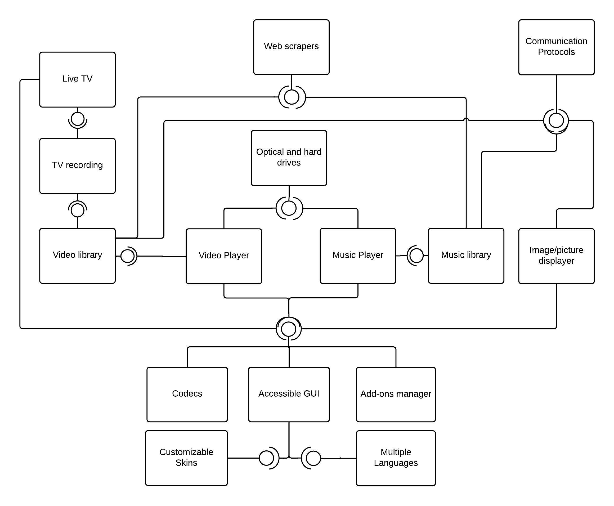
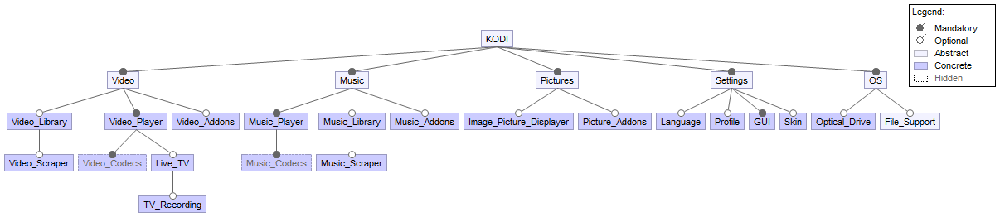
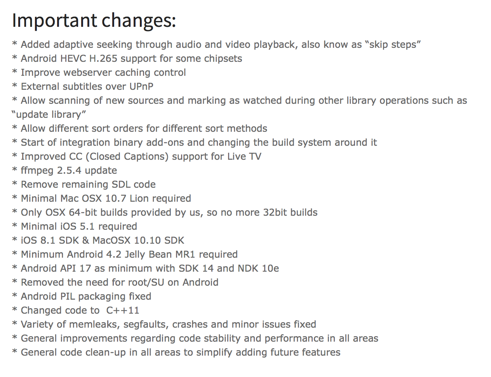

# *Architecting Software to Keep the Lazy Ones On the Couch*

*A Report On the Journey of Team Kodi*

<p align="center">
  
</p>

*Authors: [Kaj Dreef](https://www.github.com/kajdreef), [Menno van der Reek](https://www.github.com/mvanderreek), [Koen Schaper](https://www.github.com/kpschaper), [Maarten Steinfort](https://www.github.com/maartensteinfort)*

*April 23, 2015*

## Abstract 

[Kodi Media Player](http://kodi.tv) is a multi-platform entertainment center, developed by the XBMC Foundation with [hundreds of contributing members](https://github.com/xbmc/xbmc/graphs/contributors) located all over the world collaborating online. In this chapter the most prominent stakeholders are unmasked and their workflow is captured. To be able to analyse the Kodi architecture; it is displayed from various views and perspectives including the context view, that describes the interaction with its environment. The development view encloses the different layers and modules; the 'building blocks'. Subsequently, the features and their functionality across different environments are debated in the functional and variability views. Finally, the evolution perspective will give a good view about the roadmap to the [next update](http://kodi.tv/kodi-15-0-alpha-1-road-to-isengard/).
After analysing Kodi from the different viewpoints and perspectives it can be concluded that it has a robust architecture, which is ready for the future.

## Table of contents 

1. [**Introduction** - ***Preparing the journey***](#1-introduction---preparing-the-journey)
	1. [From the outside...](#11-from-the-outside)
	2. [From the inside...](#12-from-the-inside)
2. [**Stakeholders** - ***The brainiacs behind your TV screen***](#2-stakeholders---the-brainiacs-behind-your-tv-screen)
	1. [Board Members](#21-board-members)
	2. [Developers](#22-developers) 
	3. [Users](#23-users)
3. [**Context view** - ***Interacting with the environment***](#3-context-view----interacting-with-the-environment)
4. [**Developerment view** - ***The Building Blocks of Kodi***](#4-development-view---the-building-blocks-of-kodi)
	1. [Modular Design](#41-modular-design)
	2. [Dependencies and Interactions](#42-dependencies-and-interactions)
	3. [Development Guidelines and Principles](#43-development-guidelines-and-principles)
5. [**Functional view** - ***More about the features***](#5-functional-view---more-about-the-features)
6. [**Variability view** - ***The effort to broaden audience***](#6-variability-view---the-effort-to-broaden-audience)
	1. [During Build Time](#61-during-build-time)
	2. [During Run Time](#62-during-run-time)
7. [**Roadmap to update Isenguard** - ***New cool features and fixing bugs***](#7-roadmap-to-update-isenguard---new-cool-features-and-fixing-bugs)
	1. [Evolution Perspective](#71-evolution-perspective---the-need-for-evolution)
	2. [Ease of Evolution](#72-ease-of-evolution)
	3. [Evolution Tradeoffs](#73-evolution-tradeoffs)
8. [**Conclusion** - ***Have we learned something?***](#8-conclusion---have-we-learned-something)

## 1. Introduction - ***Preparing the journey***
The [Kodi Media Player](http://kodi.tv) (formerly known as XBMC Player) is a multi-platform entertainment center, developed by the XBMC Foundation with [hundreds of contributing members](https://github.com/xbmc/xbmc/graphs/contributors) located all over the world collaborating online, mainly on Github. Over a span of a few weeks, Team-Kodi, from the [Delft Students on Software Architecture (DESOSA)](http://avandeursen.com/2013/12/30/teaching-software-architecture-with-github/)-group, dived into the Kodi Media Player, by walking through the different layers and viewing it from different perspectives and architectural views. With the gained insight in Kodi we also tried to contribute on Github, by solving bugs or issues. However, this journey started by downloading the media player [for free](http://kodi.tv/download/) and study it from the outside; using its features and viewing a few movies for the first time. 

In this chapter, we (Team-Kodi) take the reader through the different layers that have been analysed and debates its interesting findings during the journey by the use of the new knowledge and tools obtained from the Software Architecture course at the Technical University Delft. Finally, we bring all the views together to see if Kodi has an architecture which is robust, but at the same time allows extension for future improvements.

### 1.1. From the outside...
Kodi allows the user to view movies, music and pictures by its attractive and supremely user-friendly design. Serving as a complete covering media center the user has a clear and interactive overview of the his/her multimedia. In fact, Kodi perfectly fits in a living room-environment when the computer is connected to a TV, served from the couch with a remote keyboard and mouse.

Furthermore, the Kodi player supports numerous [add-ons](http://kodi.wiki/view/Official_add-on_repository), allowing the user to stream or download multimedia from external sources, for example Spotify, Grooveshark, series, 24-hour news channels and missed broadcasts. After installation of a particular add-on, most recent multimedia is downloaded automatically to the system or could be streamed any time. An advantage of downloading multimedia is the ability to watch when the system is offline.

Originally, the Kodi software was developed for the XBOX game, a game console, the then purporting [XBOX Media Center](http://en.wikipedia.org/wiki/Kodi_(software)) (XBMC), that increased popularity whereby the XBMC foundation decided to expand their software to other platforms. Currently, the software is available for Windows, OSX, iOS, Android, and Linux. Since the name was still based on XBOX, XBOX Media Center, the foundation decided in 2014 to change the name to "Kodi" Entertainment Center. From this point we will continue naming the project Kodi. Besides that, the software has always been open-source and published for free.

<p align="center">
   
   <p align="center"><i>Figure 1: The attractive design of the Kodi Media Player from the outside</i></p>
</p>

### 1.2. From the inside... 
At the other side, in the backoffice, the developers are collaborating with each other to continuously improving the source code of the Kodi Media Player. Starting with exposing the prominent stakeholders by diving into Kodi's repository on Github. The stakeholders with the most influence on the course of the media player software are the developers controlled by the [board members](http://kodi.wiki/view/Team_Kodi/Members), consisting of experienced developers and maintainers. Secondly, the [context view](http://www.viewpoints-and-perspectives.info/home/viewpoints/context/) highlights the dependencies, relationships and interactions with its environment. The [development view](http://www.viewpoints-and-perspectives.info/home/viewpoints/development/) describes Kodi's independent 'modular' architecture that supports the development and maintenance process. These modules can be described as well-ordered ['building blocks'](images/KodiDevelopmentView2.png) in a large construction. Subsequently the [functional](http://www.viewpoints-and-perspectives.info/home/viewpoints/functional-viewpoint/) view focuses more on these 'building blocks' and how they operate and interact. Although Kodi might seem similar on many of the different operating systems from the outside, the differing features are investigated from the inside in the variability view. Ultimately with the help of the evolution perspective the roadmap to the next version, called ['Isenguard'](http://kodi.tv/kodi-15-0-alpha-1-road-to-isengard/), is discussed and evaluated.

<p align="center">
   
   <p align="center"><i>Figure 2: The backoffice of the Kodi community; working on the continuous enhancement of the media player</i></p>
</p>

## 2. Stakeholders - ***The brainiacs behind your TV screen***
The Kodi Foundation comprises a [large community](https://github.com/xbmc/xbmc/network/members) of hundreds software engineers, architects, developers and testers. They work on a voluntary base, as most of them have another job and no income is generated since Kodi is freeware. The search for detecting and identifying the most prominent stakeholders and capture their workflow led to the conclusion that [a limited group of developers](https://github.com/orgs/xbmc/people) have the right to approve or deny the potential contributions and pull requests, see Figure 3. However, by looking deeper into their profile history on Github, it appeared that these developers have 'earned their rights' by enormous amounts of commits after a certain period actively participating to the continuous improvement process of the software. 

<p align="center">
   
   <p align="center"><i>Figure 3: Four most present integrators within the community</i></p>
</p>

Although most of Kodi's stakeholders fit within the structure of [Rozanski and Woods](http://www.viewpoints-and-perspectives.info/home/stakeholders/), for classifying stakeholders, some of them act as more than one stakeholder type. A classification of the most prominent stakeholders is discussed below.


### 2.1. Board Members
At the helm of the Kodi foundation are the board members busy with executing management tasks and are chosen by elections within the community. Since the members are mainly former developers, they have a very deep understanding of how the media player operates. Remarkable is that some of these board members still are very active solving bugs and expanding functionality (for example [Martijn Kaijser](https://github.com/MartijnKaijser)). The board members can be seen as the communicators, assessors within the community. 

### 2.2. Developers
There is a certain group of developers that is continuously contributing to improve Kodi. They reply, issue and close tickets when a bug is fixed. In that way they work closely with the users. Users who report a relevant bug are normally taken seriously by the developers. The developers then ask the user to provide a log so the problem can be tracked. Furthermore they merge pending pull requests if the content meets with the standard of Kodi. Since the developers are continuous 'deep' involved with the software, they often propose and debate over new functionality on the forum. Therefore they are essential for Kodi foundation since they are the 'core-drive' of the development.

### 2.3. Users
Since Kodi is dependent on their users, they embrace them to contribute to the continuous improvement of the media player by reporting bugs and proposing new functionalities. Therefore, many of Kodi's fixes and additions are dedicated to the users. Furthermore Kodi is a non-profit organization, the costs are mostly covered by donations. 

## 3. Context View -  ***Interacting with the environment***

By zooming in on the Kodi source code, the dependencies, interactions and relationships with the environment do appear. As can be seen in Figure 4, the Kodi software is supported on six different (operating) systems, which variates from high-specification desktop computers to low-specification computers with the purpose of only running the media player. In the context view, the behaviour of the media player and its environment are captured and displayed, as described in [Rozanski Woods](Rozanski_Woods_context_view). 

<p align="center">
   
   <p align="center"><i>Figure 4: Context view of Kodi</i></p>
</p>

It can be noted that Kodi supports multiple operating systems. It relies on these operating systems to abstract the communication with the hardware away. For other features external libraries are used, sometimes multiple libraries to be able to support all these operating systems. Using an automated build-system, the right libraries are picked for the targeted operating system.

As mentioned before, some features of Kodi depend on external factors which will be further elaborated. 

**System**: Kodi is developed in with support for multiple operating systems and different hardware in mind. As a result the developers needs to keep in mind that Kodi still need to run smoothly on relatively low-end hardware like the Raspberry Pi. Also they need to keep cross-platform incompatibilities to a minimum to give all the platforms a similar experience. In the [variability section](#6-variability-view---the-effort-to-broaden-audience) further investigation will be done on how this variability is implemented in Kodi.

**Add-ons**: To be able to extend the functionality of Kodi during run-time; Kodi makes use of Add-ons. Those are written in Python and stored in the Add-on database. Third party developers can use the Kodi API in combination with python to create their own add-ons. Because of the big community of Kodi many add-ons have been created over time.

**Library**: Libraries are used to store the user entertainment content. Those can be stored on the users own computer or phone, but can also be stored on an external drive or NAS. With the help of support for many communication protocols these can be streamed and played with Kodi.

Kodi is a system that has external dependencies or limitations imposed by hardware that developers need to keep in mind. Like low power devices like the Raspberry Pi, iOS, and Android, but also different rendering API's like OpenGL, OpenGL ES, or DirectX. During development this imposes limitations on the architectural design.

## 4. Development View - ***The Building Blocks of Kodi***
The Kodi foundation aims to work with independent software modules, as stated on the [Kodi Wiki website](http://kodi.wiki/view/XBMC_development):
> *"Kodi should still compile and run if a non-essential module/library is disabled or removed."*

This is one of Kodi's general guidelines that actually fits in the [Rozansky and Woods](http://www.viewpoints-and-perspectives.info) requirements for successful architecture of complex software. Introducing modules improves the scalability and maintainability of the source code, especially when the software is being used and compiled while the developing and maintaining continues. In the case that one of the modules has failures the software can still be used. They serve as the 'building blocks' of the total architecture that are interacting with each other and distinguishing them from each other based on the functional activities performed. Subsequently these modules are classified in functional groups which are independent from each other. 

Starting with discussing the [modular design](#modular-design) that form the 'building blocks' of Kodi and illustrate these with an overview to gain a deeper understanding of the architecture of Kodi. Furthermore, the dependencies of and interactions of the modules and layers are discussed. 

### 4.1. Modular Design

<p align="center">
   
   <p align="center"><i>Figure 5: Kodi's 'building blocks'</i></p>
</p>

Firstly in Figure 5, the **yellow** building block encloses all files and packages about the [skins](http://kodi.wiki/view/Category:Skins), translations, fonts, and GUI of the Kodi Media Player. This is one of the most popular modules for the external developers, while it also provides a perfect example for the visualisation of the working of modules within a greater software architecture.  

Secondly, the **purple** Interface building block includes all the files and packages concerning among others the add-ons, streaming clients, event servers and external libraries. In this case, it is again possible to visualise how the rest of the system continues to work while an add-on is not working properly. The add-ons are mostly designed by external developers, and mistakes are more likely to occur since they have less knowledge of the system. 

An interesting and very popular add-on which was also a [DelftStudentsOnSoftwareArchitecture team in 2014](http://delftswa2014.github.io/chapters/sick-beard/index.html), is [Sickbeard](https://seo-michael.co.uk/how-to-install-vdubt25-add-on-kodi-xbmc/). This add-on enables to download a shows episodes once they are published on torrent trackers. 
  
Subsequently, the **orange** building block comprises of all files, functions and -packages about handling the content regarding the multimedia. The content management operates on the 'rough' side of the media files, which includes storing, locating files on the hard disk and disk drives, streaming it from an external server, scraping data from FTP, RSS, HTTP, and other (network protocol) sources, and enabling finding multimedia by tags or metadata. 

Next, the **green** building block includes the manners of reading and displaying the audio and video files with the use of codecs like DIVX and AC3. These codecs are necessary for converting the rough data file to a clear view on the user's monitor. In short, this module performs all tasks considering the displaying of the users content. Though these codecs are developed by third parties and imported from external libraries. 

Finally, the **blue** building block is specialised in the sharing of files. This is related to the add-ons that allow streaming, downloading, scraping and sharing. An example for this are FTP based providers that publish movies, software and audio that can be downloaded with fast speed.  

### 4.2. Dependencies and interactions
As can be seen in the overview, the modular building blocks divide the total architectural design vertically. This is to virtually demonstrate the independency of the different building blocks. The largest part of the 'communication' between the different blocks is done on the highest layer (in Figure 5 called the "Building Blocks-Layer"). Thus the common processes are organised as much as possible, whereby it uses the same packages. 

Furthermore, the relatively 'independent' modular design of Kodi prevents developing functions multiple times, by orchestrating it into the packages among the different layers. Another interesting advantage of the modular architecture, is that the [scalability](http://en.wikipedia.org/wiki/Scalability) is improved drastically. Because of the sharp boundaries between the modules, it is not only easier to maintain the source code but also easier to develop new features for the system. 

### 4.3. Development guidelines and principles
A large community of developers, testers, maintainers and users are [invited to contribute](http://kodi.tv/get-involved/) to the Kodi software with the goal of fulfilling as much wishes of the users as possible. For this reason most of the developers, testers and maintainers are also actively using the media player system. Besides that, a large part of the reputation that Kodi has gained since their launch in 2002 is due to their framework for add-ons. Its accessibility is associated with the [guidelines and principles](http://kodi.wiki/view/XBMC_development) that Kodi has published. All members of the community,  developers and software engineers involved should abide these rules and principles. To illustrate a understanding of these guidelines, a selection* is provided.

1. **Code documentation** 
> *This should be done by using Docbook or Doxygen (preferred)*

2.  **Installation** 
> *Be easy to install, set up and maintain, so that our valuable end-users do not get fed up with it and quit*

3. **Modular design** 
> * *Kodi should still compile and run if a non-essential module or library is disabled or removed* 

**Due to the limited words that the book chapter may contain, the guidelines are cut out, however we would like to refer to the [Kodi website](http://kodi.wiki/view/XBMC_development) where this is discussed in more detail.* 

## 5. Functional View - ***More about the features***
While continuing the journey, Kodi's Media Player is viewed from another viewpoint. 
However, this time it is more focussed on the underlying layer that drives most of the other viewpoints; the functional view. This view provides insights in the functional elements, graphical interfaces, and primary interactions. Although most of Kodi's features are obvious - 'browsing and watching multimedia' - , most of them enclose combinations of more features. 

In Figure 6 a simplified model is given of the functional view of Kodi.
Only the key-features are shown here to keep the figure as simple as possible, but still show how the feature interact with each other to deliver the user the best media entertainment system possible.

<p align="center">
   
   <p align="center"><i>Figure 6: Functional view of Kodi</i></p>
</p>

**Players**: The 'players', this is the part of Kodi where the user can actually play/open its content. This is of course the feature the user will use most often, because of this it is important that it uses an accessible GUI, resulting in a user friendly player. The players uses other features to get the content to the screen like the codecs, or their own dedicated library.

**Libraries**: The libraries are, as mentioned before, the location where the entertainment content is stored. The web scrapers can use these libraries to store additional content about for example the shows that you've been watching. To make sure that multiple devices can access this content they can make use of communication protocols (this is not exclusive to the libraries). 

**TV**: In the last updates of Kodi 'Live TV' was one of the new big features, being able to record this and store it in your video library. TV recording is, as shown in the functional view figure, a feature of Live TV. The Live TV also uses a accessible GUI so it is user friendly.

In the functional view a discovery has taken place regarding the depth of the features of the Kodi software program. In most cases a combination of more features are indirectly involved in the features that actually directly are serving the users on the user interface. 


## 6. Variability View - ***The effort to broaden audience***
Nowadays it is not rare that people have multiple devices used for different purposes, varying from desktop computers and notebooks to tablets and smartphones. For example, lets look at the [Raspberry Pi](http://raspberrypi.org), which is a low-spec computer operating on a simplified version of Linux. Users can profit from prices that are as low as the specs, resulting in the necessity for software that fits its capacity. The developers of Kodi decided to also focus on the Raspberry Pi, while they already support multiple Linux version. Although, to make Kodi available for a device with lower specifications, it will result in that some features will be left out because of hardware limitations. These ''variability points'' can be found in Figure 7. This also applies for Apple OS X, iOS, Linux, Android, and Microsoft Windows operating systems. This leads to the emerging question; what is the price to reach a broad audience? 

<p align="center">
   
   <p align="center"><i>Figure 7: Feature variability model of the Kodi Media Player</i></p>
</p>

The main features of the system are investigated along with the perspective of the stakeholders (see section 7: [functional view](#5-functional-view---more-about-the-features)). Every software system has main features, since these also comprises the core activities. Also Kodi has published their main features on their [Wiki](http://kodi.wiki/view/Features_and_supported_formats). Based on the tens of different features that Kodi counts a variability model is created, see Figure 7. This model displays the cohesion of the features within  Kodi. There are 5 different 'abstract' features created; Music, Pictures, Videos, Settings, and Operating System. Subsequently, these are stripped down until the core features have emerged. 

The price of reaching a broader audience is that Kodi has to cope with different incompatibilities across the different operating systems and devices. This can be lack of hardware, for example the lack of disc drive for mobile devices, or other factors like the lack of support of a certain library for a specific platform. These variabilities are resolved during **Build Time** or **Run Time**.

### 6.1. During Build Time
An example of variabilities during build time, is the use of the video player engine, since during the build time it is determined whether the DirectX11, OpenGL ES, or OpenGL API is used. This directly influence the way Kodi will render its interface. In code fragment 1, it can be seen how the features are configured using a configuration file. There are many different features initialised only during build time and subsequently remain that way. 


arm*-*-linux-gnu*|arm*-*-linux-uclibc*)
     ARCH="arm"
     use_arch="arm"
     use_joystick=no
     use_neon=yes
     use_gles=yes 		// OpenGLES
     use_gl=no			
     use_wayland=no
     USE_STATIC_FFMPEG=1
     ;;  


*Code fragment 1: Shows what variable features are included/excluded during build time - source [config.in](https://github.com/delftswa2014/xbmc/blob/master/configure.in)*

This code fragment is part of the build time for unix systems, windows is not included because it doesn't (natively) support the build system that Kodi uses. Because of that it now uses a separate way resolve the variabilities for windows. In the future the developers of Kodi want to have one build system CMake for this, but the migration will take more time.

### 6.2. During Run Time
As long as the audience of the Kodi Media Player is expanding around the world, the necessity of offering the software in more languages is also increasing. When Kodi is running, not much is done with the configuration file. However, there are features present that can be changed while the system is running. Examples of this are installing an add-on or changing the language of Kodi. The latter is explained further below.  

If the user wants to change the language, this can be done in the program itself while running. The menus will then automatically reload so the changes become visible and the menus are displayed in the new language. All languages have been recently moved to the add-ons and the default language is English(GB). This language is located in the add-ons directory of the Kodi:````/addons/resource.language.en_gb/resources/string.po````. This ````.po```` file contains all the strings of the menus and options (see code fragment 2). 


msgctxt "#118"
msgid "Rename"
msgstr "Hernoem"


*Code fragment 2: Example of the ````.po```` language string that is obtained in every function - source: [strings.po](https://github.com/xbmc/xbmc/blob/master/addons/resource.language.en_gb/resources/strings.po)* 

The functions within the ````.cpp```` source files call these strings by their ````msgctxt```` number (see code fragment 3). In this way, it is only required to translate the ````.po```` string files when a new language is adopted. Besides that, this emphasises the modular strategy of Kodi; the languages can be changed while running the program.


if ((CSettings::Get().GetBool("filelists.allowfiledeletion")
....
buttons.Add(CONTEXT_BUTTON_RENAME, 118);
....


*Code fragment 3: The function relating to the #118 string - [source](https://github.com/xbmc/xbmc/blob/master/xbmc/video/windows/GUIWindowVideoNav.cpp#L965-L972)*

## 7. Roadmap to Update Isenguard - ***New cool features and fixing bugs***
During the course of the Software Architecture trip, on February 28, 2015 board member and developer [Martijn Kaijser](https://github.com/MartijnKaijser) announced on behalf of the Kodi Foundation that a new update will be released soon. The roadmap indicates that [88% of the issues](http://trac.kodi.tv/roadmap) have been resolved. In this update - v15.0 Isenguard, related to the Hobbit place on Middle Earth (Lord of the Rings trilogy) - [hundreds of pull request and over thousand commits](http://kodi.tv/kodi-15-0-alpha-1-road-to-isengard/) are taken into account targeting to improve the maintainability and stability among multiple devices. These important changes are briefly discussed from an Evolution Perspective.  

### 7.1. Evolution Perspective - The Need for Evolution

Currently Kodi supports a lot of different platforms, which is accompanied with the continuous increasing of device types. As it would become impossible to keep [supporting all hardware devices](http://kodi.wiki/view/Supported_hardware) a selection is made whereby the scope is moved and redefined during updates; the [Evolution Perspective](http://www.viewpoints-and-perspectives.info/home/perspectives/evolution/). The effort of maintaining these legacy devices, magnitude of the change divided by the time required, would not weight up to the value gained. For this reason the need to drop support in order to keep evolving Kodi and accept newer hardware, which also can be seen in the changes involved in update Isenguard (see Figure 8). The other way the developers try to make Kodi better maintainable is by refactoring major parts of the code and moving it to become add-ons. This allows the developers to add future features to the core, while trying at the same time to keep the core as simple as possible and better meeting the immediate needs.

<p align="center">
   
   <p align="center"><i>Figure 8: Most important changes of Kodi's Isenguard update</i></p>
</p>

#### 7.2. Ease of Evolution

The Kodi developers still try to keep evolving towards cleaning up code, stability and future features. Dropping support for multiple [legacy devices](http://www.techopedia.com/definition/2230/legacy-device), as result of end-of-life of hardware, was part of the code clean-up. In order to keep moving forward, evolution of platform support is necessary.

Furthermore this also introduces the risk of breaking the code while removing support and the risk of users leaving Kodi because support for their legacy devices have been dropped. Both risks can be seen as small because Kodi is well designed and users are used to move to newer hardware while their current hardware is becoming slow and lacking modern innovations. To reduce the size of the core by moving features to the add-ons, mainly two risks can become problems:
First of all by moving code to the add-ons new bugs can be introduced to the code, but this risk can be reduced by refactoring the code incrementally and verifying the operation by continuous testing and builds with [Jenkins the Build Bot](http://kodi.wiki/view/Jenkins). Important is that this increases the overall software reliability.

Secondly, a user could expect to get an all in one media player with all the great features embedded. But instead the user gets a stripped down version and needs to install, potential less option rich third party, add-ons himself. This could disappoint people and scare them away, but should not be a really big problem.

#### 7.3. Evolution Tradeoffs

Removing legacy code from the project must be done with high precaution since this code can be deeply integrated into the overall code. Therefore refactoring would be required to untangle it and to make this deletion possible. Different types of legacy code could be categorised into categories, code that is not used anymore, selective code that is only used by some older devices and code that is still used but better alternatives are available in for example the add-on repository. Only code that is not used can be removed without drawbacks. Code that is only used by some legacy devices needs to be examine more closely. An assessment should be made of the specific devices that use the involved part of the code. Then an estimation of the required effort, magnitude of the change divided by de estimated required time needed, should be made. As result of that support of the specified device could be removed by removing the corresponding code.

There is a certain trade-off that on keeping support the devices resulting in a broader audience versus the ability to maintain the project code and be able to easily add new features. As stated before, older devices lack the benefit of new hardware support innovations therefore keeping the support results in a more complex [variability model](#6-variability-view---the-effort-to-broaden-audience) that is harder to maintain. The last category a review has to be done of the devices that can upgrade to the new and potentially better alternative. This will mean that Kodi will move forward to a new innovation level, but if only a few users could make the transition, than replacing and removing the code would make no sense. Moving functionality to the add-ons can further minimise the size of the Kodi core. By creating a variability model a map can be made of the parts that depend on each other. This is an important step because moving some features from a higher level in the model to the add-ons could possibly break features that depends on this. 

So there is a need to make a tradeoff of having a more stable and better maintainable core versus probably more effort to keep the system stable and maintainable after the users adds a lot of plugins (what is the driven power behind Kodi). Most add-ons are created by third-party developers meaning it becomes harder to cooperate in one place and base new features on top of other features. 


## 8. Conclusion - ***Have we learned something?***

At the end of the journey through Kodi's different layers we can conclude that Kodi has an interesting architectural design. As been pointed out during the [context view](http://www.viewpoints-and-perspectives.info/home/viewpoints/context/) analyses, the hardware and multiple operating systems support imposes restrictions and limitations on what the developers can do with Kodi. As a result of this they try to keep Kodi as independent as possible to make development easier.
 
The [development view](http://www.viewpoints-and-perspectives.info/home/viewpoints/development/) describes Kodi's independent 'modular' architecture. This helps to make it easier to add functionality and support the multiple operating systems. To dive deeper in the architecture we looked at the [functional view](http://www.viewpoints-and-perspectives.info/home/viewpoints/functional-viewpoint/) and variability points in Kodi. This shows that there are some core features that are available on all platforms, but also features which aren't available because of for example the lack of needed hardware. This all is configured correctly during build time.
The evolution perspective shows how the community decided to improve stability and maintainability, while keeping in mind all the tradeoffs. They made the right decision by following this roadmap, because only this way Kodi will keep evolving and gaining more popularity.

After analysing Kodi from different viewpoints and perspectives it can be clearly seen that the architecture of Kodi has been designed well with the restrictions imposed by the different platforms and with future evolution in mind. By using python for the add-ons new functionality can easily be added while not having to recompile the whole system or having to worry about system specific dependencies.

Another lesson learned from the intensive study on the organisation of Kodi, is that collaborating online on a large software project does work properly in this case. Kodi has numerous enthusiastic contributors and embraces news developers to also help with the building and maintenance process. Github is a perfect place for this online cooperation, that is accessible and communication incentivising. 

Ultimately, the Kodi community also convinced us to be part of their quality enhancement process. To bring over our enthusiasm we have created a guide to start contributing to Kodi (see [Appendix](https://delftswa.github.io/chapters/kodi/appendix.html)).
