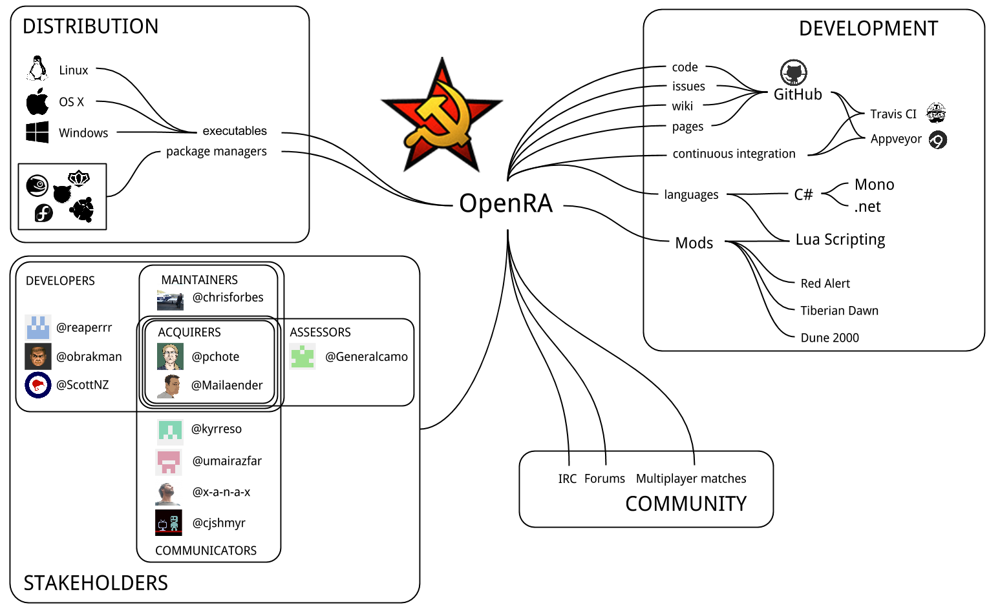
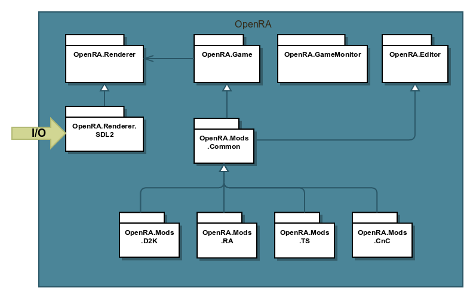
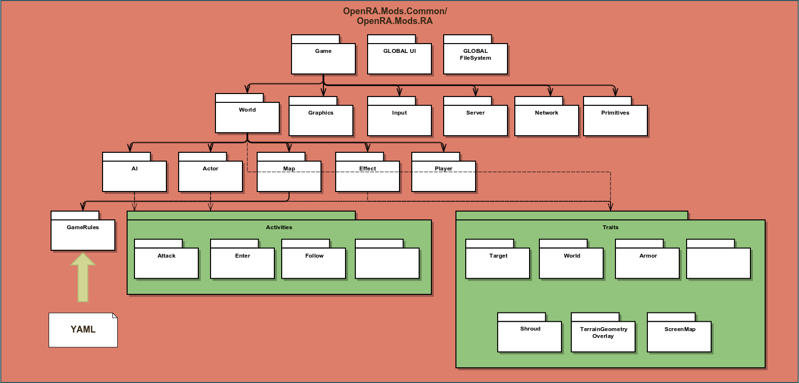
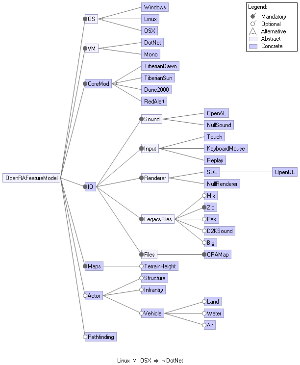
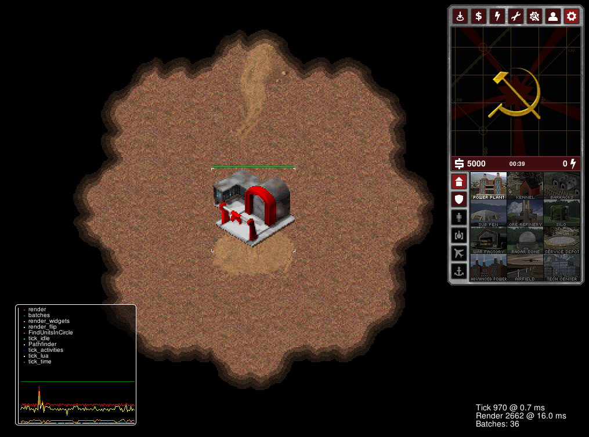

# OpenRA

## Abstract

OpenRA is an open source, cross-platform real-time strategy game engine.
This game engine is targeted at legacy Westwood games like Red Alert, Dune 2000, Tiberian Sun, and Tiberian Dawn.
<!-- michielha: more entry points for readers who know any of these games-->
The goal of this project is to have an extensible engine that makes modifying (modding) these games easy.
The project has been scrutinized from multiple viewpoints: context view, development view, and evolution view.
The outcome of this research and the conclusions that can be drawn from it are compiled in this chapter.
<!-- michielha: it is generally accepted to put the actual conclusion in the abstract -->

## Table of Contents

|# | Title
---|:------------------------
|[1](#introduction) | Introduction
|[2](#stakeholder-analysis) | Stakeholder Analysis
|[3](#context-view) | Context View
|[4](#development-view) | Development View
|[5](#evolution-perspective) | Evolution Perspective
|[6](#contributions) | Contributions
|[7](#conclusion) | Conclusion

# Introduction

Around the turn of the millennium [Westwood Studios](https://nl.wikipedia.org/wiki/Westwood_Studios) released a number of Real-Time Strategy (RTS) games jointly known as the Command & Conquer series.
The series has been well received amongst gamers and has made a significant contribution to the pop-culture of the day.
Many gamers still look at the titles with nostalgia, but the original titles can generally not be run on modern computer systems any more.

All of the games in the Command & Conquer series feature a similar gameplay: the player has to build a base and acquire resources to construct new buildings and combat units.
The player can build defensive structures to guard his or her base, or go on the offensive and attack the enemy base.
The goal is to defeat all enemy players through superior tactics.
Many games have later incorporated many of the same gameplay elements introduced by the Command & Conquer series, following a standard set by the series of games that entertained a generation.

<!-- michielha: maybe chuck in a screenshot in here to visualize what you just said -->

## The conception of OpenRA

OpenRA, where RA is an abbreviation of *Command & Conquer: Red Alert* --the best-received game of the Command & Conquer series-- is an open source project that aims for the reimplementation of the game engine featured in a number of Command & Conquer games.
Besides the bare engine, the project features a number of so-called *mods* that can be run on the engine, with the mods mimicking the gameplay of individual games.
As of March 2015, there are playable mods for the Red Alert, Dune 2000, and Tiberium Dawn games.
A mod for Red Alert 2 is in active development.

The OpenRA project was started by Chris Forbes in June 2007, presumably out of nostalgia for the old games.
The project lay relatively dormant for about two years.
Then suddenly, in October 2009, the project quickly gained a number of much-needed contributors, providing the spark that started a development effort that today is stronger than ever.
At the time of writing, the project has amassed 15220 commits by 159 individuals, including some contributions by the authors of this chapter.

# Stakeholder Analysis

Stakeholders within OpenRA work a little bit different than in a commercial(ly backed) product.
As virtually no money is involved, most contributions come from a very small set of people that take many tasks upon themselves.

Within the OpenRA project, the contributors aren't really concerned with a (materialistic) return on investment.
There is however a thriving community of people concerning themselves with the planning of the project: creating road maps for the project, categorizing issues and reporting bugs.
As we can see from the [issue](https://github.com/openra/openra/issues) and [pull request](https://github.com/openra/openra/pulls) page, most issue and milestone management is done by [@Mailaender](https://github.com/Mailaender), [@pchote](https://github.com/pchote) and [@obrakmann](https://github.com/obrakmann), who also have been the top contributors over the last twelve months.

A summary of the project's stakeholders can be found in [Table 1](#t1).

<a name="t1"></a>

 Type | Entities |
|---|---|
| Developers | [@pchote](https://github.com/pchote) , [@Mailaender](https://github.com/Mailaender), [@obrakmann](https://github.com/obrakmann), [@chrisforbes](https://github.com/chrisforbes) |
| Users | hundreds of players around the world, [ModDB](http://www.moddb.com/games/openra) |
| Suppliers | .NET/Mono, [Westwood](http://nl.wikipedia.org/wiki/Westwood_Studios), [Electronic Arts](http://www.ea.com/) |
| Assessors | Preventing copyright infringement done by [@pchote]https://github.com/pchote) and [@Mailaender](https://github.com/Mailaender) in https://github.com/openra/openra/issues?q=legal |
| Additional stakeholders | [Bountysource](https://www.bountysource.com/teams/openra/issues?tracker_ids=36085) |

**Table 1** The stakeholders within OpenRA

<!-- michielha: consider removing the table and putting it into text. Devs/users is pretty clear. At this point, it is not clear what 'mono' is. Assessors and additional stakeholders is really not clear to me. What is bountysource even? -->

# Context View

The Context view of the system defines the relationships, dependencies, and interactions between the system and its environment.
It defines what the system can do and what it does not do, how it interacts with other systems and the people involved across these boundaries.

A visual representation can be seen in [Figure 1](#f1).

<a name="f1"></a>



**Figure 1** The different stakeholders within OpenRA and their relations

## Overview

OpenRA is a cross-platform game engine written in C#, making use of Microsoft's .NET framework.
Where C# used to only be used for development of Windows applications, the Mono framework extends the use of this language to other platforms, such as Mac OS X, Linux and the BSDs.
Mono allows the developer to leverage one of Microsoft's most prized technologies and deploy it on multiple platforms.

The OpenRA project makes extensive use of GitHub for all parts of development.
First of all, they use GitHub as their code repository.
Secondly, they also make good use of GitHub's issue tracker to keep track of bugs, feature requests, and code reviewing.
Besides that, they use the wiki provided by GitHub for their documentation, FAQ, and other information.
Hooking into GitHub are two commonly-used continuous integration systems: [Travis CI](https://travis-ci.org/) and [AppVeyor](http://www.appveyor.com/).
These are used to automatically run a test suite for each pull request, and show a summary of the testing results right on the pull request's page.
This way a developer doesn't have to manually check out the branch and run the test-suite himself, something that saves the developers a lot of time.
Finally, they use GitHub pages to publish their website.

OpenRA is the basic engine, but lacks any playable functionality by itself.
However, OpenRA allows mods to be run that adds specific game aspects.
Mods are implementations of actual games, featuring all game elements the game may have: units, buildings and game mechanics.
The OpenRA project provides mods for the games Red Alert, Dune 2000 and Tiberian Dawn.
The wiki documents how one may develop their own mod.
A mod for Red Alert 2 is currently in development.
This seems to be highly anticipated, as there are over $1,500 dollars rewarded for it on [Bountysource](https://www.bountysource.com/issues/380169-tiberian-sun-red-alert-2-mod-1-557).

Like the original game, there are multiple missions shipped with the game, Lua can be used to script missions.
Lua is well-known as a game scripting engine, with numerous games having a Lua API a scripting enthusiast may program against.
Having a Lua API allows people who are familiar with modding other games to easily step in and do the same for OpenRA.
Missions and maps can be uploaded to the [OpenRA Resource Center][OpenRA Resource Center] which can be used in-game.
Modders can also upload their own missions and maps to have them available to others when hosting a match.
This allows people to contribute to the game without having to have any experience with Git or GitHub, making the barrier for entry significantly lower.
OpenRA also has a map maker tool that helps modders to build maps.

## Distribution

Whenever software is involved, distribution plays a major role.
Getting a piece of software to run on all major platforms usually comes with a high cost in terms of development effort.
As discussed above, Mono, by the company Xamarin, takes a lot of this effort away from the developer, letting them focus on the things that matter: just building the functionality without worries of the cross-platform behaviour.
<!-- michielha: false reference, it is not discuss above -->
The user can acquire and play OpenRA in a number of ways.
For most platforms (Linux, Windows, Mac OS X) the OpenRA team provides simple installers on their website.
Some Linux platforms also include OpenRA in their platform-specific repositories, and some cross-platform Linux repositories such as Desura and Lutris also include OpenRA among their packages.
The scope of OpenRA is to provide a cross-platform engine similar in functionality to the original engine used in the Red Alert games.
Users can provide the game data (such as textures and sound) from their original CD to run OpenRA, or download a 3rd party recreation of the game data (from a separate OpenRA project) .

## Community

OpenRA features an extensive wiki (using the GitHub wiki) documenting every part necessary for contributing, from building the software to scripting mods and creating maps.
They also provide a thorough FAQ on the wiki.
The changelog is updated with every merged pull request.
OpenRA also boasts quite an active forum, with new messages posted daily.
They also have a [Reddit community](http://www.reddit.com/r/openra), a [Google+ community](https://plus.google.com/+OpenRAnet), [Twitter](https://twitter.com/openra), and [Facebook](https://www.facebook.com/openra) pages.
Channel #openra on the Freenode IRC server is used for discussing different issues and ideas.

# Development View

The Development view attempts to capture all aspects of the system relevant to the development of the project.
OpenRA is split up in several modules to separate independent parts of the project.
Splitting the code up in several modules "helps developers understand it (the system, OpenRA) and work on it without affecting other modules in unexpected ways" (Rozanski and Woods).

OpenRA features the module system depicted below:

* A game module containing submodels for:
  * Activities that OpenRA allows
  * File parsers (for original Dune 2000/Red Alert/Tiberian Sun/Dawn files)
  * Game rules
  * High level rendering (see rendering engine further below)
  * Input handling
  * Networking
  * Scripting sublayer (allowing Lua scripts)
  * Sound handling
  * Support modules
    * Centralized logging facility
    * Centralized random number generator
* A monitoring facility, checking correct behaviour of the game module itself
* Common functions required for game modes (eg. path finding)
* Modules for game modes:
  * Tiberian Sun
  * Tiberian Dawn
  * Dune 2000
  * Red Alert
* Low level rendering/sound/input handling ([SDL][SDL])

The structure of these modules makes it easy to add and improve functionality of OpenRA.
However, there is a problem with the modules for the game modes and the module for common functionality: as of this moment a lot of common functionality is not stored in the `common`-module, but exists in a duplicated state in all game mode modules.
To implement new functionality for actors in OpenRA, developers should extend the `TraitInfo` class and apply this extension to actors.
By doing this, it is easy to separately test the newly implemented functionality (create an actor with only the new `TraitInfo`).

<!-- Michielha: those last two sentences are two specific, and I don't know what it's about. Suggested revision: say what you want but more abstract. -->

## Source Code Structure

Each module as specified in [Module Structures](#module-structures) resides in its own namespace.
The core of the system has the namespace `OpenRA`.
These files are located in the folder `OpenRA.Game`.
Each submodule is contained in a separate folder with the name of the module.
For example the module containing network code is located in `OpenRA.Game/Network`.
The classes in this folder have the namespace `OpenRA.Network`.
Modules that are not part of the core of the system are in separate folders.
For example, each mod has a folder prefixed with `OpenRA.Mods`.
Within these modules their submodules are prefixed with `OpenRA.Mods.NameOfTheMod`.

Apart from source code, each mod has several configuration files and assets.
These files are located in the `mods` folder.
Each mod has a folder within `mods`.
The layout of a mod folder is described in the [Modding Guide](https://github.com/OpenRA/OpenRA/wiki/Modding-Guide).

Graphical assets are usually created using external programs, like Adobe Photoshop and Illustrator.
These programs have their own file formats, which are not directly included in builds, but are needed to generate and modify the actual assets.
These files are located in the `artsrc` folder.

The following model defines the organisation of the system’s source code in terms of modules and dependencies between them.
[Figure 2](#f2) represents an overview of the complete game framework.
[Figure 3](#f3) is zoomed into the `OpenRA.Mods.Common` and the `OpenRA.Mods.RA` module.
This module is combined and represented as a whole because `OpenRA.Mods.RA` is an extension of `OpenRA.Mods.Common` as seen in [Figure 2](#f2).

<a name="f2"></a>



**Figure 2** Overview of the complete OpenRA Game Framework

<a name="f3"></a>



**Figure 3** Overview of the `OpenRA.Mods.Common`/`OpenRA.Mods.RA` source code modules

In [Figure 3](#f3) the most important modules are listed for the OpenRA Red Alert Mod and are divided in separate layers.
The top layer represents the game itself and global modules to handle the UI and the file system.
The next layer handles the game setup such as creating a world, a renderer and primitives.
The next two layers contains the game core such as actors, activities, maps and players.

## Test tools and infrastructure

OpenRA contains very few unit tests (13, of which three are currently disabled to not break the continuous integration systems).
Furthermore there are automated tests to parse the default levels of all game mods.
Finally, the code style for C# code is checked as defined in [Code Style](#source-code-structure).

All tests can and should be executed by a developer before sharing his or her contributions.
Also to make sure these tests don't fail on the `master`-branch, OpenRA makes use of continuous integration systems executing these tests for every pull request.

Currently only the result of TravisCI is used to determine if a build passes or fails, as AppVeyor is mainly used to generate Windows builds.
<!-- michielha: and not for testing? if not, you might want to add -->

## Codeline Organization

The OpenRA project has a strict coding standard that should be followed by contributors.
This standard is being maintained by StyleCop, a system that checks if source code files follow code conventions.
The coding standard of OpenRA can be found on their [wiki](https://github.com/OpenRA/OpenRA/wiki/Coding-Standard).
Below is a small summary of the most important code style constraints:

* One class per file
* Class files should have the same name as the class contained in it
* Keep dependencies between assemblies to a minimum
* Put classes in a namespace which fits their purpose the best
* Use tabs for indentation
* Keep curly braces on a separate line
* Do not use curly braces whenever a statement is a single line
* Types properties, method names and public variables are always PascalCase
* Private variables and formal parameters are camelCase
* Keep functions short
* Avoid excessive parentheses
* Include spaces around binary operators
* Use `var` for declaring local variables inside methods
* Do not explicitly declare methods as `private`
* Prefer US spelling over English

<!-- michielha: consider removing this section, its really specific and adds very little value -->

## Build Process

Developers can build the system locally to test their changes.
The project maintains a set of building instructions for both Windows and OSX/Linux systems.
These instructions can be executed to obtain executables for the respective systems.

There are two Continuous Integration systems being used by OpenRA: TravisCI and AppVeyor.
AppVeyor is used to build the Windows version and TravisCI is used to build the OSX/Linux variants.
Whenever a developer creates a pull request, these two systems automatically build the system and runs the test suite.
StyleCop is also run to ensure that the commits follow the coding standards.
Whenever a build succeeds, the corresponding pull request can be merged.

Builds are packaged for different supported operating systems.
Scripts are used to automatically package the binaries, upload them and update the wiki pages that contain generated content ([Traits](https://github.com/OpenRA/OpenRA/wiki/Traits), [Lua API](https://github.com/OpenRA/OpenRA/wiki/Lua-API)).
These scripts are located in the repository in the `packaging` folder.

## Release Process

OpenRA has three different types of releases: bleed, playtest and public release.
These releases are located on seperate branches according to the [wiki](https://github.com/OpenRA/OpenRA/wiki/Branches-and-Releases):

* `bleed` &rarr; bleed
* `next` &rarr; playtest
* `master` &rarr; public release

The bleed branch is where all commits are initially merged to.
This is the most up to date branch and might be very unstable.

Several times a year, the contents of `bleed` are merged to `next`.
These releases are aimed at testers to show the current state of development and test the added features and bugfixes before merging them into a public release.

Public releases are usually released one or two weeks after a playtest.
This gives the developers time to polish up a playtest before releasing it as a public release.

# Variability Perspective

OpenRA has several important features that make up the engine.
[Table 2](#t2) shows these features.

<a name="t2"></a>

Feature     | Description
----------- | -----------
OS		| Operating system where the program runs on
VM		| Virtual Machine where compiled binaries are executed on
Mod		| Mod currently being played. This can be changed at runtime by selecting a different mod
Sound		| Sound manager where game sounds are directed to
Input		| Input that is being used to play the game
Replay		| Input type where a replay of a previously played game is handled
Renderer	| Renderer used to display the game
NullRenderer	| Empty renderer that emits render call to the void
Legacy Files	| Legacy file formats of existing games that are used to store maps, assets and other file types

**Table 2** Different features within OpenRA

[FeatureIDE](http://wwwiti.cs.uni-magdeburg.de/iti_db/research/featureide/) is used to visualize all these features/variabilities into a model, which can be seen in [Figure 4](#f4).

<a name="f4"></a>



**Figure 4** Feature model of OpenRA

### Incompatibilities between features

As shown in [this issue](https://github.com/OpenRA/OpenRA/pull/7393#issuecomment-72135381) there is an incompatibility in reading image files between .NET (Microsoft Windows) and Mono (Windows, Linux, Mac OS X).
This can be prevented by exporting images in a different way.

OpenRA uses SDL to render graphics on the screen of the user.
SDL supports rendering with OpenGL and Direct3D, but within OpenRA only OpenGL 2.0+ is used.

Another obvious incompatibility is trying to use .NET as virtual machine on either Mac OS X or Linux.
This will most likely not change in the foreseeable future as Microsoft currently hardly has any interest in other platforms besides Windows.
On the other hand, it is possible to use Mono on Windows.

<!-- michielha: but then why is not mono being used on all platforms? or reference to the next section -->

### Variation points

The main variation point in OpenRA is the mod selection.
This choice is made as soon as OpenRA starts up.
To determine which mods are available, the `mods`-directory is read and the directories found there are assumed to be mods and are shown at the loading screen of the product.
Therefore adding a mod to the already installed product only requires a valid mod to be placed in the `mods`-directory.

One notable build-time variation point is creating the build for either Mono or .NET.
Even though executables created with either VM should work on the other (build with Mono, run on .NET or vice versa), there were some issues with this in the past which resulted in building the Windows version separately on an actual .NET VM (via AppVeyor).

## Architecture and Design
There are multiple variation points in the system. The first one is the AI debug variation that is implemented at run-time, the second variation is the map editor that is implemented at build-time.

The AI debug feature is a feature that can be enabled at run-time by checking the box in the settings dialog.
This will trigger the `BotDebug` boolean in `OpenRA.Game/Settings.cs`.
```
public class DebugSettings
{
  public bool BotDebug = false;
  public bool PerfText = false;
  public bool PerfGraph = false;
  public float LongTickThresholdMs = 1;
  public bool SanityCheckUnsyncedCode = false;
  public int Samples = 25;
  public bool IgnoreVersionMismatch = false;
}
```
Enabling this feature will generate bot debug messages by calling the function BotDebug.
```
public static void BotDebug(string s, params object[] args)
{
	if (Game.Settings.Debug.BotDebug)
		Game.Debug(s, args);
}
...
HackyAI.BotDebug("AI: {0} is starting production of {1}".F(player, item.Name));
```
This feature is particular useful for developers creating new bots for OpenRA.
As you can see, there are multiple booleans present for different features in OpenRA at run-time.
The user can also enable a performance graph to keep track of the time spent on different elements such as path-finding, rendering and activity traits.
This is displayed in [Figure 5](#f5).

<a name="f5"></a>



**Figure 5** Screenshot of OpenRA with performance graph visible in lower left corner.

At compile-time, the Makefile will make sure that for example the map editor will be shipped with the game.
```
# program targets
CORE = rsdl2 rnull game utility
TOOLS = editor tsbuild crashdialog
VERSION     = $(shell git name-rev --name-only --tags --no-undefined HEAD 2>/dev/null || echo git-`git rev-parse --short HEAD`)
```

The map editor is useful for modders and the build details are also in the Makefile where the developer could specify the environment details such as the mod locations, libraries and icons.
```
# Map Editor
editor_SRCS := $(shell find OpenRA.Editor/ -iname '*.cs')
editor_TARGET = OpenRA.Editor.exe
editor_KIND = winexe
editor_DEPS = $(game_TARGET) $(mod_common_TARGET)
editor_LIBS = System.Windows.Forms.dll System.Data.dll System.Drawing.dll $(editor_DEPS) thirdparty/Eluant.dll
editor_EXTRA = -resource:OpenRA.Editor.Form1.resources -resource:OpenRA.Editor.MapSelect.resources
editor_FLAGS = -win32icon:OpenRA.Editor/OpenRA.Editor.Icon.ico
```

# Deployment
As OpenRA is a software product, suitable hardware is necessary to deploy and use the system.
OpenRA tries to be an open-source, cross-platform port of the original Westwood games and engine, keeping the range of hardware it runs on as large as possible.
Therefore the requirements to the hardware are kept to a minimum and in practice any consumer can run OpenRA on his or her computer.
The only dependency the user should worry about on non-Windows systems, is that Mono should be installed.

Developers need to install more software, such as Visual Studio (on Windows) or MonoDevelop (on other systems).
All these development requirements are properly listed in the OpenRA documentation so that any developer can quickly get started.

# Evolution Perspective
The evolution perspective introduces a viewpoint into a project focused on continual change of a system.
It's very similar to the notion of maintainability, taking into account metrics such as code quality and modularity.
It goes beyond these, however, in that it tries to define whether or not maintenance and evolution is necessary or desired, and if so, where in the system this would be painful and where it would all go smoothly.

## Evolution in OpenRA
Applying this perspective to OpenRA, we see see that it scores well on quite a few points raised by the perspective.
On the other hand, it also scores poorly in some other cases, arguably making the evolution of the project significantly harder.

OpenRA is designed in a pretty modular fashion.
This potentially makes the process of evolution much simpler, given that the modularity is implemented well.
OpenRA seems to score well on these points: it makes heavy use of traits (a common interfacing pattern) and attempts to split out common components into modules where possible.
The mods, implementing individual games with the OpenRA Core being the game engine, could arguably be considered as separate projects within OpenRA.

Two types of evolution are likely within OpenRA: functional evolution, when the OpenRA Core or mods have to deal with changes from within (ranging in size from a small bug fix to reimplementation or extension of components); and environment evolution, when the OpenRA Core changes, which essentially causes the loosely-coupled mods' environment to change.

## Evolution candidates
Some components of OpenRA are in a high need of evolution, for instance the AI submodule.
GitHub yields some insight here, as there are many reports of faulty AI behaviour on its issue list.
The AI submodule is an excellent example of a pattern seen in many open source projects.

When a project is mainly developed in the free time of its developers, and as such some components were implemented to be "good enough for now".
As is the aptly named HackyAI module, for which incidentally a complete reimplementation is planned.
Other ongoing evolution efforts can be found in the rendering engine, where terrain height is being implemented, which will trigger environment evolution in the mods as they'll change to adapt the new features.

## Ease of evolution
As mentioned before, OpenRA's modularity will benefit evolution of the project.
Despite its modularity, however, evolution may not go so smoothly.
Tests are virtually non-existent in the project - checking mainly for coding style.
This could make it easier for bugs to creep in and go unnoticed, and make tracking these bugs down equally hard.
Again taking the AI submodule as an example, it has a clearly defined interface for which relatively little change should be necessary.
However, guaranteeing the AI will occur no loss of functionality will be a tedious process, due to the absence of a test suite.

To ease future evolution and aid with the current reimplementation effort of the AI submodule, it would be advisable for the developers to try and maintain a test-driven workflow.
Capturing current AI behaviour in specification tests (specs), and developing the new functionality testable against these specs has the potential to largely bring down the cost of reimplementation and future evolution.

A benefit for the project is the fact that the build system and tooling are on par.
Every module can be built separately, and executables generated by automatic build systems.
This makes it easier for other programmers to start hacking on the project, thereby increasing the number of potential contributors.
This, in turn, should ensure continued evolution of the project.

# Contributions

During the course of this project, several contribution have been made to OpenRA.
A list of these contributions can be found in the [contribution list](contributions.html).
Most merged pull request are bug fixes, or small additions to the game.
One of these additions is a kill/death ratio that is shown after a match.
One of our team members, [@pevers](https://github.com/pevers), is even invited to the OpenRA organisation for all the fixes he implemented.

<!-- michielha: That's really nice! -->

# Conclusion

OpenRA was started to recreate the nostalgic experience many people have with the original Westwood games from the '90s.
While the main effort was and still is to get the games working on as many modern platforms as possible, there is no concrete roadmap for features.
This results in volunteers just implementing features as they want them to be included and right now nobody cares about tests.
The game itself is used as the main test and currently the automated tests only checks the style of the C# and YAML files.

The process of development via GitHub is managed quite well though, which ensures that there is at least a human check on the quality of proposed code changes.

We do however think, that in the very near future a proper test suite should be implemented, as we've seen many pull requests get merged that eventually seemed to be the reason of older features breaking.

<!-- michielha: maybe a killer endnote would be a nice addition -->

[SDL]: http://www.libsdl.org/
[OpenRA Resource Center]: http://resource.openra.net
