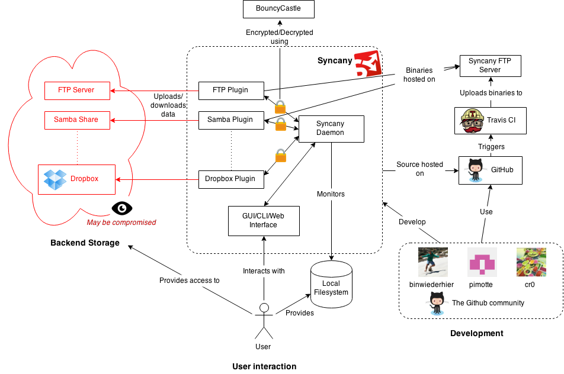
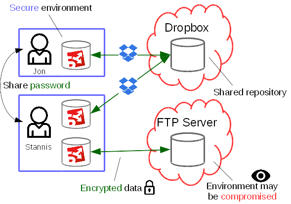
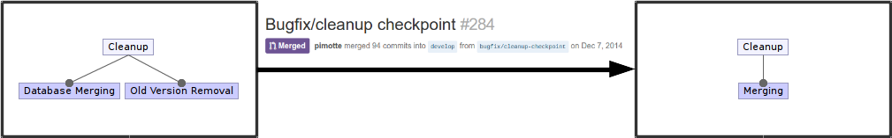
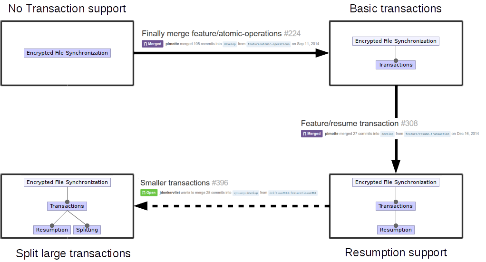
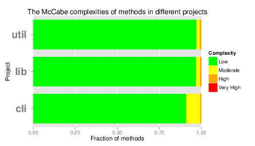
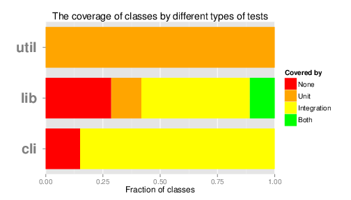
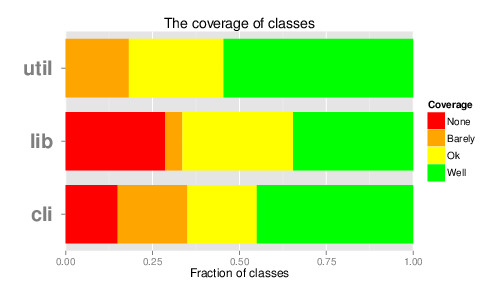

# Syncany: The road to beta

**By [Jesse Donkervliet](https://github.com/jdonkervliet), [Tim
Hegeman](https://github.com/thegeman), [Stefan
Hugtenburg](https://github.com/MrHug), and [Niels
Spruit](https://github.com/nspruit)** 
*Delft University of Technology*

*After the Snowden revelations in 2013, the call for privacy has gone out more
loudly than ever before. Syncany offers users this privacy by enabling them to
store and share encrypted information on many different (unsafe) storage media.
This chapter describes the design and functionality of Syncany as well as the
road towards Syncany's beta release. Both the growth of Syncany from a
simple encryption program that could synchronize files to the full product line
that it is today, and plans for the future are outlined in this chapter.*

## Introduction

In 2008 Dropbox introduced itself as a platform for storing your data, accessible
at any time from anywhere in the world. Dropbox and similar cloud storage services
have since gathered millions of users. With the increase in popularity also came
an increase in concern: can we trust cloud storage services with our data?
Recent revelations have shown that our privacy may not be guaranteed when our data
is no longer in our control. Philipp C. Heckel had this same idea when he first
announced Syncany in 2011; a file synchronization application with client-side encryption.

The goal of Syncany is to allow users to utilize any cloud storage service for
the purpose of synchronizing files, while ensuring the privacy of the user by
encrypting all data before it leaves the user's machine. This provides the user
with the flexibility to use an FTP server, a personal Dropbox folder, or a
Samba share to store their data, without worrying about their security. Syncany
complements this with a variety of features, such as file versioning, and
reducing storage footprint through deduplication.

On the bumpy road towards the beta release of Syncany, we reflect on the design, architecture, and development of Syncany,
analyzed from multiple viewpoints. We further discuss how these aspects influence
the progress of the project as Syncany moves towards its first beta release.

## (Back to) the drawing board                                                   

Designing a software system is always a daunting task, especially when designing larger
systems like Syncany. After creating a software architecture, how do you know if it is
any good? Just like in architecture of buildings, there are three things you must consider:
the neighbourhood, the features of the building, and the lay-out of the building you are
designing. In software the neighbourhood refers
to the context that your system is placed in, thinking about users, developers, and tools used.
The features of the building are of course the features and functionality of the software system.
Similarly to how buildings have a specified lay-out, many software products do too.
These blueprints determine how different functionalities work together and achieve the goals of
the system. Having a thorough understanding of any creature's habits and habitat, or equivalently
a system's features and context, can help to understand and explain both past and future actions
taken by the creature.

### Syncany in its natural habitat

The design of any software system depends not only on its intended functionality,
but also on the context in which it operates. Like most software systems, Syncany
relies on and integrates with many external systems. These external systems
provide access to storage, power the encryption that makes Syncany secure, and
aid the user in deploying the Syncany application. Figure 1 depicts the context
of Syncany, including systems, services, people, and more.

__Figure 1__: Context diagram of the Syncany project.

#### The ecosystem

Syncany's context consists of roughly the following three areas:
user-oriented functionality, backend storage and development support.
The user has access to both a local file system and some remote storage that
they wish to synchronize. To instruct Syncany to perform this synchronization
for them, they require access to some user
interface to interact with Syncany. Syncany, in turn, must be able to access
the user's data on the local file system, including the ability to monitor for changes so
they can be uploaded without requiring user intervention. Syncany users may be
using many different platforms, primarily on laptops and desktop computers, but in the
future users may wish to access their data on-the-fly using their mobile
devices. As a result, Syncany is designed and developed to be
platform-independent.

Users may use many different types of remote storage, so Syncany has to
accommodate for the users' needs by integrating with a large variety of storage
solutions. To support this, Syncany includes a plugin-based design for the
communication with the backend storage. The backend storage also imposes
requirements on the security of Syncany; one of the key assumptions of Syncany
is that any remote system or network may be compromised. Any data leaving
Syncany's core is encrypted using a key held by the user, and it cannot be
decrypted until the data is downloaded by any user holding the key. Because
trust in Syncany's cryptography is key for Syncany's success, integration with
a tried-and-proven solution like the
[BouncyCastle](https://www.bouncycastle.org/java.html) library is a must.

#### The zookeepers

The development process of Syncany primarily takes place on
[GitHub](https://github.com/syncany/syncany), but the process is more than
just uploading source code. Key people in this process are project owner
[Philipp Heckel](https://github.com/binwiederhier), main contributors
[Pim Otte](https://github.com/pimotte) and [Christian Roth](https://github.com/cr0),
and the GitHub community that aids them by testing Syncany in practice,
reporting bugs, and submitting patches. The results of these efforts are
monitored using continuous integration provided by
[Travis CI](https://travis-ci.org/syncany/syncany). Successful changes result
in new binaries and these are automatically uploaded to an FTP server, enabling
the end-user to download new plugins or update their existing installation.

An alternative view on the key people in Syncany as a project is given by a
stakeholder analysis (as described by Rozanski and Woods[[1]](#references). For example,
Syncany's *acquirers* are the people who donate through channels like
[tip4commit](https://tip4commit.com/github/syncany/syncany) to support the project, in
addition to Philipp Heckel, who puts in many hours of his spare time to ensure
that the project progresses. Most other roles are fulfilled by Syncany's
developers and users. For example, as an alpha product Syncany relies on its
users to aid in testing the system. This stresses the importance of users in
Syncany's existence, as opposed to larger (open source) projects that may be
supported by large companies, rather than individuals.

### The creature's habits

Before you can design a software system, you need to know what it is supposed to do.
What are its features? What is its purpose?
Only when the features of a system are clearly defined you can create a solid
system design.
Syncany is a system with such a clear set of features.

Let us start by looking at the *repository*.
Any time Syncany gains a new user,
this user starts by creating a repository.
Such a repository is comparable to a repository in a VCS (Version Control
System).
The repository is managed by Syncany and keeps track of all files and
directories that are placed inside it.
Syncany also keeps track of file versions,
so that earlier versions can be restored later.
Storing files with their complete history can result in enormous repositories
over time,
even when the number of files in the repository is relatively small.
Syncany tackles this problem in two ways.
First, they provide the naive feature of *cleaning up* the repository.
In this cleaning process all file versions older than a predetermined value
are removed from disk.
This reduces disk space usage, but still allows the user to restore some older
versions of files when necessary.
Second, the encryption mechanism used by Syncany incorporates a *deduplication*
step.
Deduplication is a compression technique that Syncany uses when encrypting files
and meta-data.
Simply put, it scans the data for duplicate byte patterns.
If such duplicates are found they are replaced by references to the original
byte sequence.
This reduces the size of the data that needs to be stored on disk.

When files should be backed up on a remote location,
Syncany offers the functionality to do so.
A unique feature of Syncany, compared to other file synchronization systems, is
that it offers secure storage on remote locations, even if the remote itself is
not secure.
It achieves this by encrypting all data and meta-data that is stored on the
remote.
Even if a third party can reach the remote data, they are unable to decrypt the
data.
Adding network features in a system also brings added complexity.
Networks are infamous for not working when required or being unstable
altogether.
When uploading large amounts of data the probability of experiencing a network
failure is significant.
Syncany stores the status of an upload when it is interrupted.
This allows users to resume uploading data as soon as the network becomes
available again.
This results in both a better user experience since the data upload does not
completely restart after a network failure.
It also allows for large transactions to be possible over highly unreliable
networks that would otherwise cause transactions to repeatedly restart before
they are complete.

Syncany also offers the functionality to share repositories with others.
To use this functionality users first need to exchange the password that enables
decrypting the remote content.
Syncany comes with built-in conflict detection in case multiple users modify the
same file concurrently.
When this happens, users are notified and have the opportunity to resolve the
conflict by hand.
Sharing repositories allows users to synchronize their work between multiple
computers, such as their desktop and laptop.
It also allows multiple users to share data and work together on documents,
providing a user experience comparable to that of Dropbox and Google Drive.

Another unique feature of Syncany is the possibility to use *any* remote storage
platform available.
Syncany uses a plugin system that can provide support for any storage backend.
Examples of such plugins are FTP, WebDAV and Dropbox.
Note that in the latter case, the storage space from Dropbox is used, but all
synchronization and encryption is performed by Syncany.
Because the remote storage support is implemented through small plugins,
users can also provide support for their own remote storage solution with little
development effort.
This creates a much more flexible system when compared to conventional data
synchronization systems, where users have no other choice but to use the storage
solution that comes with it.

Besides providing plugins for remote storage, Syncany also uses plugins for
their user interface.
Users run Syncany as a daemon process, allowing plugin-based user interfaces to
communicate with the daemon.
This design allows for a larger userbase, allowing techies to type away on a
command line interface while normal people can use a graphical interface
implemented as a desktop or web application.

The figure below shows users Jon and Stannis using Syncany, and
visualizes the core functionality of Syncany in a single image.
It shows the repositories, remote file synchronization, repository sharing and
storing secure content on unsecured remote locations.

__Figure 2__: Syncany core functionality summarized.

### The Syncany blueprints

We all know that with awesome functionality comes great responsibility.
Taking this responsibility comes in the form of a solid system architecture.
A good architecture results in a clean codebase organization that is easily
extended and maintained.

As dictated by the need to accommodate for many different needs of Syncany's
users, Syncany is organized in multiple projects. The majority of Syncany's
implementation is part of the main project
([`syncany`](https://github.com/syncany/syncany)). This includes most of the
platform- and storage-independent code. Additional projects exist for the
various plugins provided by the Syncany developers, e.g.
([`syncany-plugin-gui`](https://github.com/syncany/syncany-plugin-gui)). This
structure enables Syncany to grow as a software product line; keeping shared
implementation in a single place, while being extensible enough to add new
storage solutions, interfaces, etc.

__Figure 3__: Module Structure Model of Syncany, based on Rozanski and Woods [[1]](#references).

#### The bricks and mortar

Zooming in on the source-level architecture, Figure 3 depicts the components
that make up Syncany in its current design. Syncany can be divided into the
typical presentation, data, and business layers. These were derived from the
context in which Syncany is placed; the presentation layer encompasses the user
interfaces, two data layers for local and remote storage, and the business
layer for the core functionality of Syncany. The components as depicted in
Figure 3 originate from the flow of data as users are using Syncany.

The user interacts primarily with the *Command Line Interface* or *Graphical
User Interface*. Both are able to communicate with Syncany's core implementation
by issuing the execution of synchronization commands. Alternatively, they
interact with the Syncany daemon. The user interfaces can also listen to the
*EventBus*, a message passing system that is used by the core to notify users
in detail of the progress of ongoing operations.

The *sync operations* component contains implementations of the operations
exposed by user interfaces to the user. These include `up`, `down`, `ls`,
and `status`. These operations are the glue that combine the various
components in the business layer to provide functionality that matters to
the user.

One of these components is *chunking*. The chunking framework implements the
features of Syncany that relate to turning files on a local system into a format
that can be stored on remote systems. This includes indexing (figuring out which
files have been changed since the last release), splitting files into chunks,
and deduplicating (figuring out if chunks have previously been uploaded).

The output of this component is passed on to (or its input provided by) the
*cryptography* component. This component encapsulates the security provided
by Syncany. As demanded by Syncany's context, the cryptography component uses
BouncyCastle behind the scenes to perform the encryption and decryption. The
complexity of the cryptography component is primarily found in determining what to
encrypt and how to ensure that not only data but also metadata is hidden.

Interaction with storage (both local and remote) is managed by the *data access*
and *transfer management* component. The former provides database integration to
load and store metadata for repositories, include file histories, chunk hashes,
etc. The latter is much more involved and is still evolving in its design.
Transfer management includes many features that are required to interact with
remote repositories; determining what data is already on the remote, using
transactions to prevent data corruption, version management in case of conflicts,
etc.

The transfer management component requires a *storage solution plugin* to
implement a small set of operations on remote storage using a specific service
or technology, such as Dropbox or FTP. Operations include (dis)connecting,
uploading, downloading, deleting, and listing files. Files handed to the
storage plugin are already encrypted, and as such, the storage plugin is
oblivious of the file management process. This greatly simplifies the
implementation of storage plugins, making them both easy to add (which adds to
the goal of supporting many different platforms), and less complex (which
greatly reduces the maintenance load of the developer team).

#### Masonry to create the stronghold

As the architecture was derived from the logical flow of information in Syncany,
it is structured well and is easy to comprehend and extend. However, a set of
components does not yet make a product. Syncany as a software product line has
many different configurations. Both the user interface and storage interface
can be swapped out at will. The good practice of coding against interfaces in
Java enables this integration on a source code level. Architecturally, the
need for different configuration resulted in a strong encapsulation of the
functionality into plugins. These plugins must define and use a limited but
well-defined API to perform their tasks. This facilitates the abstraction
required to reliably implement and maintain a large number of alternatives,
but also limits the use of extra capabilities (or consideration for the
limitations) that a storage platform may have. Overall, between the clearly
defined communication patterns between components as described earlier, and
the encapsulation achieved by the plugin system, Syncany's architecture is
sound and more than capable of accommodating the project's current goals.

## Syncany is Evolving!

In the fourth version of Unix, which was launched in 1973, the command-line
utility 'grep' first appeared.
It in an adaptation of the 'ed' program and allows users to search for
expressions in files.
Now, fast-forward to 2015, grep is one of the basic components of every Linux
install.
Although grep is a relatively simple application, it is still maintained an
receives frequent patches.
If a simple command-line application such as grep still needs maintenance after
nearly three decades, it quickly becomes clear that maintaining a large software
project such as Syncany can be a daunting task.
On one hand you need to maintain your existing codebase and improve existing
processes.
On the other hand you need to deal with new challenges that emerge during the
development of your system.
Syncany needs to keep working on these issues to reach the beta status,
and eventually be pre-installed on each Linux distribution, just like grep.

### Even the mightiest of redwoods begin their lives as mere saplings

The sapling that was Syncany is quickly on it's way to become that mighty
redwood. Along the way it has encountered a variety of challenges.  A historical
overview of these challenges reveals some of the decisions that led to the
architecture as it is today, and the decisions that have yet to be taken for the
challenges that Syncany is still facing.

#### Rule 45: Clean up your own mess

Given the large amounts of data Syncany stores for its users and the
fact that it also keeps track of previous file versions, it is no surprise that
this can quickly take up a lot of disk space. As a result, Syncany has developed
a cleanup feature that has undergone several changes over time. Cleanup started
out as a feature with two responsibilities. The first responsibility was to
mark file versions as *to be deleted*. The second was to merge multiple
database versions into one. This shrinks the file history chain, and drops all
file versions marked for deletion. This method proved to be error-prone because file
versions that were deleted by one client were still being referenced by other
clients. This resulted in corrupted databases, making repositories unusable.

Some major refactoring of this functionality resolved this issue by 
reorganizing the cleanup sub-features.The cleanup now no longer performs
a mark operation followed by a merge operation. It instead only performs a
merge operation. The merge operation has built-in mechanisms to drop all
file versions which are safe to delete, and to notify all other clients that
they should update their local data with the new cleaned data on the remote
storage. The latter action prevents any inconsistencies that may have arisen between
clients after a cleanup operation. Figure 4 below summarizes the evolution that this
feature has undergone.

__Figure 4__: Feature evolution for the Cleanup feature.

#### Transactions to compensate for your unstable Internet

Another feature that has historically been the cause of many issues is the use of
transactions by Syncany. Repositories are likely to grow in size over time, both in number of
files and individual file sizes, and this leads to whole new set of challenges.
For instance, when uploading many files over an unstable internet connection,
users likely do not want to restart if the connection temporarily drops. To this
end a transaction mechanism was introduced, helping Syncany scale to larger
files and repositories.

To eliminate the problem of having half-completed uploads in your repository,
atomicity was [introduced](https://github.com/syncany/syncany/issues/64).  This
resulted in a file transfer sub-feature called transactions.  The introduction
of transactions created additional problems; dropping a
connection meant restarting the transaction.
This behaviour was problematic when transactions were large, the network was
unreliable, or both. The Syncany team also realized this was an issue and
eventually implemented [transaction
resumption](https://github.com/syncany/syncany/issues/141).

At the time of writing, the next step in this process is still an [open pull
request](https://github.com/syncany/syncany/pull/396), through which the Syncany
project hopes to eliminate yet another problem with transactions.  Because
Syncany does in-memory indexing of files, large transactions become a very
memory intensive operation.  Furthermore, the transfer of files can only begin
once the transaction is completely assembled.  This means that users might need
to wait a long time before files in a large transaction are actually uploaded.
To solve this problem transactions are split after a certain transaction size
has been reached. The uploading of these transactions is then pipelined with the
further indexing of changes. Figure 5 below shows the evolution of the
transactions feature.

__Figure 5__: Feature evolution for the Transactions feature.

### Time for your check-up, Syncany

Before looking at the future, it is important to also consider the present. It
is likely that more people will (re)try Syncany after a beta release, which will
lead to more bug reports and (minor) feature requests. To ensure that the
developers can process these reports and requests in a timely fashion, it is
important for the product to be maintainable. Because maintainability is a
rather abstract concept, we apply the [Goal Question Metric
(GQM)](http://www.cs.umd.edu/~mvz/handouts/gqm.pdf) methodology to define
concrete metrics for measuring the maintainability of Syncany.

The goal we analyze is improving the maintainability of Syncany.
Maintainability concerns may be found in three distinct aspects of the Syncany
product line: the codebase, the test suite, and the development process.

#### Complexity is easy, simplicity is hard

In order for any product to be called maintainable, the code should not be
overly complex. It is easy to design a few classes that can do a lot of things
very quickly, but going back to them in a day, a week or even a year will be a
pain. Several design principles consider specifically these "God classes" that
deal with too many different things within a single class. The Single
Responsibility Principle (SRP), as introduced by Martin [[2]](#references), is a clear example
of this. It states that each class in code should have only one "reason to
change", meaning it is responsible for only one type of operation or
information. When adding new features to the code or changing/fixing existing
pieces of code, God classes are often a part of the changes made.

One way to track classes that might be God classes, is by looking at the
complexities of the methods of a class. If these methods are of low complexity,
they are not likely to do many things at the same time, making it unlikely for
the class to be a God class. Obviously this is no guaranteed method to find all
God classes, as classes with many simple setters/getters might still govern
different unrelated pieces of data.

Measurements on the Syncany code base show that in general the code has a low
[McCabe
complexity](http://ieeexplore.ieee.org/xpls/abs_all.jsp?arnumber=1702388),
indicating few paths through a method. As a result, methods can easily be
changed and tested and this measure raises no real concern for too complex
methods or classes. Figure 6 shows an overview of the complexity of the methods
for the three main Syncany projects.

__Figure 6__: Method complexities for Syncany's main projects.

#### Keep testing it 

Unfortunately for Syncany [Andy Zaidman's
son](http://www.tedxdelft.nl/2015/01/tedxdelft-speakers-andy-zaidman-make-testing-fun/)
is still too young to properly test their system. As he has advocated at the
TEDXDelft 2015 event, it is more important than ever before that testing is
given the attention it deserves. And although possibly a little biased, he
claims his two-year old son is the best tester out there. Why? Because he simply
tries everything. Large projects like the Fyra high-speed train between the
Netherlands and Belgium have been a massive failure, largely due to software
errors. In order to ensure Syncany does not follow the Fyra to it's bug prone
grave, it will require an extensive and qualitative test suite.

Such a test suite is important to ensure that new functionality or patches do
not break existing functionality or reintroduce old bugs. For this purpose, not
only is sufficient test coverage required (i.e. that all lines of code are
tested), but there should also be different kinds of tests. For Syncany we
identify two such types of tests: unit tests that cover only a single class and
ensure it operates as specified, and integration tests that cover multiple
classes and test the interaction between classes. However, when analysing the
types of tests classes in the three main projects have, it becomes apparent that
Syncany does not yet have both tests for a majority of its classes, as shown in
Figure 7.

__Figure 7__: Coverage data on a class level for the three main Syncany projects.

In addition to not being extensive enough, the quality of the test suite is also
a cause for issues. Not only do many tests have a tendency to semi-randomly
fail, because they depend too heavily on timing, but the tests that are there
and pass also fail to cover the majority of the code properly. In Figure 8 we
show the coverage on a method level, in which we plot the percentage of lines
covered by some test in a method. "Barely covered" represents 1-49% coverage,
"Covered" represents 50-79% and "Covered well" represents 80+%.

__Figure 8__: Coverage data on a method level for the three main Syncany projects.

#### Do not get stuck in the past

When aiming to grow, it is important not to have issues from the past hold you
back. As a result it is important that the developers can keep up with the
feedback provided by the new users of the beta version. New feature requests and
bugs will reported at a higher rate, stressing the development team. When
examining the time between the opening and closing of issues and the backlog of
open issues labelled as `bug`, it becomes clear that Syncany can improve in this
aspect. Some issues have been open for over half a year and so long as they
remain, it seems likely for these bugs to carry over to new versions of Syncany
as well.

#### The diagnosis: take some testing pills

Syncany's codebase is sufficiently changeable, as it contains very few complex
methods. Unfortunately, Syncany's test suite is a major concern. It lacks unit
tests for most of the classes and some classes even remain fully untested. The
coverage has also been dropping lately to a point where it is now "not covered"
to "barely covered" for over 50% of the code.  Before Syncany can move to a beta
version, they will have to update and expand their test suite and re-examine
issues that have been open for longer periods of time.

### This is not even the final form!

Although Syncany has already come a long way from that tiny single-man project
it was just a few years ago, it is not quite yet at the 'grep' stage. In the
future Syncany will have to expand and optimise many things before attaining
such a status. Pim Otte, one of the main developers for Syncany, sees two main
obstacles before a beta release and more can happen: the large memory footprint
and issues with database corruption.

#### Reducing the silicon footprint

Before Syncany can be all that it is promised to be, optimizations in the
program will still be required. Unfortunately we do not all have desktops with
16 GB of memory that can easily index and decrypt entire photo albums in memory
in one go. Whereas the transaction system has come a long way in ensuring the
network is no longer an obstacle for these kinds of operations, it still
stresses the memory heavily. 

When asking Pim what his main priority is for the coming weeks, it is looking
into the possibility of splitting larger transactions into smaller ones. This
way Syncany only has to put a part of it's files in memory at one time, thus
preserving resources. Potentially this is also a first step to mobile devices,
which simply have less memory available. Having solved the issue of high memory
usage, we predict that a high CPU load would be the next blocking obstacle on
the power-sensitive mobile devices.

#### Dealing with corruption: clean databases

When using a product like Syncany, you want to make sure that the data you put
it is not only protected from attackers, but also stored safely from Syncany
itself. Unfortunately though, this is not yet a guarantee Syncany can give. When
the cleanup and transaction mechanisms were not yet properly implemented it
would often happen that databases would become corrupted due to a strange
sequence of events. Whereas these mechanisms were now thought to have been
properly implemented, new issues related to corrupt databases have risen.

Pim and Philipp already despair fixing these issues, as they have proven a pain
to debug in the past. A comment of Philipp has already expressed his confidence
by stating: "To debug this, we'll need as much information as possible, [...]
Otherwise, we don't stand a chance I'm afraid..." As this bug can cause whole
repositories to be lost though, it is crucial that the developers address it
before the beta release.

## Gazing in the crystal ball

Having worked with and for Syncany over the course of several weeks, it becomes
clear immediately that this small project shows a lot of potential. The
three-manned development team lead by Philipp Heckell addresses the concerns
many users have in this post-Snowden age. By allowing users to store their data
safely in a wide variety of unsafe storage options, it offers something that
alternatives like Dropbox can not: security and flexibility. 

Syncany has encountered several challenges in the past, and at the time of
writing not all of these have been resolved. As the project moves forward
towards a beta release and a version 1.0 release afterwards, more challenges
will certainly present themselves. However, with the extensible and clear design
Syncany has chosen, it should be relatively easy to tackle these challenges. In
other words, time to make Syncany beta!

## References 

1: Rozanski, Nick, and Eóin Woods. Software systems architecture: working with
stakeholders using viewpoints and perspectives. Addison-Wesley, 2011.

2: Martin, Robert Cecil. Agile software development: principles, patterns, and
practices. Prentice Hall PTR, 2003.
