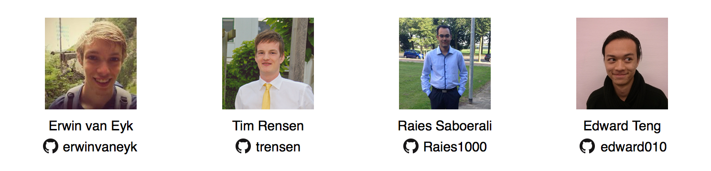
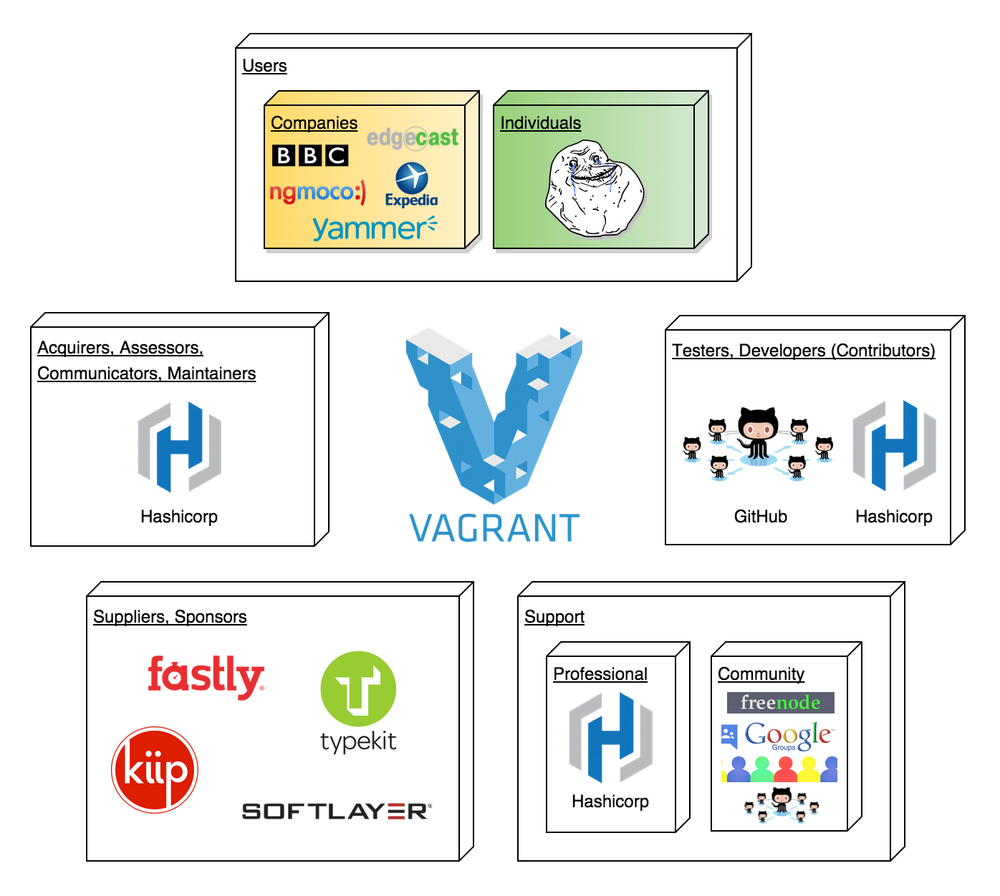
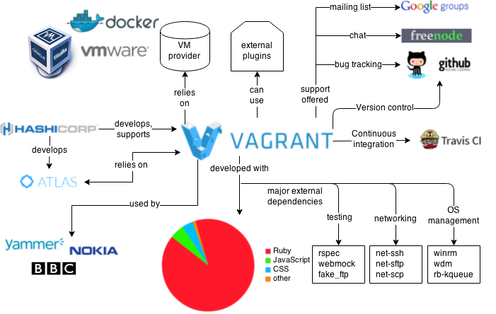
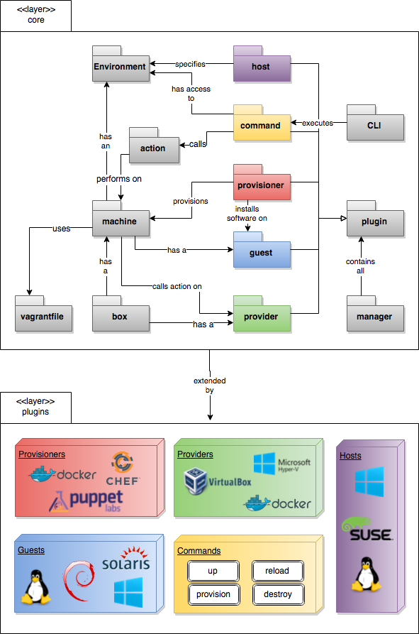
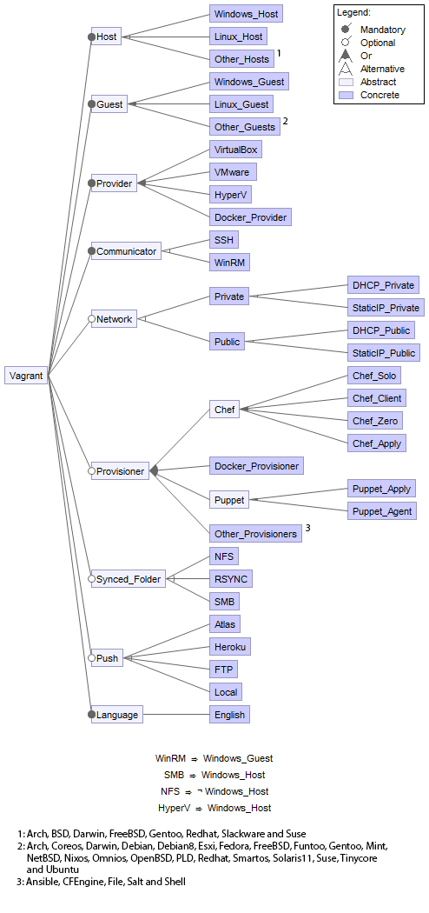
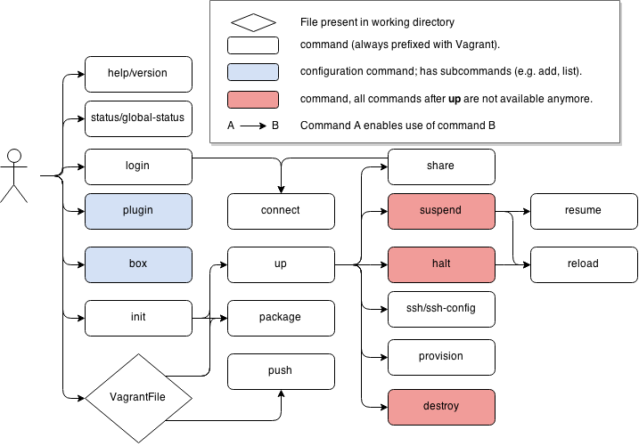

# Vagrant: Development environments made easy




**Abstract**

*Chances are, that as a developer you have come across the “it does not work on my machine” excuse from other developers with whom you have been working on a project. 
A possible solution to this problem is Vagrant. Vagrant is a tool for building complete development environments which are portable, and focus mostly on ease of use. 
Vagrant helps you decrease the time and effort necessary to setup the development environment and makes it easy to distribute these environments with other developers.
This allows developers focus more on actual development of the project instead of wasting hours on setting the environment.*

**Table of Contents**

* [Introduction](#introduction)
* [Vagrant's Playground](#playground)
* [The Underlying Architecture](#developmentview)
* [Variability](#productlines)
* [Usability Perspective](#usabilitypersective)
* [Functional View](#functionalview)
* [Development Process](#devprocess)
* [Future and Conclusion](#future-and-conclusion)
* [References](#vagrant-references)
* [Appendix](#append-vagrantcommands)

<a id="introduction"/>

## Introduction
Every developer has faced problems when it comes to setting up a development environment.
Usually the environment behaves as it should on one machine, while on another machine it behaves differently or does not function at all. 
Vagrant changes the way how developers setup their work environments and maintain them.
Vagrant makes it possible to create a configurable portable development environment easily.
These environments need to be configured in a so-called `Vagrantfile` to get completely configured.
In this file, the developer specifies how the environment should be set up, configured, which software should be installed and which operating system should be used.
This Vagrantfile can then be distributed among other developers who just need this file in order to set up the same development environment on their own machine. 
Vagrant will then follow every step as defined in the provided Vagrantfile and initialise the machine.

This incredibly useful developer tool Vagrant was created by Mitchell Hashimoto. 
Hashimoto started working on Vagrant in 2010 as a side-project for almost three years.
Over time Vagrant became more popular and trusted.
In 2012, Hashimoto formed HashiCorp in order to back the development of Vagrant. 

The chapter starts by discussing Vagrant's playground, in which the context view and the stakeholders will be presented. 
These stakeholders are people who are affected by Vagrant or try to influence the development of Vagrant in a certain way, whereas the context view shows the relation between Vagrant and external parties.
After the context view, we will dive into the underlying architecture of Vagrant in order to get an understanding of how the system works internally.
Then, the variable features are discussed by looking into the various features of Vagrant and their variability points.
Afterwards, the usability perspective and the functional view if the system will be discussed.
Lastly, the development process of Vagrant is presented.

<a id="playground"/>

## Vagrant's Playground
Users are not the only people affected by the system/software they use. According to [Rozanski and Woods](#rw2000), the systems are not just used, they need to be designed, built, maintained and paid for. 
Each of these activities involve different people, each having their own interest and requirements in the realisation of the system. 
These people are also called *stakeholders*.
The system is also affected by external entities interacting with the system.
These entities will be presented and discussed in the *context view*.

<a id="stakeholders"/>

### Stakeholders
The number of different stakeholders in general is large and in reality it will be challenging to meet all the requirements and needs of the different stakeholders. 
The following diagram shows a visual overview of the stakeholder analysis of Vagrant. 



As already mentioned in the [Introduction](#introduction), the main backer of Vagrant is Mitchell Hashimoto and his company HashiCorp. At the moment, HashiCorp handles the development, required investments, marketing, quality control, legal regulations and they provide professional support and training for Vagrant.
The documentation is mainly maintained by HashiCorp staff.
However, as the documentation is open source, users over the world can also contribute to that. 
This makes HashiCorp the **acquirer**, **assessor** and **communicator** for Vagrant.

The currently active **maintainers** for this project on GitHub are: [Mitchell Hashimoto](https://github.com/mitchellh), [Seth Vargo](https://github.com/sethvargo) and [Shawn Neal](https://github.com/sneal). 
These maintainers are associated with HashiCorp.
As it is an open source project, any user on GitHub can contribute. 
The maintainers control the project on GitHub by discussing and reviewing these contributions by using Pull Requests.

Currently there are over 490 **contributors** on GitHub, these can be either active developers or users who are familiar enough with the system to have made a contribution.
The main developers for Vagrant are the employees of HashiCorp.

When contributors want to merge a patch into the source code, they are also required to write test cases to ensure the system still functions correctly. 
This way, the system is mostly tested by these contributors. However there is no indication of a dedicated group of testers at HashiCorp for Vagrant.

The **users** are mostly concerned with the systems functionality and stability.
Users of Vagrant are both companies such as Nokia, BBC, Expedia, Discus and individuals. 
Vagrant benefits different types of users, such as *developers*, *operations engineers* and *designers*. As mentioned before developers are certain that they all are developing using the same working environment. Operations engineers can use Vagrant to test out various infrastructures, tools and workflows without having to actually dedicate multiple (production) machines for this purpose. Finally, designers can setup a newest version of the system without having to understand all tooling, so that they can just keep focusing on the design-aspect.

Vagrant offers community **support** to its user via [Freenode](http://irc.lc/freenode/vagrant), [Vagrant Google Group](http://groups.google.com/group/vagrant-up) and [Issue Tracker on GitHub](https://github.com/mitchellh/vagrant/issues), provided by the developers, maintainers, and other users on the various support platforms.
Professional support is also provided by HashiCorp for paying users. 

The **sponsors** can be seen as a different set of stakeholders, whom provide resources to help the Vagrant project run smoothly, by among other things, supporting hosting costs, providing testing machines and donating their services.
Unlike investors, they donate their services to HashiCorp to help them with the development of the system without expecting greater revenue. 
Instead they expect to be rewarded in the form of a better system which they can use.  

### Context View
To get an overview of the all the external entities interacting with the system, the following diagram is presented.



Since Vagrant makes use of external virtual machines, it is highly dependent on VM providers like [VMware](http://www.vmware.com/), [Docker](https://www.docker.com/) or Oracle's [VirtualBox](https://www.virtualbox.org/). 

HashiCorp also develops the proprietary [Atlas](https://atlas.hashicorp.com/), which features cloud-based sharing and storage possibilities for custom boxes.
This enables users of Vagrant to share and download boxes with other users from the Command-Line. 
Boxes are packaged Vagrant environments.
This functionality to communicate with Atlas is built-in to Vagrant. 
As Atlas is built just for Vagrant, both systems depend on each other.

Vagrant is mainly developed in Ruby.
Other languages used in the project are mostly web-development languages, with among others, JavaScript and CSS. 
These are needed for the website of Vagrant [vagrantup.com](http://vagrantup.com), which is also located in the same repository as system itself. 

<a id="developmentview"/>

## The Underlying Architecture
In order to understand how Vagrant works, it is necessary to dive into the underlying architecture of Vagrant. 
The organisation of the modules and their coupling are shown in the picture below, which will be discussed further.




### Core layer
As can be seen from the diagram, the core-layer consist of the most inner kernel of Vagrant.
It specifies the core components of the system, such as a machine, which represents an interface to the actual virtual machine.
Additionally, it specifies the interfaces, which plugins can extend.
These can be identified by the colour-coding.
For example: the VirtualBox provider plugin in the *plugins layer* extends the *provider* interface in the *core layer*. 

To increase the understanding of the diagram, the various terms and relevant relations of the core layer will  be explained here.
As mentioned before, Vagrant revolves around the **Machine** module, which represents a virtual machine. 

A **box** is the actual virtual machine environment packed into a Vagrant-compatible file.
In the end, this makes Vagrant a valuable tool, as the boxes can easily be shared among developers to get identical working environments.
The machine can configure a box using the settings that are described in a Vagrantfile.

The **Vagrantfile** is the central configuration of a Vagrant machine for the end-user.
Here all kind of settings, such as provider and provisioning, can be specified.
Every user who has the same Vagrantfile will also be able to setup the exact same environment by using this file. 

Operations can be performed using the **action** middleware.
This middleware basically specifies certain functionality, which all machines, unrelated to the type of machine should be able to perform.

The machine also has a reference to the **environment**.
The Vagrant environment basically represents a configuration of how Vagrant should behave in terms of working directory, UI settings, etc.

The environment is altered with OS-specific functionality by the **host** interface.
This interface enables developers to write plugins to enable OS-specific functionality in Vagrant. 
The action middleware, mentioned before, is used by the commands.

The **command** interface enables developers to write plugins to allow users to execute specific commands in the Command-Line Interface (**CLI**).
The core commands provided by Vagrant are also written using this interface.

The **provider** interface allows for implementations for communicating with virtualisation products.
A few examples of the implementation for the provider interface are the providers plugins for VirtualBox, Docker and Hyper-V.	

A machine naturally implements a specific OS, this is called the **guest** OS.
A guest is responsible for detecting the guest operating system running within the machine. 
The guest can then be extended with various OS-specific functionality with this type of plugins.

The **provisioner** is responsible for this task of installing software and configuring the machine according to the needs described by the user.

To ensure consistency between the plugins all plugins are extended from the abstract **Plugin** class.
The plugins are kept track of and controlled by a central **manager** which ensures that all plugins are listed and registered.

### Plugin layer
As stated in the [documentation](#plugindoc), most of the core of Vagrant is implemented using plugins. 
Since Vagrant [dogfoods](#dogfood) its own plugin API, one can be confident that the interface is stable and well supported. 
This additionally means, that the core itself is relatively small and lacks most required functionality of Vagrant. 
The actual functionality is implemented in the plugin layer by plugins which provide their functionality by building on top of the modules in the core-layer.
In the diagram the interfaces, such as command, provisioner and guest, which can be extended are represented using colours.
For example: for the provisioner interface, the implementation of *Docker*, *Puppet* and *Chef* are visible.
Using this type of view it is easy to see how the implementations in the plugin-layer relate to the interfaces and core-functionality in the core-layer.

### Common Design Components
In the previously described architectural view, the specific modules in Vagrant are identified. 
However, there are several components used by many of these modules. 
Identifying these components is necessary to show potential developers what functionality is available and often relevant for existing and new modules.

In the internals of the core layer, the various modules make use of common configuration settings.
These configs are available for every type of Component and can be adjusted by either plugin-developers or end-users.
It was decided to not include all types of configs in the diagram to avoid it from becoming unreadable.
Important config-implementations are the modules Config, Vagrantfile and Registry.

Vagrant also makes use of common third-party libraries, which serve functionality for logging, testing, networking and OS Management purposes. 

<a id="productlines"/>

## Variability
This section discusses the analysis of the variability of Vagrant. 
This is done by first looking into the features and the variability of the features. 
Afterwards, the variability feature model will be presented in a graph and the main variation point is identified.

<a id="mainfeatures"/>

### Main Features Offered by Vagrant 
Vagrant provides the user the possibility to package a currently running environment by executing `vagrant package` which packages such an environment into a re-usable box. 
These boxes can be shared easily with other users which is very useful. 
However, currently this plugin only support packaging VirtualBox environments as stated in Vagrant's [documentation](#cli-doc). 
This can be seen as a variable feature, since the user should be able to package environments for other providers as well.

Vagrant also provides the possibility of **syncing the `vagrant` folder** of the guest with the `vagrant` folder on the host. 
Vagrant can run on different platforms and be synced with different types of folders. 
To tackle problems regarding synchronising folders between different guests and hosts, there are multiple `synced_folders` plugins available. 
This mainly concerns the users, because it gives them the ability to sync between different types of folders.
For example: in some cases the default shared folder implementation may have performance penalties. 

Vagrant environments can be packaged in **boxes**, which can be used to setup a virtual environment.
Users may also create or customise their own box. 
Vagrant provides a number of predefined boxes on their [Vagrant Boxes](https://atlas.hashicorp.com/boxes/search) page. 
With the command `vagrant box` the user can manage boxes. 
The `box` command also has subcommands such as `vagrant box add ADDRESS`: can be used to add a box with the given address to Vagrant. 

**Provisioners** provide users the possibility to automatically install software and alter configurations. 
There are a number of built-in provisioners the users can use. 
Each of these provisioners provide the user with a certain set of options.
For example, Shell allows the user to upload and execute scripts within the guest machine according to the [documentation](#shell-doc).
Provisioners are configured in the Vagrantfile and they are run during the first execution of `vagrant up`. 

**Networking** allows for the communication between the host and the Vagrant environment. 
There are a few networking options available such as forwarded ports, private networks and public networks. 
The network configuration is done in the Vagrantfile. 
For instance, the forwarded ports use TCP by default, however the user can specify an additional protocol to use in the Vagrantfile.  

The **Multi-Machine** feature provides the user with the possibility to setup Vagrant environment with multiple machine. 
The configuration for this is done in the Vagrantfile where the user can specify the machines and assign names to them. 
The use of multiple machines may change the behaviour of some commands. 
For example, `vagrant ssh` will require the name of the machine to control. 

In order to achieve its magic, Vagrant uses **providers** for the virtual environments. 
By default Vagrant uses VirtualBox and has out of the box support providers such as VMware, Docker and Hyper-V.
Users can install additional providers as plugins.
Users can select a specific provider which is available on their machine to run, by providing the provider name when executing `vagrant up`. 
Providers are also configured in the Vagrantfile and Vagrant also has the capability to select the right provider for the user at run-time.

**Vagrant sharing** allows users to share Vagrant environments with other users via either HTTP, SSH or general sharing.  
These features may also be used in combination with each other.
The user can specify the use of sharing protocols at runtime via the CLI.
HTTP sharing for example, enables the user to create an URL endpoint in order to access the HTTP server in the Vagrant environment. 

Since Vagrant runs a virtual environment without a UI, the user could use the Vagrant's CLI to easily gain access to the machine. 
Users can choose from `ssh` and `winrm` **communication protocols**, which are decided upon runtime.

### Variability Feature Model
Based on the features in the [previous](#mainfeatures) section, the feature model of Vagrant is created and presented below.
In the model, the most basic features are mandatory because these features are needed in order to use the tool. However the user has the possibility to choose between the different options with exception to the language as English is the only supported language currently. 




<a id="usabilitypersective"/>

## Usability Perspective

The usability perspective focuses on the ease with which people work effectively with the system.
One major aspect is the usability of the user interface.
However, there are more aspects that need to be taken into account.
One of these aspects is that this perspective should focus on the architecture's alignment with the users' capabilities, expertise and experience. 
The places where people can interact with the system should be identified, so called 'touch points'.
Moreover, the user interface should be nicely separated from functional processing.
This way, the user interface could be changed or replaced easily without having to untangle the implementation.

### Users
As described in [Stakeholders](#stakeholders), the users are mainly developers ranging from professional developers at large companies to independent programmers and hobbyists.
These developers have most likely experience with Command-Line based interfaces and are familiar with virtual machines and -environments.

### User Interface
Vagrant offers one User Interface: namely the Command-Line Interface (CLI).
This interface is the most important 'touch point' currently.
The CLI offers a large variability of commands, the most common are provided by `vagrant help` (see [Appendix A](#append-vagrantcommands)).

All commands are plugins as described in [The Underlying Architecture](#developmentview), so additional commands could easily be added to Vagrant.
The CLI contains no hardcoded commands: all supported commands are determined by analysing the structure and contents of `/plugins/commands/`.

Vagrant's CLI is capable of auto-completing most commands and subcommands by simply pressing `Tab` which improves the ease of use.
However, one decent downside of the CLI is the fact that the auto-completion is not offered consistently.
For example, `vagrant u` will be completed to `vagrant up` whereas subcommands like `vagrant up someV` will not be auto-completed to `vagrant up someVM`.
Since users cannot fully rely one this handy feature, the overall experience may deteriorate.

### Separation User Interface and Functional Processing

Vagrant is able to run without any User Interface: every possible command can be executed by simply creating the corresponding Command object.
In theory, you could put such Object in some main method and run this method by using an executable.
In that case, only pure functionality is being used, without an UI involved.

The CLI only analyses the command the user provided, determines the right Command class (the functional processing part) and executes it.
This indicates that there is some sort of separation between the User Interface and the Functional Processing.

However, the naming of certain functional modules already suggests that they are closely related: `Command`, for example.
As mentioned before, one could create and execute a new Command object manually, which will nicely run and result in something you would expect.
For example, destroying a VM can be done by running 

```
VagrantPlugins::CommandDestroy::Command.new(['--force'], @env).execute
```

This immediately shows that the functional part of Vagrant is partly called with CLI information: the list of subcommands (`[--force]`).

<a id="functionalview"/>

## Functional View

According to [Rozanski and Woods](#rw2000) the Functional view of a system defines the architectural elements that deliver the system’s functionality. 
As mentioned in the [Introduction](#introduction), as a developer it is normal to encounter problems when it comes to setting up a development environment. 
For this reason, it is more interesting to focus on the User than the other stakeholders. 
The users in this case can be seen as developers who use Vagrant to create development environments. 
Looking from the User as the stakeholder point of view, two concerns are important regarding this matter. 
A functional viewpoint generally consists of the functional capabilities, the internal and the external interfaces.
However, the internal interfaces are not very interesting to cover, as these have already been extensively described in the [The Underlying Architecture](#developmentview). 
Additionally, the actual important and interesting interfaces are often both internally and externally used. 
The remaining two, functional capabilities and external interfaces, will be described in the following sections.

### Functional capabilities
The functional capabilities can be defined as what the system, in this case Vagrant, is required to do and what it is not required to do. 
The most important functionality of Vagrant is to be able to build a complete development environment. 
Module structure [The Underlying Architecture](#developmentview) is used to achieve this function. 
Vagrant has several modules but not all of them are necessary to fulfil this requirement. 
To be able to build a working development environment (the machine), Vagrant uses three modules: the guest, host and provider.    
Other modules exist to improve the user experience. 
These modules provide several features, which have been defined in the [Variability](#productlines) section.
Derived from these features, the required functional capabilities of Vagrant are shown below:

*	Creating working development environment 
*	Being easy to use  
*	Sharing folders 
*	Sharing environment through vagrant boxes
*	Using provisioners
*	Being able to choose which guest/provider to use
*	Being able to deploy 

Vagrant can be seen as a middleware tool, it connects different software together such as virtualisation software (VirtualBox), provisioners (Chef, Docker) and deployment tools (Heroku).  
This is the reason why Vagrant does not implement the functionalities of the software mentioned. 
These functionalities lie beyond the scope of Vagrant. 
Vagrant does have plugins that support these softwares so that the users have the option to use the softwares (tools) they prefer.  

### External Interfaces
Vagrant is basically a very good, yet very minimalistic abstraction of the external interfaces of the various virtual machine providers, such as VMWare and VirtualBox.
In this section we will discuss the major external interfaces of Vagrant.
In Vagrant there are two major external interfaces, namely the user interface and the plugin interface.

### User Interface
The most prominent external interface is obviously the user interface.
This is the interface that is exposed to all of the users of the system.
The User Interface of Vagrant is restricted to a minimalistic Command-Line Interface.
This choice can be attributed to the fact that the user of Vagrant tends to be a developer familiar with Command-Line tools.

The Command-Line Interface has been covered in the [Usability Perspective](#usabilitypersective).
In the usability view the Command-Line Interface was discussed in terms of usability.
In this section the Command-Line Interface will be discussed in terms of functionality.
The functionality will be shown in the form of the following diagram.



In the diagram above it is clear to see how the various commands of the system relate.
The blocks each represent a command available in Vagrant.
The arrows in between the blocks represent dependency links. 
Take for example the arrow from `up` to `halt`.
It indicates that one has to call `vagrant up` in order to be able to call `vagrant halt`.
The red blocks indicate that after being called the commands available to the user after calling `up` are no longer available.
The user would need to call `vagrant up` again or in some cases `reload` or `suspend` to enable the other commands again.
The blue blocks indicate that the associated command has several subcommands.
In Vagrant these nested commands only occur for the configuration commands `box` and `plugin`.
These commands are very trivial in their meaning and usage.
For this reason they are not included into the diagram individually.
Finally, the diamond in the diagram represents a file in the directory in which the terminal is located.
One could see this `Vagrantfile` as a separate external interface, as it enables users to configure entire Virtual Machines without calling all the Command-Line commands.
However to be able to use the Vagrantfile the user always needs to call at least one command in the terminal, in many cases `vagrant up`.
For this reason, the Vagrantfile is associated with the Command-Line user interface.


### Plugin Interface
The other external interface is the interface of plugins.
Although there are several subinterfaces for all various types of plugins, they all originate from the general plugin interface as defined in the source of Vagrant.
The plugin architecture has been covered in multiple other sections, including [The Underlying Architecture](#developmentview).
In this section only the things that have not yet been covered by the previously mentioned section will be discussed.

Except for a minimal kernel, all of Vagrant itself is implemented using the same external plugin interface as external plugins use.
This also means that the external interface also is used internally.
All external and internal plugins implement at least the plugin interface.
Using this approach the developers can control the data flow and functionality access of the plugins.

The diagram in [The Underlying Architecture](#developmentview) can also be used to describe the functional view in terms of the external interface of the plugins. 
It shows all the different types of plugins, such the provisioner and provider plugins. 
Additionally, using the colour-coding it also shows what tools have plugins available for vagrant.
In general these plugins are not much more than middleware enabling Vagrant to access functionality of the external tools, such as VirtualBox.

<a id="devprocess"/>

## Development Process
Next to the module structure, it is important for  developers to know the process regarding new contributions.
In Vagrant these approaches are very loosely defined.

To **build** the system there exists a simple [guide](#devguide) to help developers on how to build a 'bleeding-edge' version of Vagrant.
Thanks to Ruby project management libraries, such as Bundle, Gem and Rake, the building of the project is a breeze.

For the **testing approach**, Travis CI is used for continuous integration testing of Vagrant.
User may also run tests on their own machine by building the project as described in the building approach and running `rake` for testing.
This way the user can test his changes locally before opening a pull request and does not have to wait for Travis CI to test his build.

For the **integration approach** the maintainers provide a [contribution guide](#contr-guide).
According to this guide, contributors are required to write test cases for their pull request to make sure the system still works as before. 
Whenever a pull request is opened on GitHub, [Travis CI](https://travis-ci.org) is triggered by the GitHub event-api.
Travis CI then builds the system as specified in the build approach and runs all the tests.
Then, the pull request is reviewed by one of the maintainers and merged into the system if everything looks alright.

### Release Process
New Vagrant versions are not being released with any regular schedule. 
Project maintainer Mitchell Hashimoto explained the rationale for this in a personal email.
The reason for relatively slow updating is that Vagrant already is reasonably mature (five years old) and considered stable for its primary use.
Vagrant is finished in the sense that there are no any plans to add new or change existing functionality, except for minor requests.
The infrequent releases of Vagrant mostly contain fixes of small bugs which reside on specific host-guest combinations, new feature requests and minor updates to the documentation. 

## Future and Conclusion

###Future
We have contacted Mitchell Hashimoto and he stated in the mail: “Vagrant is 5 years old and extremely stable for its primary use”, therefore the focus at HashiCorp is more at the younger projects they have instead of Vagrant. Looking at the issues on GitHub, they are usually minor issues with very specific configurations affecting a really small number of users and therefore they get a lower priority. In the future there probably will not be any major changes to Vagrant’s functionality.

###Conclusion
The goal of this research was to study the stakeholders, the architecture of Vagrant and the flexibility of the architecture.
For Vagrant, HashiCorp is a very important stakeholder along with the users, developers and the sponsors.
HashiCorp is very important for Vagrant, because they are the ones who handle the development, required investments, legal regulations etc. 
The sponsors play an important role because of the services they provide either for free or at a low cost in order to help the development of Vagrant. 

The architectural development study shows that Vagrant has a plugin-based architecture. 
This choice of architecture makes Vagrant highly flexible for adding new features, and makes it easier to maintain the features.
From the context view it is clear that Vagrant heavily depends on Virtual Machine providers in order to create, run and manage the virtual machines.
In order to support many operating systems as host and guest, Vagrant offers various types of plugins to support all of these different system configurations. These provide features that are exclusively available on a specific machine type.
The usability perspective of Vagrant clearly shows, that Vagrant separates the underlying functionality from the user interface.

To conclude, Vagrant solves the common problem of having differences in the working environments of developers. Using Vagrant, developers can create and share reproducible working environments using a single file. It has a highly flexible architecture which is very easy to maintain due to the plugin-based approach.

<a id="vagrant-references"/>

## References

* <a id="rw2000"/>ROZANSKI, Nick; WOODS, Eóin. Software systems architecture: working with stakeholders using viewpoints and perspectives. Addison-Wesley, 2011.
* <a id="dogfood"/>Dogfood: [http://en.wikipedia.org/wiki/Eating_your_own_dog_food](http://en.wikipedia.org/wiki/Eating_your_own_dog_food) (Visited: March 2015)
* <a id="plugindoc"/>Plugins Documentation: [https://docs.vagrantup.com/v2/plugins/index.html](https://docs.vagrantup.com/v2/plugins/index.html) (Visited: March 2015)
* <a id="devguide"/>Development Guide: [https://github.com/mitchellh/vagrant/blob/master/README.md](https://github.com/mitchellh/vagrant/blob/master/README.md) (Visited: March 2015)
* <a id="contr-guide"/>Contribution Guide: [https://github.com/mitchellh/vagrant/blob/master/CONTRIBUTING.md](https://github.com/mitchellh/vagrant/blob/master/CONTRIBUTING.md) (Visited: March 2015)
* <a id="cli-doc"/>CLI Documentation: [http://docs.vagrantup.com/v2/cli/package.html](http://docs.vagrantup.com/v2/cli/package.html) (Visited: March 2015)
* <a id="shell-doc"/>Shell Documentation: [https://docs.vagrantup.com/v2/provisioning/shell.html](https://docs.vagrantup.com/v2/provisioning/shell.html) (Visited: March 2015)


<a id="append-vagrantcommands"/>

## Appendix: Vagrant Commands
<pre><code>box             manages boxes: installation, removal, etc.
connect         connect to a remotely shared Vagrant environment
destroy         stops and deletes all traces of the vagrant machine
global-status   outputs status Vagrant environments for this user
halt            stops the vagrant machine
help            shows the help for a subcommand
init            initializes a new Vagrant environment by creating a Vagrantfile
login           log in to HashiCorp's Atlas
package         packages a running vagrant environment into a box
plugin          manages plugins: install, uninstall, update, etc.
provision       provisions the vagrant machine
push            deploys code in this environment to a configured destination
rdp             connects to machine via RDP
reload          restarts vagrant machine, loads new Vagrantfile configuration
resume          resume a suspended vagrant machine
share           share your Vagrant environment with anyone in the world
ssh             connects to machine via SSH
ssh-config      outputs OpenSSH valid configuration to connect to the machine
status          outputs status of the vagrant machine
suspend         suspends the machine
up              starts and provisions the vagrant environment
version         prints current and latest Vagrant version
</code></pre>

